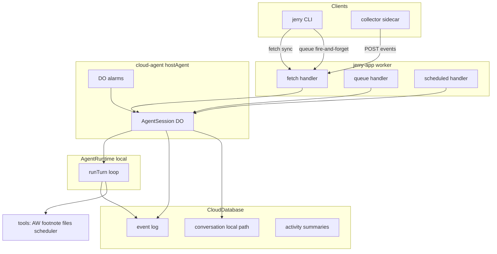
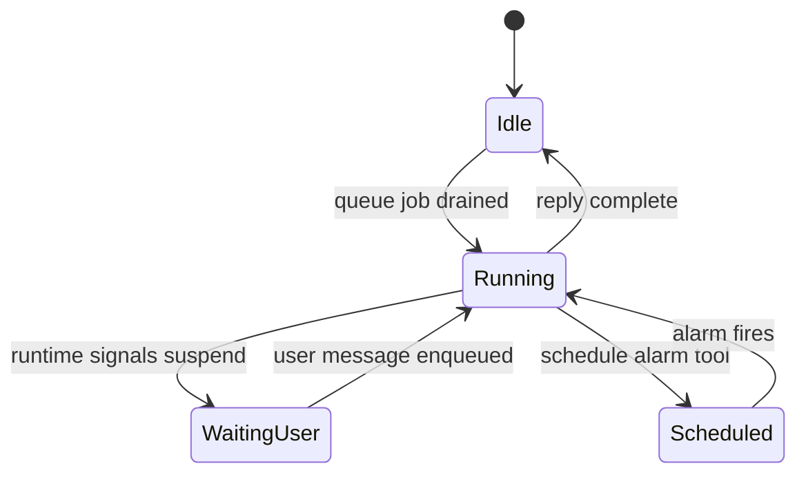
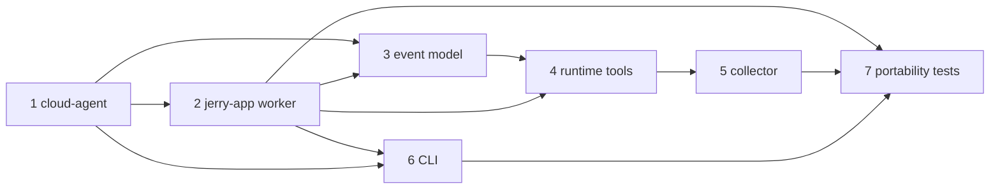

# Phase 1 — Event Host + Jerry MVP

Phase 0 is complete ([docs/plans/phase-0.md](docs/plans/phase-0.md)): `AgentRuntime` port, `local` backend, AW pure functions, target config. Phase 1 is **greenfield** for the event shell and Jerry integration. Item 1 blocks items 2–6.

## Current baseline

| Area                                                                       | Status                                                              |
| -------------------------------------------------------------------------- | ------------------------------------------------------------------- |
| [packages/agent-runtime](packages/agent-runtime)                           | `AgentRuntime`, `resolveRuntime`, `local` backend — ready to inject |
| [packages/tools](packages/tools)                                           | AW pure functions only — no `tool()` wrappers or I/O                |
| [packages/jerry-app/worker/index.mjs](packages/jerry-app/worker/index.mjs) | `fetch` only (`/`, `/health`, `/hits`) — no DO/queue                |
| [wrangler.jsonc](wrangler.jsonc) / [mieweb.jsonc](mieweb.jsonc)            | D1 + KV only                                                        |
| `vendor/cloud`                                                             | Full L4 substrate; **no** `@mieweb/cloud-agent`                     |
| [packages/cli](packages/cli), [packages/collector](packages/collector)     | Placeholder exports                                                 |

Reference worker: [vendor/cloud/packages/test-app/worker/index.mjs](vendor/cloud/packages/test-app/worker/index.mjs) — `fetch`/`queue`/`scheduled` + DO class pattern Jerry should mirror.

---

## Architecture (target end state)



**Turn lifecycle** edited from [plan.md §7](plan.md) ):\*\*



---

## Build order and dependencies



---

## Item 1 — `@mieweb/cloud-agent` (vendor/cloud branch → PR)

**Location:** new package `vendor/cloud/packages/cloud-agent` (+ companion `cloud-agent-cli`).

**Branch workflow:** create `feature/cloud-agent` in `vendor/cloud` submodule; pin Jerry to that commit; open upstream PR to `mieweb/cloud` per [plan.md §9](plan.md).

### Core API

Implement `hostAgent()` per [plan.md §5](plan.md):

```ts
hostAgent({
  agent: { name, instructions, tools },
  runtime: AgentRuntime,           // injected — types from @mieweb/jerry-agent-runtime or extracted shared types
  store: { db: CloudDatabase, vectors?: CloudVectorIndex },
  triggers: Trigger[],             // fetch routes, queue topics, cron
})
```

Returns: DO class + worker wiring helpers (route dispatch, queue consumer binding).

### Host responsibilities (must implement)

1. **Session DO** — one DO instance per session key (default: user id or explicit session header/param)
2. **Queue-driven turns** — inbound event → write to event log → enqueue `TurnJob` → DO drains one job at a time
3. **Turn runner** — load conversation messages → call `runtime.runTurn()` → stream events → persist assistant reply
4. **Suspend/resume** — when runtime yields `waiting_for_user` (or approval), persist continuation in DO storage + DB; return without blocking; resume on next inbound event
5. **Alarms** — `alarm()` handler re-enqueues a scheduled turn; expose `scheduleWake(at, payload)` to tools via host context
6. **Conversation mapping** — on `local`/`byo-cloud`: host stores messages in `CloudDatabase`; on `ozwell` (Phase 2): delegate to Ozwell conversation id (stub interface in Phase 1)

### Expected Env shape (defines Jerry wrangler bindings)

| Binding   | Type                     | Purpose                                      |
| --------- | ------------------------ | -------------------------------------------- |
| `DB`      | `CloudDatabase`          | Events, sessions, local conversation history |
| `JOBS`    | `CloudQueue<TurnJob>`    | Async turn queue                             |
| `SESSION` | `CloudStatefulNamespace` | AgentSession DO                              |
| `VECTORS` | `CloudVectorIndex`       | Footnote (Phase 1 item 4)                    |
| `BUCKET`  | `CloudBucket`            | File ingest (optional Phase 1)               |

### `@mieweb/cloud-agent-cli`

Generic dispatcher per [plan.md §8](plan.md):

- `run({ agent, baseUrl, profile })` — message-first arg parsing
- `--call` (default): SSE/streaming `fetch` to session route
- `-txt` / `--put`: enqueue via queue producer, return immediately
- `--help`, `--version`, `--debug`, `--report`, `--config`
- Agent name from `basename(argv[0])` (multicall pattern)

### Tests in cloud-agent package

- Unit: turn state machine, suspend/resume persistence (mock runtime that emits `waiting_for_user`)
- Integration: in-process DO + queue via `@mieweb/cloud-local` harness (mirror test-app pattern)

---

## Item 2 — `packages/jerry-app` worker + agent definition

### Config extensions

Update [wrangler.jsonc](wrangler.jsonc) and [mieweb.jsonc](mieweb.jsonc) to match test-app bindings:

- `durable_objects` → `SESSION` binding for `AgentSession`
- `queues` → producer + consumer on `JOBS`
- `vectorize` → `VECTORS` (sqlite-vec local / libSQL mieweb)
- D1 migrations directory for event schema

Follow binding names and adapter drivers from [vendor/cloud/packages/test-app/wrangler.jsonc](vendor/cloud/packages/test-app/wrangler.jsonc).

### Worker structure

Refactor [packages/jerry-app/worker/index.mjs](packages/jerry-app/worker/index.mjs):

```ts
export default {
    fetch(request, env, ctx) {
        /* route to hostAgent triggers + health */
    },
    async queue(batch, env) {
        /* forward to SESSION DO or host queue handler */
    },
    async scheduled(event, env, ctx) {
        /* cron triggers if any */
    },
};
export { AgentSession } from "./session.mjs"; // DO class from hostAgent
```

Add TypeScript source under `packages/jerry-app/src/` compiled or imported by worker (match repo conventions — test-app uses plain `.mjs`; Jerry may use TS → build step or `.ts` via wrangler).

### Jerry agent definition

New module `packages/jerry-app/src/agent.ts`:

- **Instructions:** value-advocate persona (concise MVP rubric from [README.md](README.md) product framing)
- **Tools:** wired from `@mieweb/jerry-tools` (item 4)
- **Profile:** read from request context / default `DEFAULT_PRIVACY_PROFILE` from [packages/agent-runtime/src/profile.ts](packages/agent-runtime/src/profile.ts)
- **Dispatch:** `resolveRuntime(profile)` per turn

Wire `hostAgent({ agent: jerry, runtime: resolveRuntime(profile), store, triggers })`.

### Routes (initial)

| Route                            | Handler        | CLI mode       |
| -------------------------------- | -------------- | -------------- |
| `POST /v1/sessions/:id/messages` | fetch → DO     | `--call`       |
| `POST /v1/sessions/:id/enqueue`  | queue producer | `-txt`/`--put` |
| `GET /health`                    | health         | —              |
| `POST /v1/events`                | collector push | —              |

Keep Phase 0 `/hits` demo optional or remove once event routes work.

### Package deps

Add to [packages/jerry-app/package.json](packages/jerry-app/package.json):

- `@mieweb/cloud-agent` (workspace from vendor)
- `@mieweb/jerry-agent-runtime`
- `@mieweb/jerry-tools`

---

## Item 3 — Event model + summaries on CloudDatabase

### Schema (D1 migrations)

New `packages/jerry-app/migrations/0001_events.sql`:

**`sessions`**

- `id`, `user_id`, `status` (`idle`|`running`|`waiting_for_user`|`waiting_for_approval`|`scheduled`)
- `conversation_id` (runtime ref — local: internal id; ozwell: external id)
- `continuation` JSON (pending question, partial tool state)
- `created_at`, `updated_at`

**`events`**

- `id`, `session_id`, `type` (`user_message`|`agent_message`|`external`|`scheduled_wake`|`waiting_for_user`|`resumed`)
- `payload` JSON, `created_at`

**`messages`** (local/byo-cloud conversation store)

- `id`, `session_id`, `role`, `content` JSON, `created_at`

**`activity_events`** (collector-pushed raw AW/watcher events)

- `id`, `source` (`aw`|`folder`|`screenshot`), `payload` JSON, `occurred_at`, `ingested_at`

**`summaries`** (MVP: store AW rollup output)

- `id`, `session_id`, `range_start`, `range_end`, `summary` JSON, `created_at`

### Host integration

- Every inbound message: insert `events` row + enqueue turn
- Turn completion: insert `agent_message` event, set session `idle`
- Suspend: set `waiting_for_user`, persist `continuation`, insert lifecycle event
- Resume: insert `resumed` event, restore messages from `continuation`, drain queue

### Summaries

MVP scope: when AW tool runs, persist `buildActivitySummary()` output to `summaries` table linked to session. Full daily/weekly SQL rollups deferred to Phase 2 ([plan.md §10](plan.md)).

---

## Item 4 — Runtime tools (tool-calling / MCP-ready)

Extend [packages/tools](packages/tools) with AI SDK `tool()` definitions that receive host-injected context (DB, vectors, scheduleWake, sessionId).

### AW tool — `summarize_activity`

- **Input:** natural language range (reuse `resolveActivityRange`, `parseActivityRangeFromPrompt`)
- **Read path:** query `activity_events` for session/time window (collector-pushed data)
- **Process:** `buildActivitySummary` + `formatActivityContext` (existing pure functions)
- **Write:** insert into `summaries`
- **Fallback for dev:** optional direct AW HTTP poll when `egress: allow-tools` and localhost reachable (collector may not be running)

### Footnote tools — `index_document`, `search_memory`

- Wrap `vendor/footnote` via `CloudVectorIndex` binding
- Ingest: text + metadata from collector file drops or CLI attachments
- Search: semantic + literal search, return citations for agent

### Files tool — `read_file` / `list_watched`

- MVP: read from `BUCKET` or local path metadata pushed by collector (not direct disk from worker)
- Enforce egress: `local` profile blocks network file fetches

### Scheduler tool — `schedule_followup`

- Calls host `scheduleWake(isoTime, { reason, sessionId })` → DO `setAlarm`
- Alarm handler enqueues scheduled turn with `scheduled_wake` event

### Tool registration

Export `createJerryTools(ctx: ToolContext): ToolSet` from [packages/tools/src/index.ts](packages/tools/src/index.ts). Host passes `ToolContext` with bindings + egress-filtered subset via existing `filterTools` in [packages/agent-runtime/src/backends/local.ts](packages/agent-runtime/src/backends/local.ts).

### Tests

- Unit: tool schemas + AW tool with fixture DB rows
- Integration: mock runtime turn invoking AW tool end-to-end (no live Ollama required — use `MockLanguageModelV1` pattern from agent-runtime tests)

---

## Item 5 — `packages/collector` sidecar

Host-specific Node/Bun process (not in worker).

### Components

1. **AW poller** — poll `localhost:5600` buckets (`aw-watcher-window`, `aw-watcher-web`), diff since last cursor, POST to `POST /v1/events`
2. **Folder watcher** — chokidar (or Node fs.watch) on configurable watch dir; on new screenshot/note, push `external` event + optional footnote ingest payload
3. **Config** — `JERRY_URL` (default `http://127.0.0.1:8787`), watch paths, poll interval

### CLI entry

`packages/collector/src/cli.ts` → `pnpm collector dev` or `jerry-collector` bin.

### Tests

- Unit: AW response normalization → event payload shape
- Manual: run collector + worker locally, verify rows in `activity_events`

---

## Item 6 — `packages/cli`

Implement per [plan.md §8](plan.md):

```
packages/cli/
  bin/jerry.js          → run({ agent: 'jerry' })
  src/run.ts            → thin wrapper over @mieweb/cloud-agent-cli
  src/profile.ts        → load privacy profile from config file / env
```

### Config resolution

- Default target: `local` → `http://127.0.0.1:8787` from [mieweb.jsonc](mieweb.jsonc) port
- Remote: read profile endpoint from user config (`~/.config/jerry/config.jsonc` or project-local)
- Send `cwd` as context header/body field for `jerry i just made this pr` ([plan.md §15](plan.md))

### Flags

| Flag                               | Behavior                           |
| ---------------------------------- | ---------------------------------- |
| (default)                          | `--call`, stream reply to stdout   |
| `-txt` / `--put`                   | enqueue, exit 0 immediately        |
| `--help` / `--version` / `--debug` | meta                               |
| `--report` / `--config`            | stub or minimal MVP (profile dump) |

Add `@mieweb/cloud-agent-cli` workspace dependency once item 1 lands.

---

## Item 7 — Portability verification

### Test harness

Add `packages/jerry-app/test/` (or root `test/integration/`):

1. **Target matrix script** — `scripts/test-portability.sh`:
    - Run Jerry integration suite against `mieweb --target local`
    - Run same suite against `mieweb --target mieweb` (requires docker compose from `@mieweb/cloud-os`)
2. **Mock model path** — reuse agent-runtime mock so CI does not require Ollama
3. **Scenarios from [plan.md §14](plan.md):**
    - `jerry summarize my last 2 hours` → AW tool invoked, summary in thread, reply printed
    - Clarifying question → `waiting_for_user` → later `jerry yes do it` resumes
    - Collector push → footnote index → search cites document
    - DO alarm fires scheduled turn without external trigger

### CI extension

Extend [scripts/ci.sh](scripts/ci.sh) or add optional workflow job:

- Phase 1 MVP: unit + integration on `local` target in CI
- `mieweb` target: documented manual gate or scheduled CI with docker services (match `@mieweb/test-app` approach)

### Tracking doc

Create `docs/plans/phase-1.md` mirroring phase-0 slice checklist for progress tracking.

---

## Suggested delivery slices

| Slice              | Deliverable                                            | Unblocks               |
| ------------------ | ------------------------------------------------------ | ---------------------- |
| `cloud-agent-core` | `hostAgent`, DO turn loop, queue drain, suspend/resume | jerry-app              |
| `cloud-agent-cli`  | Generic CLI dispatcher                                 | jerry CLI              |
| `jerry-bindings`   | wrangler + mieweb bindings, migrations                 | worker routes          |
| `jerry-agent`      | Agent definition + hostAgent wiring                    | tools, CLI             |
| `event-model`      | Schema + persistence in host                           | tools, acceptance #2   |
| `runtime-tools`    | AW + footnote + scheduler tools                        | acceptance #1, #3, #4  |
| `collector`        | AW poll + folder watch push                            | acceptance #1, #3      |
| `cli`              | `jerry` binary                                         | acceptance walkthrough |
| `portability`      | Cross-target test harness                              | item 7                 |

---

## Out of scope for Phase 1 (defer to Phase 2)

- `ozwell` and `byo-cloud` runtime backends ([packages/agent-runtime/src/resolve-runtime.ts](packages/agent-runtime/src/resolve-runtime.ts) currently throws for these)
- Daily/weekly SQL digest rollups + scheduled digests
- MCP server exposure/consumption
- Cloudflare production deploy (validate locally + mieweb first)
- DuckDB analytics ([plan.md §10](plan.md))

---

## Risks and mitigations

| Risk                                                | Mitigation                                                                                    |
| --------------------------------------------------- | --------------------------------------------------------------------------------------------- |
| Submodule branch drift                              | Pin commit in Jerry; track upstream PR in `docs/plans/phase-1.md`                             |
| Suspension as in-memory promise                     | Host must persist `continuation` in DO storage + DB before returning ([plan.md §15](plan.md)) |
| DO alarm semantics differ by target                 | Test alarm path on `local` and `mieweb`; use test-app alarm patterns                          |
| Tool surface bloat                                  | Register only MVP tools; use egress filtering already in local backend                        |
| Footnote/Vectorize binding gaps on cloudflare local | Use `501 skipped` pattern from test-app until remote bindings configured                      |
