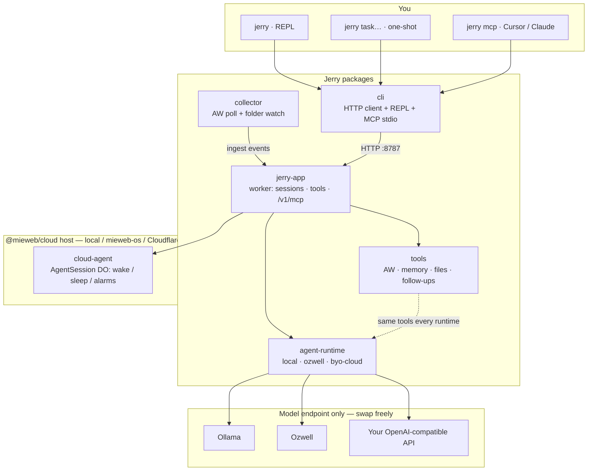

# Jerry

Your value advocate — an agent that turns activity signals into a defensible narrative of work.

Jerry is **host-agnostic**: instructions + tools bound to a pluggable model runtime. The same tools run whether the model is local Ollama, Ozwell, or your own OpenAI-compatible endpoint. Only the model endpoint moves.

---

## Run it

### Prerequisites

- **Node.js** ≥ 22.16
- **pnpm** 10.17.1 (`corepack enable` if needed)
- **Ollama** with a tool-capable model (`qwen2.5:3b` or `llama3.2:3b` — not `gemma3:4b`)
- **ActivityWatch** on `localhost:5600` (optional; needed for activity summaries — see mock inject below if you have no history)

### Setup

```bash
git clone --recurse-submodules https://github.com/mieweb/jerry.git
cd jerry
# if already cloned without submodules:
git submodule update --init --recursive

pnpm install
cp .env.example .env   # optional: fill API keys for ozwell / byo-cloud
OLLAMA_DOWNLOAD_PARTS=1 ollama pull qwen2.5:3b
```

Submodules matter: Jerry consumes `@mieweb/cloud-agent` and `@mieweb/cloud-agent-cli` from `vendor/cloud` by SHA (not npm `main`). Clone with `--recurse-submodules` or init them before `pnpm install`.

### Start the worker (required)

```bash
# Terminal 1
pnpm dev
curl http://localhost:8787/health
# {"status":"ok","package":"@mieweb/jerry-app"}
```

Optional — ActivityWatch (activity summaries):

> **Testers without real history:** install [ActivityWatch](https://docs.activitywatch.net/en/latest/getting-started.html), start it (`localhost:5600`), then inject three days of DevOps mock signals (Aug 1–3, 10:00–15:00 ET):
>
> ```bash
> pnpm inject:mock-aw
> # or: ./scripts/inject-mock-aw.sh
> ```
>
> Data lives in [`MOCK_AW_DATA.json`](./MOCK_AW_DATA.json). Then ask Jerry, e.g. `jerry what's my work summary from 2026-08-01 to 2026-08-03`.

```bash
# Terminal 2 — optional continuous ingest (ActivityWatch must already be running)
pnpm --filter @mieweb/jerry-collector dev
```

### Talk to Jerry ⭐

From the repo root:

```bash
alias jerry='NODE_OPTIONS="--import tsx" node packages/cli/bin/jerry.js'
```

The CLI has **three entry points**:

| Entry        | How                                              | Use when                                         |
| ------------ | ------------------------------------------------ | ------------------------------------------------ |
| **REPL**     | `jerry` · `jerry hello` · `jerry --session <id>` | Multi-turn chat, runtime/model switching, resume |
| **One-shot** | `jerry <task…>`                                  | Scripting / single answer then exit              |
| **MCP**      | `jerry mcp` / `jerry-mcp`                        | Tools inside Cursor / Claude Desktop             |

#### Interactive REPL

```bash
jerry                 # bare → REPL
jerry hello           # greeting → REPL (also: hi / hey / yo)
jerry --session <id>  # resume that session in the REPL
```

Inside the REPL: `/help`, `/session`, `/new`, `/runtime`, `/model`, `/sources`, `/dryrun <task>`. Exit with `q` / `quit` / `exit` / Ctrl+C — it prints the resume command.

A greeting only counts when the **whole** message is a greeting — `jerry hi summarize my day` is one-shot.

#### One-shot

```bash
jerry summarize my last 2 hours
# First-time AW users (after pnpm inject:mock-aw): mock data is Aug 1–3 2026, 10:00–15:00 ET
jerry what's my work summary from 2026-08-01 to 2026-08-03
jerry --session session-… what did I ship?
jerry --debug summarize my last 2 hours
```

After the answer, prints `tools: …` when Jerry called any tools (omitted if none).

#### MCP (Cursor / Claude)

Worker must be running. Stdio bridge:

```bash
jerry mcp
# or: NODE_OPTIONS='--import tsx' node packages/cli/bin/jerry-mcp.js
```

Cursor (`~/.cursor/mcp.json` or project `.cursor/mcp.json`):

```json
{
    "mcpServers": {
        "jerry": {
            "command": "node",
            "args": ["packages/cli/bin/jerry-mcp.js"],
            "env": {
                "NODE_OPTIONS": "--import tsx",
                "JERRY_URL": "http://127.0.0.1:8787"
            }
        }
    }
}
```

Exposed tools: `summarize_activity`, `search_memory`, `schedule_followup`. Details: [docs/mcp-server.md](docs/mcp-server.md).

### Smoke path

1. `pnpm install` + pull `qwen2.5:3b`
2. `pnpm dev` → health check
3. **REPL:** `jerry` → ask for a summary → confirm `tools:` footer → quit → resume with `--session`
4. **One-shot:** `jerry summarize my last 2 hours`
5. **MCP:** wire Cursor → list tools → call `summarize_activity`

Troubleshooting: [docs/chats/chat8 - running_the_program.md](docs/chats/chat8%20-%20running_the_program.md). CLI detail: [packages/cli/README.md](packages/cli/README.md).

---

## How it works

Jerry is not tied to one LLM host. The **worker** owns sessions and data; a pluggable **runtime** owns the model loop; **tools** stay on Jerry’s side for every backend.



| Package         | Role                                                                   |
| --------------- | ---------------------------------------------------------------------- |
| `jerry-app`     | Worker: agent definition (instructions + tools), sessions, HTTP + MCP  |
| `tools`         | Jerry-specific capabilities (ActivityWatch, search, files, follow-ups) |
| `agent-runtime` | Pluggable model backends — same tool loop, different endpoint          |
| `cli`           | Message-first client: REPL, one-shot, MCP stdio bridge                 |
| `collector`     | Optional sidecar: push AW / folder events into the worker              |
| `vendor/cloud`  | Submodule: generic event host (`cloud-agent`) + CLI client             |

**Host-agnostic in one line:** Jerry = instructions + tools. The host (`@mieweb/cloud-agent`) gives sessions a lifecycle; the runtime picks where inference goes; tools and storage stay put.

Full architecture: [plan.md](plan.md).

---

## Sources of truth & tools

Jerry only asserts what a **source of truth (SoT)** can substantiate. After each turn the CLI prints `tools:` (and often `sources:`) so you can see what it actually looked at. In the REPL, `/sources` shows the same wiring status.

### Sources of truth

| SoT | Status | What Jerry gets |
| --- | --- | --- |
| **ActivityWatch** | Wired | Window / web / AFK activity via `summarize_activity` (live AW or collector ingest) |
| **Local files & notes** | Wired | Folder watcher + index: screenshots, notes, docs (`read_file`, `list_watched`, footnote search) |
| **Google Drive** | Future | Shared docs / artifacts as evidence (not wired yet) |
| **YouTube** | Future | Watch / publish signals as evidence (not wired yet) |
| **GitHub** | WIP | PRs, issues, commits as shipping evidence |
| **TimeHuddle** | Planned | Declared intent + reflections (sessions / outcomes) |

Until Drive, YouTube, GitHub, and TimeHuddle are wired, Jerry should say **no evidence from \<source\>** rather than inventing those signals.

### Tools (today)

| Tool | SoT | Role |
| --- | --- | --- |
| `summarize_activity` | ActivityWatch | Natural-language time range → activity summary |
| `search_hybrid` / `search_fts` / `search_literal` | Local notes | Footnote MCP search (preferred when available) |
| `search_memory` | Local index | Basic vector search fallback |
| `read_file` / `list_watched` / `read_document` | Local files | Read captured or indexed content |
| `index_document` | Local index | Embed / upsert a document for later search |
| `schedule_followup` | Scheduler | Wake the session later (agent session alarms) |

MCP expose (Cursor / Claude) currently offers `summarize_activity`, `search_memory`, and `schedule_followup` — see [docs/mcp-server.md](docs/mcp-server.md).

---

## Runtime backends

Same tools for all three. Only the **model endpoint** changes. Default is local Ollama (`ollama:qwen2.5`). Override with env vars or a config file.

```bash
# Local (default) — nothing leaves except localhost Ollama
jerry "summarize my work from July 13th"

# Ozwell — prefer parent key ozw_… (not agnt_key-)
unset OZWELL_AGENT_KEY
JERRY_RUNTIME=ozwell JERRY_MODEL=gpt-4.1-mini OZWELL_API_KEY=ozw_your_key \
  jerry "summarize my work from July 13th"

# BYO-cloud — your OpenAI-compatible endpoint
JERRY_RUNTIME=byo-cloud \
  JERRY_MODEL='https://api.openai.com/v1#gpt-4o' \
  OPENAI_API_KEY=sk-... \
  jerry "summarize my work from July 13th"
```

### Persist keys and profile

The CLI loads a **`.env`** from the current directory (or a parent) on startup.
Existing shell variables still win — `.env` only fills gaps.

**For testers:** copy the example and edit:

```bash
cp .env.example .env
# then set OZWELL_API_KEY / OPENAI_API_KEY / ANTHROPIC_API_KEY as needed
```

Local Ollama needs no keys. `.env` is gitignored; never commit secrets.

**Or use `.jerry.json`** (cwd or `~/.jerry.json`):

```json
{
  "url": "http://127.0.0.1:8787",
  "profile": {
    "runtime": "byo-cloud",
    "model": "https://api.openai.com/v1#gpt-4o",
    "egress": "allow-model",
    "apiKey": "sk-..."
  }
}
```

Lookup order for config files (later wins for overlapping fields): `~/.jerry.json` → `~/.config/jerry/config.json` → `.jerry/config.json` → `.jerry.json`. Environment (including `.env`) overrides those for profile fields.
| Variable | Purpose |
| --- | --- |
| `JERRY_URL` | Worker base URL (default `http://127.0.0.1:8787`) |
| `JERRY_RUNTIME` | `local` \| `ozwell` \| `byo-cloud` |
| `JERRY_MODEL` | `ollama:…`, Ozwell id, or `https://…#model` |
| `JERRY_EGRESS` | `deny` \| `allow-model` \| `allow-tools` |
| `JERRY_SESSION` | Session ID for bare `jerry` |
| `OZWELL_API_KEY` | Parent key (`ozw_…`) — preferred |
| `OZWELL_AGENT_KEY` | Agent key — often skips Jerry tools; avoid |
| `OZWELL_ENDPOINT` | Default Manager host if unset |
| `OPENAI_API_KEY` / `JERRY_API_KEY` | BYO-cloud key |
| `ANTHROPIC_API_KEY` | Claude models via byo-cloud / REPL `/model` |

In the REPL, `/runtime` and `/model` switch for the **current session only** and check keys first (`… isn't set, so I can't use …`). One-shot does not preflight keys: Ozwell with no/bad key prints a notice and falls back to local Ollama; byo-cloud surfaces the provider error (e.g. 401) if the key is missing.

More: [packages/agent-runtime/README.md](packages/agent-runtime/README.md).

---

## Development

```bash
pnpm typecheck   # type-check all packages
pnpm lint        # lint
pnpm test        # tests
pnpm run ci      # full CI locally (use `run` — `pnpm ci` is reserved)
```

```
packages/
  jerry-app/       # worker
  tools/           # AW, memory, files
  agent-runtime/   # local / ozwell / byo-cloud
  collector/       # AW + folder ingest
  cli/             # jerry binary
vendor/            # git submodules: cloud, footnote, ozwellai-api
```

| Submodule             | Upstream                                                                            | What Jerry uses                                 |
| --------------------- | ----------------------------------------------------------------------------------- | ----------------------------------------------- |
| `vendor/cloud`        | [mieweb/cloud](https://github.com/mieweb/cloud)                                     | `cloud-agent`, `cloud-agent-cli`, local harness |
| `vendor/footnote`     | [mieweb/melvil-artipod-footnote](https://github.com/mieweb/melvil-artipod-footnote) | vector / footnote search                        |
| `vendor/ozwellai-api` | [mieweb/ozwellai-api](https://github.com/mieweb/ozwellai-api)                       | Ozwell client + spec                            |

After pull: `git submodule update --init --recursive`.

`vendor/cloud` is currently pinned to a feature SHA ([cloud#1](https://github.com/mieweb/cloud/pull/1) + `toolsUsed` passthrough) until that PR merges to `main`. Testers do not wait on the merge — the submodule pin is enough. When it lands, Jerry bumps the pin to `main`.

---

## Why Jerry

Invisible work has real value. Jerry reads activity signals and turns them into a manager-readable narrative — what you worked on, why it mattered, what got in the way — without forcing you to reconstruct the day by hand.

Product contract and roadmap: [plan.md](plan.md).
