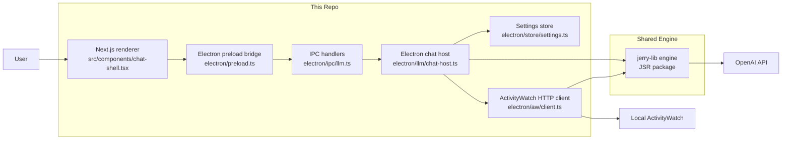
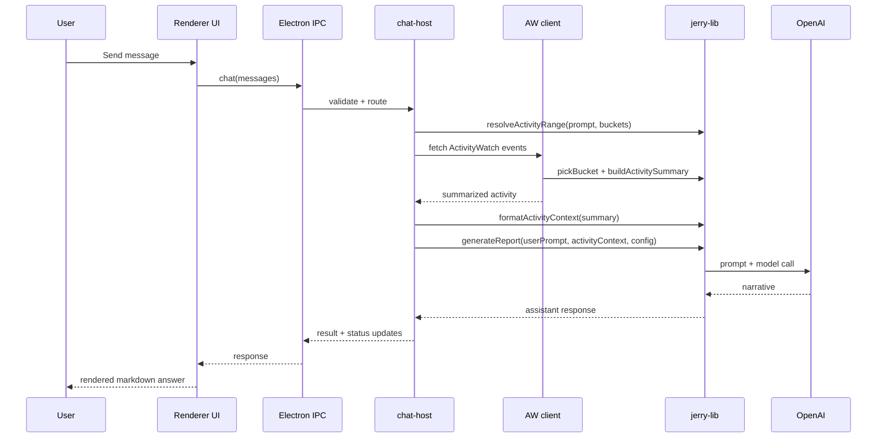
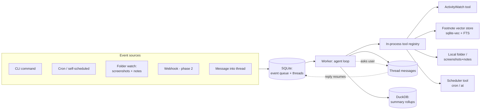
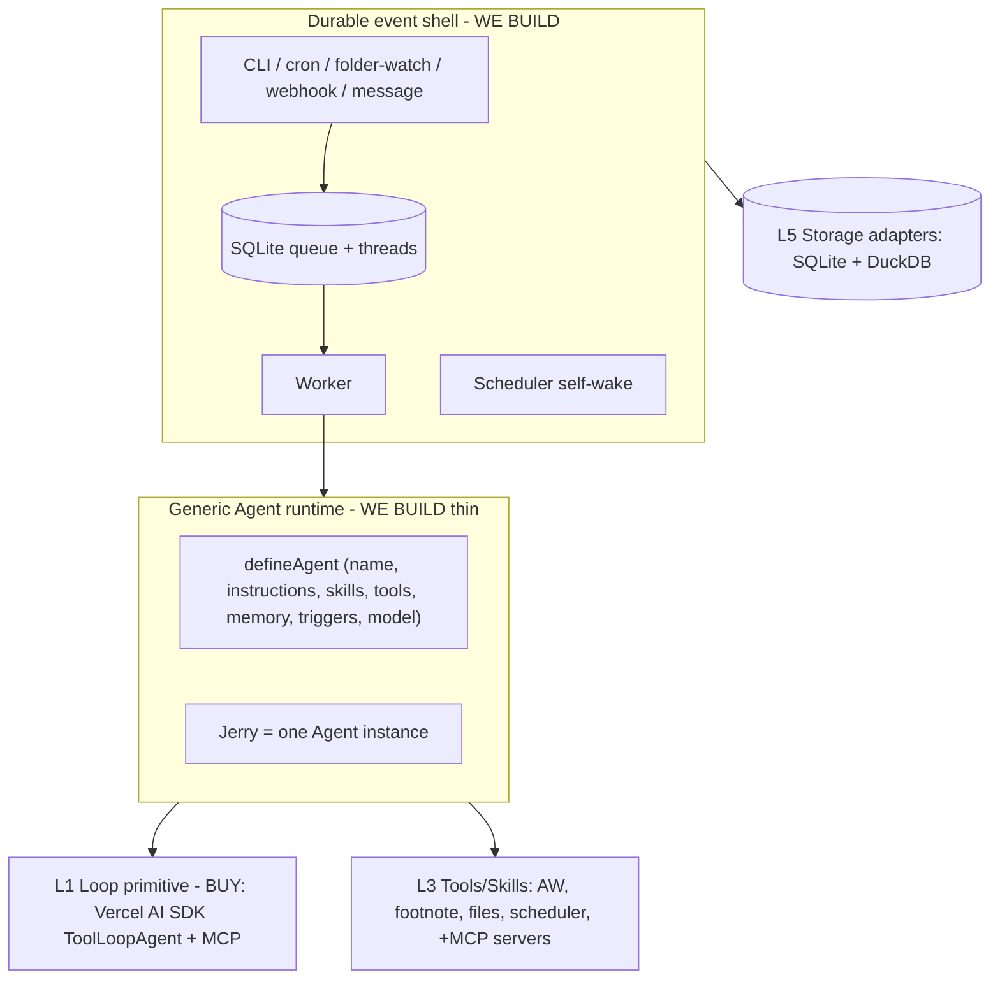
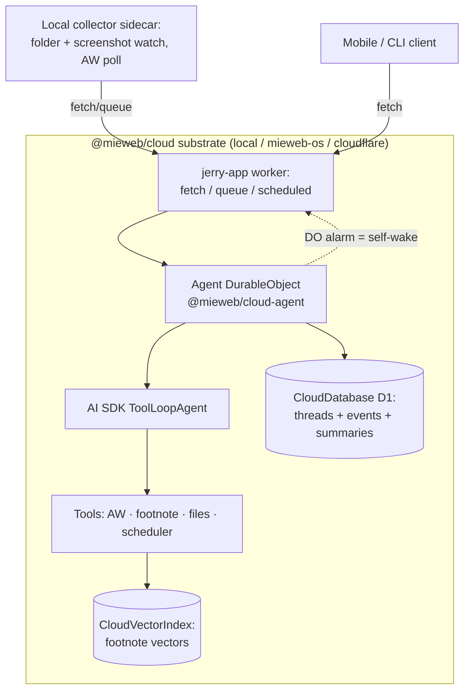
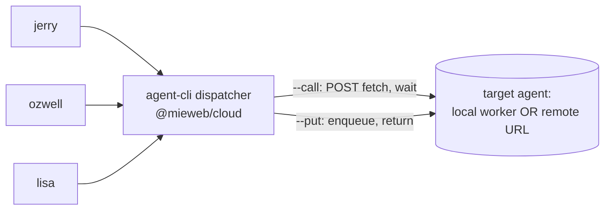

User: summarize this project.

GitHub Copilot: Updated todo list

I’m pulling the README and the main entry points first so I can give you a concrete architecture summary instead of a folder listing.

Read [](file:///Volumes/Case/prj/jerry-client/package.json)

Read [](file:///Volumes/Case/prj/jerry-client/README.md)

Read memory

Read [](file:///Volumes/Case/prj/jerry-client/electron/README.md)

The core picture is clear: Electron host, Next renderer, ActivityWatch on localhost, OpenAI behind the main process, plus a separate Deno CLI. I’m checking the actual entry points now to summarize how those pieces interact in code.

Read [](file:///Volumes/Case/prj/jerry-client/electron/main.ts)

Read [](file:///Volumes/Case/prj/jerry-client/src/app/page.tsx)

Read [](file:///Volumes/Case/prj/jerry-client/electron/llm/chat-host.ts)

Read [](file:///Volumes/Case/prj/jerry-client/jerry-cli/README.md)

I’ve confirmed the host split. One more pass through the renderer shell and preload bridge will make the summary accurate about the user flow and Electron security model.

Read [](file:///Volumes/Case/prj/jerry-client/src/components/chat-shell.tsx#1-1), lines 1 to 320

Read [](file:///Volumes/Case/prj/jerry-client/electron/preload.ts)

Read [](file:///Volumes/Case/prj/jerry-client/electron/ipc/llm.ts)

Read [](file:///Volumes/Case/prj/jerry-client/src/components/settings-dialog.tsx)

The remaining gap is where settings and prompt/runtime wiring live, so I’m checking those integration points before I summarize.

Read [](file:///Volumes/Case/prj/jerry-client/electron/jerry-lib-runtime.ts)

Read [](file:///Volumes/Case/prj/jerry-client/electron/store/settings.ts)

Read [](file:///Volumes/Case/prj/jerry-client/electron/aw/client.ts)

**Overview**
Jerry Client is a macOS-first desktop assistant that turns your local ActivityWatch data into chat answers and work summaries. The main product is the Electron app described in README.md, and the repo also includes an experimental standalone CLI in README.md. The stack is Electron, Next.js, React, TypeScript, Tailwind, and shadcn/ui, with OpenAI used for the language layer as shown in package.json.

**Architecture**
- The desktop host lives in main.ts. It starts Electron, creates the app window, initializes the shared Jerry runtime, and registers IPC handlers.
- The renderer is a small Next.js app whose home page just mounts the chat surface in chat-shell.tsx. That component owns the thread UI, markdown rendering, model picker, ActivityWatch status badge, and settings dialog.
- The security boundary is deliberate in preload.ts: the renderer only gets a narrow bridge for chat, ActivityWatch, and settings, while Electron runs with context isolation, sandboxing, and no Node integration.
- The main-process chat orchestration is in chat-host.ts. It decides whether a prompt needs ActivityWatch context, fetches and formats that context through client.ts, then sends the result to the shared Jerry runtime loaded in jerry-lib-runtime.ts.
- Local settings and secrets are stored with electron-store in settings.ts. Theme, selected model, and the OpenAI API key are kept locally on the machine.
- A key design choice is that much of the core Jerry logic is not implemented directly in this repo. This repo is mostly a host layer around the external Jerry runtime package, with two adapters: the Electron desktop app and the Deno CLI.

**Current State**
This is a focused beta. The working pieces are chat, markdown replies, ActivityWatch-powered work narratives, local settings, and macOS packaging. The current gaps called out in README.md are no tray/menu bar app yet, no persisted chat history, and some planned features like notifications and a rules engine.

If you want, I can next give you:
1. a folder-by-folder map
2. a startup and data-flow walkthrough
3. a guide to where to make common changes in this codebase

User: how is jerry-lib used?

GitHub Copilot: Updated todo list

I’m tracing the direct import sites and the runtime wrapper so I can explain exactly which responsibilities stay in this repo versus jerry-lib.

Searched for regex `@sarkarshubhdeep/jerry-lib|jerryLib\(|initJerryLib|DEFAULT_OPENAI_MODEL|isAllowedOpenAiModel|buildActivitySummary|pickBucket|formatActivityContext|resolveActivityRange|ask\(|generateReport\(` (`jerry-client`), 87 results

Read [](file:///Volumes/Case/prj/jerry-client/electron/jerry-lib-runtime.ts)

Read [](file:///Volumes/Case/prj/jerry-client/electron/README.md)

Read [](file:///Volumes/Case/prj/jerry-client/docs/a3t_integration.md)

The shared library is used in both host adapters, not just Electron. I’m pulling the CLI call sites now so the split is complete.

Read [](file:///Volumes/Case/prj/jerry-client/jerry-cli/src/cli.ts)

Read [](file:///Volumes/Case/prj/jerry-client/jerry-cli/src/commands/ask.ts)

Read [](file:///Volumes/Case/prj/jerry-client/jerry-cli/src/commands/report.ts)

Read [](file:///Volumes/Case/prj/jerry-client/jerry-cli/src/aw/client.ts)

Read [](file:///Volumes/Case/prj/jerry-client/jerry-cli/src/config.ts)

I’ve got the concrete call sites. One last doc check will let me phrase the host-versus-engine boundary the same way the repo does.

Read [](file:///Volumes/Case/prj/jerry-client/jerry-cli/SYNC.md)

Read [](file:///Volumes/Case/prj/jerry-client/jerry-cli/deno.json)

Read [](file:///Volumes/Case/prj/jerry-client/CHANGELOG.md)

I’ve confirmed the pattern the repo uses everywhere: jerry-lib is the shared engine, and this repo mainly supplies host-specific I/O and UI. I’m saving that repo fact for later tasks, then I’ll answer directly.

Created memory file [](file:///Users/horner/Library/Application%20Support/Code/User/workspaceStorage/90a5ed05adbe8df2fc3ceb4ced56bc88/GitHub.copilot-chat/memory-tool/memories/repo/architecture.md)

jerry-lib is the shared engine behind both host apps in this repo. The repo’s own docs describe Electron and the CLI as host adapters that handle UI, config, IPC, and raw ActivityWatch HTTP, while jerry-lib owns the core logic: prompt assets, date/range parsing, model defaults and allowlists, activity aggregation/formatting, and OpenAI orchestration. See README.md, SYNC.md, and CHANGELOG.md.

In the Electron app, it is loaded once at startup through jerry-lib-runtime.ts and initialized from main.ts with a prompt override path under the app’s user data directory. After that, the main-process host code calls into it from chat-host.ts: `ask` handles normal chat, while `resolveActivityRange`, `formatActivityContext`, and `generateReport` handle “what did I work on” style prompts. Electron still fetches ActivityWatch data itself in client.ts, but it uses jerry-lib’s `pickBucket` and `buildActivitySummary` to interpret that data. Settings code in settings.ts also relies on jerry-lib for the default model and model validation so the UI stays aligned with the engine.

In the CLI, the same library is imported through the alias defined in deno.json and initialized in cli.ts. The command handlers then call its APIs directly: ask.ts uses `ask`, report.ts uses `resolveActivityRange`, `resolveRangeHours`, `formatActivityContext`, `formatActivityWindowLog`, and `generateReport`, client.ts uses `pickBucket` and `buildActivitySummary`, and config.ts uses the shared default-model and model-validation helpers.

The practical rule is simple: if you want to change prompt behavior, range parsing, report generation, or model policy, that likely belongs in jerry-lib. If you want to change the desktop UI, IPC bridge, settings storage, or the raw ActivityWatch fetch path, that belongs in this repo. If you want, I can trace one full request end-to-end through the Electron path next.

Created 4 todos

User: show me a diagram

GitHub Copilot: Updated todo list

Here’s the host/engine split as a diagram:



And here’s the Electron request flow when a user asks “What have I been working on today?”:



Relevant code paths are main.ts, jerry-lib-runtime.ts, chat-host.ts, client.ts, and SYNC.md.

If you want, I can also draw the CLI path or a folder-level architecture diagram.

User: ok, this design seems like spagetti.  The jerry lib needs the mcp tools to call into AW database.  It seems like it trombones back and forth.  jerry lib should be the mcp client loop, tools, skills to talk to AW.  The loop should not *require* a chat.  If the agent needs feedback from the user it should just place messages into a conversation thread and way for a reply.  
the jerry look should be event driven.  Jerry is lunched by a command to do something, a message being placed in a conversation, a web hook firing, etc.  Jerry wakes up does something and then goes away until another event (which could be a chron or at event scheduled by jerry)

In the future, I want tools and skills to read folders from the hard drive, fetch documents from google drive, post videos to youtube (and fetch videos too), read and post to time huddle (a time tracking system).  I also want it to be able to read a folder with captured screenshots and quick notes I make throughout the day.

I want this all to be done with the CLI / lib layer with no UI.  

I want to sqllite or duckdb to capture summary information (mostly using a me).   Jerry-lib is basically a folder with https://github.com/mieweb/melvil-artipod-footnote/ vectordb with content.

help me by coming up with a plan to refactor what we have or if we should just start over

GitHub Copilot: Updated todo list

This is a big architectural shift. Let me research the current engine surface and the referenced vectordb project before proposing a plan.   

Map jerry-lib API surface


Fetched https://github.com/mieweb/melvil-artipod-footnote/

Read [](file:///Volumes/Case/prj/jerry-client/node_modules/%40sarkarshubhdeep)

Read [](file:///Volumes/Case/prj/jerry-client/jerry-cli)

Read [](file:///Volumes/Case/prj/jerry-client)

Read [](file:///Volumes/Case/prj/jerry-client/jerry-cli/node_modules)

Read [](file:///Volumes/Case/prj/jerry-client/package.json)

Searched for files matching `**/@sarkarshubhdeep/jerry-lib/**/*.d.ts`, no matches

Searched for text `jerry-lib`, 20 results

Read [](file:///Volumes/Case/prj/jerry-client/electron/jerry-lib-runtime.ts)

Read [](file:///Volumes/Case/prj/jerry-client/electron/aw/client.ts#1-1), lines 1 to 100

Read [](file:///Volumes/Case/prj/jerry-client/electron/store/settings.ts#1-1), lines 1 to 50

Searched for text `jerryLib().`, 1 result

Read [](file:///Volumes/Case/prj/jerry-client/electron/llm/client.ts)

Read [](file:///Volumes/Case/prj/jerry-client/electron/ipc/llm.ts#1-1), lines 1 to 50

Read [](file:///Volumes/Case/prj/jerry-client/electron/llm/chat-host.ts#1-1), lines 1 to 150

Read [](file:///Volumes/Case/prj/jerry-client/docs/a3t-usage.md)


Fetched https://jsr.io/@sarkarshubhdeep/jerry-lib/doc

Read [](file:///Volumes/Case/prj/jerry-client/jerry-cli/src/cli.ts#1-1), lines 1 to 100

Read [](file:///Volumes/Case/prj/jerry-client/jerry-cli/src/commands/ask.ts)

Read [](file:///Volumes/Case/prj/jerry-client/jerry-cli/src/commands/report.ts#1-1), lines 1 to 100

Read memory

Let me read the jerry-lib API inventory the subagent gathered. 

Read [](file:///Users/horner/Library/Application%20Support/Code/User/workspaceStorage/90a5ed05adbe8df2fc3ceb4ced56bc88/GitHub.copilot-chat/chat-session-resources/26db6181-bfd8-4ef2-894a-bee32c5a55f0/toolu_017bWuV3DuoiN5ELriuALtyS__vscode-1782592615464/content.txt)

I have a thorough picture now: jerry-lib today is a one-shot LLM pipeline (no agent loop, no tools, no MCP), and footnote/Melvil already provides exactly the MCP + SQLite-vec pattern you're describing. Before I write the full plan, a few decisions will shape everything. 

Analyzing your answers...

Great — that runtime question is the pivotal one, so let me work through it before locking the plan.

## Runtime tradeoffs for mac / pc / iOS / Android

The hard truth up front: **none of Node, Bun, or Deno run as an app runtime on iOS or Android.** They're all desktop/server runtimes. So "cross-platform including mobile" splits into two different problems, and the right answer is to *not* pick one runtime to rule them all — it's to keep the agent core as portable TypeScript behind adapter interfaces, and let each platform supply its own host.

**Why mobile is fundamentally different here:** your core capabilities — DuckDB, sqlite-vec, reading local folders, talking to ActivityWatch, spawning processes — are native/desktop workloads. DuckDB has no real mobile story; sqlite-vec *can* run on mobile (via `expo-sqlite`/`op-sqlite`), but the rest can't. So mobile realistically becomes a **thin client to a Jerry service** running on your Mac/PC/server, not a full local agent. That's a feature, not a limitation: "wake up on an event, do something, go away" is a server/daemon model, and phones are just another event source + thread viewer.

Desktop/server runtime comparison:

| | Node | Bun | Deno |
|---|---|---|---|
| Cold start (matters for "wake/act/exit") | Slowest | **Fastest** | Fast |
| Built-in SQLite | No (needs better-sqlite3) | **Yes (`bun:sqlite`)** | Via FFI/npm |
| DuckDB native addon | Works | Usually works, less battle-tested | Via npm/FFI, fiddly |
| MCP TS SDK / footnote (Node, npm) | **First-class** | Good (Node-compat) | Node-compat, occasional gaps |
| Single-binary distribution | Node SEA (rough) | **`bun build --compile`** | **`deno compile`** |
| Current code (jerry-cli is Deno; JSR) | — | — | **Already here** |

**My recommendation: Bun for the desktop/server host, with all I/O (storage, filesystem, network, scheduling) behind adapter interfaces in a runtime-agnostic `@jerry/core`.** Reasoning: the event-driven "ephemeral wake" model rewards fast cold start and easy single-binary distribution (Bun wins both), built-in SQLite removes a native-addon headache, and Node-compat keeps footnote + the MCP SDK available. The one risk to validate early is the **DuckDB native addon under Bun** — if it's painful, we fall back to Node for the worker process only (the adapter boundary makes that swap cheap) while keeping Bun for the fast CLI/dispatcher.

The key architectural principle that makes the runtime choice low-stakes: **`@jerry/core` imports zero runtime-specific APIs.** Storage, FS, fetch, and scheduling are injected. Then Bun (desktop), Node (server/CI), and a future Expo mobile client each provide their own adapter set. We can even change our mind on Bun-vs-Node later without touching core or tools.

Here's the full plan based on that plus your other choices:

## Plan: Jerry → event-driven agentic core (new repo)

Retire `jerry-client`; greenfield a new monorepo where Jerry is an **event-driven agent loop** (in-process tools now, MCP later) that wakes on a trigger, runs a tool-calling loop against a durable conversation thread, can pause to ask the user, and can schedule its own future wake-ups. Reuse the existing ActivityWatch aggregation as a tool; use SQLite for threads/queue/vectors and DuckDB for analytical summaries; CLI/lib only, no UI; desktop-first on Bun with mobile deferred to a thin client.



**Phase 1 — Working agentic slice (must-haves you picked)**

1. **Monorepo scaffold** — Bun workspaces, strict TS, lint/format. Packages: `@jerry/core` (runtime-agnostic), `@jerry/store`, `@jerry/tools`, `@jerry/cli`. *(blocks all)*
2. **Core agent loop** (`@jerry/core`) — `Tool` interface (name, description, zod/JSON-schema input, `execute(args, ctx)`), `ToolRegistry`, and an `AgentLoop` that runs LLM tool-calling until a `FINAL:` answer (reuse Melvil's marker convention from footnote). Loop emits status events and writes assistant/tool messages into the thread. **No chat required**: the loop is driven by an `Event`, not a prompt. *(parallel with step 3)*
3. **Storage adapters** (`@jerry/store`) — SQLite for conversation threads + durable event queue + `waiting_for_user` state (via `bun:sqlite`); DuckDB for analytical summary rollups. Both behind interfaces so core never imports them directly. *(parallel with step 2)*
4. **Event dispatcher + worker** (`@jerry/cli`) — a thin always-on dispatcher (cron scheduler + folder watcher) that appends events to the queue, and a worker that drains the queue and runs the agent loop. `jerry do "..."` enqueues a one-off event. Jerry can persist a future cron/`at` schedule to self-wake. *(depends on 2,3)*
5. **Human-in-the-loop** — when the agent needs input, it posts a question message to the thread and suspends the event (`waiting_for_user`); a reply (CLI `jerry reply` or a message row) re-enqueues and resumes. *(depends on 4)*
6. **Tools** (`@jerry/tools`) — *(depends on 2; tools parallel with each other)*
   - **ActivityWatch**: port the AW HTTP client + reuse aggregation (`buildActivitySummary`, `resolveActivityRange`, `pickBucket`, `formatActivityContext`) as a single tool.
   - **Footnote vector store**: wrap `@mieweb/footnote` to ingest the screenshots+notes folder and expose hybrid/FTS/literal search tools.
   - **Local folder / screenshots+notes reader**: list/read files, watch for new captures, hand text to the footnote ingester.
   - **Scheduler**: `schedule(cron|at, event)` writing to the queue.
7. **Verification harness** — run a real event end-to-end with a mock LLM; assert thread + queue transitions.

**Phase 2 — Captured for later (do not build yet)**

1. **MCP layer** — expose Phase-1 in-process tools as MCP servers (stdio) and let the loop also *consume* external MCP servers (footnote already ships one). The `Tool` interface is the seam; an MCP adapter wraps both directions.
2. **Integrations as tools** — Google Drive (read/fetch), YouTube (post + fetch), Time Huddle (read/post time entries). Each is a `@jerry/tools` module with its own auth adapter.
3. **Webhook event source** — small always-on HTTP listener that enqueues events (the third trigger type you named).
4. **DuckDB summarization** — scheduled daily/weekly rollups over activity + thread history ("mostly using me"), trend queries, digest generation Jerry schedules for itself.
5. **Mobile** — thin Expo client (thread viewer + event source) over a sync API to the desktop Jerry service; optional reduced local agent using `expo-sqlite` + sqlite-vec (no DuckDB).
6. **Distribution** — single-binary `bun build --compile` per desktop OS; Node fallback for the worker if DuckDB-under-Bun proves fragile.
7. **Local models** — Ollama embeddings for footnote (already supported) and optional local LLM for the loop, for offline/private runs.

**Relevant existing code to reuse (port into the new repo)**
- AW aggregation API in `@sarkarshubhdeep/jerry-lib` (`buildActivitySummary`, `resolveActivityRange`, `resolveRangeHours`, `pickBucket`, `formatActivityContext`, `isWorkRelatedUrl`, `aggregateMeetingSessions`) — becomes the AW tool's core.
- client.ts — AW HTTP fetch/pagination, port as the AW tool's fetch layer.
- a3t prompt assets + override resolution (`initJerryLib`, `getPrompt`) — carry over as skill/prompt files.
- Melvil's tool-calling + `FINAL:` agent pattern from `@mieweb/footnote` (ask.ts) — reference design for the `AgentLoop`.
- `@mieweb/footnote` / `@mieweb/footnote/vectorize` — the vector store dependency itself.

**Verification**
1. `jerry do "summarize my last 2 hours"` with a mock LLM → asserts AW tool called, summary written to thread, event marked done.
2. Agent asks a question → thread shows `waiting_for_user`; `jerry reply "..."` resumes to completion.
3. Drop a note/screenshot into the watched folder → dispatcher enqueues → footnote index updated → `jerry search "..."` returns it with a citation.
4. Schedule a `+1min` self-wake → worker fires it without a CLI invocation.
5. DuckDB rollup query returns a daily summary row (smoke test for the analytics seam).

**Decisions locked**
- Greenfield `@jerry/core`; reuse AW aggregation as tools. New repo; `jerry-client` retired.
- Hybrid tools: in-process registry now, MCP in Phase 2 (the `Tool` interface is the seam).
- SQLite (threads, queue, footnote vectors+FTS) + DuckDB (summary rollups).
- CLI/lib only, no UI. Desktop-first.

**Open decision to confirm**
1. **Runtime**: my recommendation is **Bun host + runtime-agnostic core**, mobile deferred to a thin client. Alternatives: Node (safest for DuckDB/MCP/footnote, slower cold start) or Deno (matches today's CLI + JSR, fiddlier native addons). Option A: Bun / Option B: Node / Option C: Deno.

I'll save this and refine once you confirm the runtime. 

Created memory file [](file:///Users/horner/Library/Application%20Support/Code/User/workspaceStorage/90a5ed05adbe8df2fc3ceb4ced56bc88/GitHub.copilot-chat/memory-tool/memories/MjZkYjYxODEtYmZkOC00ZWYyLTg5NGEtYmVlMzJjNWE1NWYw/plan.md)

Plan saved. The one thing I need from you to finalize is the **runtime call** — Bun (my rec), Node, or Deno — since it sets the host scaffold, the DuckDB approach, and the distribution story. Everything else above is locked.

A couple of things worth your thought before you decide:
- If offline/private operation or shipping a single double-clickable binary matters most → **Bun**.
- If maximum stability with DuckDB + the MCP SDK + footnote matters most (least surprise) → **Node**.
- If staying close to today's jerry-cli + JSR publishing matters most → **Deno**.

Want me to lock in Bun and flesh out the Phase 1 scaffold details (exact package boundaries, the `Tool`/`Event`/`Thread` interfaces, and the SQLite/DuckDB schemas), or would you like to talk through any of the Phase 2 integrations first?

Created 7 todos

User: i like this plan.  Quick idea tho.  What about making an agent idea.  refactor the layers to there is a generic "agent" idea and define a "jerry" agent so it can the tools skills and behaviors.  Also before we re-invent this idea is there any existing layers like openclaw we should be using rather then writting it from scratch?

GitHub Copilot: Updated todo list

Good instincts on both. Let me ground the build-vs-buy part in what's actually current rather than my priors — checking the leading TS agent frameworks for MCP + durable/event-driven + human-in-the-loop support. 


Fetched 4 resources

Both ideas are good, and the second one matters a lot — we should **not** hand-roll the LLM loop, tool-calling, MCP plumbing, or human-in-the-loop machinery. That's a solved problem now. Here's what I found and how it reshapes the layering.

## On "openclaw"
I couldn't find an established agent framework by that exact name — you may be thinking of one of the real contenders below (or Anthropic's **Claude Agent SDK**, or Cloudflare's **Agents SDK**). If you had a specific one in mind, tell me and I'll evaluate it directly. The serious TS candidates as of now:

| Framework | Loop | MCP | Human-in-loop | Memory | Runtimes | Shape |
|---|---|---|---|---|---|---|
| **Vercel AI SDK 7** (`ai`) | `ToolLoopAgent` | ✅ built-in | ✅ tool approvals | ✅ | Node/Bun/Deno/edge/**Expo** | **Library** (unopinionated) |
| **OpenAI Agents SDK** (`@openai/agents`) | ✅ | ✅ | ✅ | ✅ sessions | Node/Bun/Deno | Library, small primitives |
| **Mastra** | ✅ | ✅ | ✅ | ✅ | Node/Bun/edge | **Framework** (batteries + own storage/workflows) |
| **LangGraph.js** | graph | ✅ | ✅ interrupts | ✅ checkpoints | Node/Bun/Deno | Durable graph engine |

**My recommendation: buy the loop with the Vercel AI SDK; build only the event shell ourselves.** Reasoning that fits your constraints: it's a *library* not a framework (so it lives inside our adapter architecture and doesn't dictate storage — we keep DuckDB/SQLite), it's provider-agnostic (OpenAI/Gemini/Ollama, matching what jerry-lib already does), MCP is first-class (your Phase-2 seam), tool approvals give us the human-in-the-loop pause, and crucially it **runs on Bun/Node/Deno and Expo** — which directly de-risks the mobile question from last turn.

What no framework gives us, and we still own: the **durable event shell** — the SQLite queue, cron self-wake, folder-watch/webhook sources, conversation-thread persistence, and suspend-on-question/resume across process restarts. The SDK runs *one* agent turn; we orchestrate *when and why* turns happen. That's the part that makes Jerry "event-driven, wakes up, acts, goes away."

(If you'd rather adopt a full framework and write less shell code, **Mastra** is the alternative — but it brings its own memory/storage/workflow opinions that partly conflict with the DuckDB+SQLite decision, so I'd only go there if minimizing our own code outweighs control.)

## On the generic-Agent idea — yes, do this
This is the right factoring and it lines up perfectly with how all these SDKs model an agent (identity + instructions + tools + model). We make **`Agent` a generic definition** and **`Jerry` a concrete instance**, so the event shell, store, and tool registry are reusable for future agents (a "Reporter," a "Scheduler," etc.).

Layers become:



`defineAgent(...)` returns a portable description; the shell binds an agent's `triggers` to event sources and runs its tools through the AI SDK loop. Jerry is just the first `defineAgent` call. This costs us almost nothing now and buys clean multi-agent extensibility later.

Let me fold both into the plan. 

Updated memory file [](file:///Users/horner/Library/Application%20Support/Code/User/workspaceStorage/90a5ed05adbe8df2fc3ceb4ced56bc88/GitHub.copilot-chat/memory-tool/memories/MjZkYjYxODEtYmZkOC00ZWYyLTg5NGEtYmVlMzJjNWE1NWYw/plan.md)

Updated memory file [](file:///Users/horner/Library/Application%20Support/Code/User/workspaceStorage/90a5ed05adbe8df2fc3ceb4ced56bc88/GitHub.copilot-chat/memory-tool/memories/MjZkYjYxODEtYmZkOC00ZWYyLTg5NGEtYmVlMzJjNWE1NWYw/plan.md)

Plan updated. Net effect of your two ideas: we delete a big chunk of risky from-scratch work (the loop, tool-calling, MCP, HITL all come from the AI SDK) and gain clean multi-agent extensibility (generic `Agent`, Jerry as an instance). The package set is now:

- `@jerry/agent` — generic `defineAgent(...)` + runtime over the AI SDK loop (build, thin)
- `@jerry/store` — SQLite threads/queue + DuckDB summaries (build)
- `@jerry/tools` — AW, footnote, files/screenshots, scheduler (build)
- `@jerry/agents` — the Jerry instance (build, tiny)
- `@jerry/cli` — dispatcher + worker + commands (build)
- L1 loop: **buy** (Vercel AI SDK)

Two decisions now gate fleshing out Phase 1 scaffolding:

1. **Loop primitive** — confirm **Vercel AI SDK** (my rec), or prefer **OpenAI Agents SDK** / go full-framework **Mastra**? (If you meant a specific "openclaw"-like project, name it and I'll slot it into the comparison.)
2. **Runtime** — still open from last turn: **Bun** (rec), Node, or Deno. The AI SDK runs on all of them, so this is now purely about cold-start/distribution vs. native-addon safety.

Once you pick those two, I'll detail the exact interfaces (`Agent`, `Event`, `Thread`, `Tool`) and the SQLite/DuckDB schemas.

Created 8 todos

User: does cloudflare use wrangler to for making agents?  Whats the tldr on it?

GitHub Copilot: Updated todo list

Short version: **Wrangler is Cloudflare's CLI for building/deploying Workers — agents are just a special kind of Worker, so yes, you use Wrangler to deploy them, but Wrangler isn't an "agent tool" per se.**

TLDR on the stack:
- **Agents SDK** (`agents` npm package) is the actual agent framework. You write an `Agent` class that runs on **Durable Objects** — which give each agent instance persistent state, a SQLite-backed store, hibernation/wake, alarms (cron-like scheduling), and WebSocket/HTTP handling. That maps almost 1:1 to your "wake on event, hold state, schedule itself" model.
- **Wrangler** is the build/dev/deploy/secrets/bindings CLI (`wrangler dev`, `wrangler deploy`). It configures the Durable Object bindings and ships the Worker. You'd scaffold with `npm create cloudflare` (C3), then iterate with Wrangler.
- It supports MCP (host or server), tool-calling, and works with the Vercel AI SDK / OpenAI Agents SDK for the loop itself.

How it relates to your plan: Cloudflare Agents is genuinely the closest off-the-shelf match to your **durable event shell** (Durable Objects = per-agent state + alarms + storage, which is exactly the queue/cron/self-wake/thread layer we said we'd build). The catch for *your* requirements: it's **edge/server, not local-first** — it can't read your local folders, watch screenshots, or reach `localhost:5600` ActivityWatch, and **DuckDB won't run on Workers**. So it conflicts with "CLI/lib, local-first, reads my disk."

Practical read: Cloudflare Agents is a strong option **if Jerry becomes a hosted service** (with local watchers pushing events to it), but not for the local desktop agent. A reasonable hybrid later: local Bun worker for disk/AW tools + a Cloudflare-hosted agent for webhooks/cron/sync — but that's Phase 2+ territory, not the first slice.

Want me to add Cloudflare Agents to the framework comparison as the "hosted-service path" option in the plan?

User: Look at cloud.  This is something we control.  i would like to consider making the agent layer a function within https://github.com/mieweb/cloud 

GitHub Copilot: Updated todo list

Let me look at the mieweb/cloud repo to understand what it is and how an agent layer might fit. 


Fetched 2 resources

This is a significant find — `@mieweb/cloud` isn't just relevant, it largely **is** the durable event shell we were about to build, and it dissolves the local-vs-hosted tension I raised earlier. Let me lay out what it changes.

## What `@mieweb/cloud` is
A Cloudflare-shaped portability layer you own: stable contracts for **Database, Bucket, KV, Queue, StatefulNamespace (Durable Objects), VectorIndex, and AI**. You write one Cloudflare-style worker (`fetch` / `queue` / `scheduled` handlers + Durable Objects) and the same code runs on three targets via the `mieweb` CLI:
- **local** → SQLite / filesystem / in-memory / in-process (this is your local-first desktop path)
- **mieweb** (os.mieweb.org) → libSQL + S3/MinIO + Valkey (self-hosted, "we control it")
- **cloudflare** → native bindings, zero overhead (`mieweb` just passes through to `wrangler`)

## Why this is the right substrate for Jerry
The mapping is almost suspiciously clean — Jerry's event model maps 1:1 onto Cloudflare worker primitives that `@mieweb/cloud` already abstracts:

| Jerry concept (our plan) | Cloudflare worker / `@mieweb/cloud` primitive |
|---|---|
| Trigger: CLI command / webhook / mobile sync | `fetch` handler |
| Trigger: message placed in a conversation | `queue` handler (CloudQueue) |
| Trigger: cron self-wake | `scheduled` handler + **Durable Object alarms** |
| Per-agent state, "wake/act/sleep" | **Durable Object** (CloudStatefulNamespace) |
| Conversation threads + event state | CloudDatabase (D1 → SQLite/libSQL) |
| Footnote vector store | **CloudVectorIndex** — and footnote is *already* "Cloudflare Vectorize-compatible," so they share the same contract |
| LLM | CloudAI, or the Vercel AI SDK loop running inside the worker |

So the entire "durable event shell" we scoped to build ourselves (queue, cron, self-scheduling, thread persistence, suspend/resume) is provided by Durable Objects + Queues + D1 — and it's **portable across local, self-hosted, and edge with the same source.** That directly answers the earlier objection that "Cloudflare conflicts with local-first": on the `local` target it runs on a Node harness with SQLite/fs, no Workers account needed.

## The clean way to slot in your "generic Agent" idea
Your earlier instinct (generic `Agent`, Jerry as an instance) now fits perfectly as a **new portable primitive in `@mieweb/cloud` itself**: a `@mieweb/cloud-agent` package providing an **Agent Durable Object base** + tool/skill registry + the AI SDK loop, sitting alongside `CloudAI`/`CloudVectorIndex`. Then:
- The **agent layer becomes a platform function inside mieweb/cloud** (reusable, portable, contract-tested by the same cross-target harness).
- **Jerry is the first consuming app** — a `defineAgent(...)` instance wired to tools (AW, footnote, files) and triggers.

## The one thing that stays outside the portable core
Reading local folders/screenshots and reaching ActivityWatch at `localhost:5600` are inherently machine-specific and *can't* live in a portable worker (Cloudflare couldn't run them). Pattern: a thin **local collector sidecar** (small Bun/Node process) watches folders + polls AW and **pushes events/documents into Jerry via `fetch`/`queue`**. The portable agent core stays clean; the local I/O is a swappable source. Mobile becomes just another source/client hitting the same `fetch` API — exactly what we wanted.

## What this revises in the plan
- **Durable event shell**: don't build it — adopt Durable Objects + Queues + D1 via `@mieweb/cloud`.
- **Runtime**: shifts from "Bun-first" to **pnpm workspaces + the `mieweb` CLI / Node host harness** for the portable core; Bun is still fine for the local collector sidecar. The Bun-vs-Node question is now mostly moot for the core.
- **Storage**: this is the real trade-off to decide. `@mieweb/cloud`'s portable DB is SQLite/libSQL/D1 — **DuckDB is not a cloud primitive**. To stay portable, summaries/rollups would run as SQL on libSQL/D1, with DuckDB demoted to an optional *local-only* analytics extra (or dropped). That reverses our earlier "DuckDB for summaries" pick.
- **Loop**: AI SDK still works inside the worker, or use `CloudAI`. Footnote aligns via the shared Vectorize contract.

## Two decisions before I rewrite the plan around this
1. **Where does the agent layer live?**
   - **(A)** Add a generic agent primitive **into `@mieweb/cloud`** (`@mieweb/cloud-agent`), Jerry is a separate consuming app. *(my recommendation — matches "a function within mieweb/cloud" and your generic-Agent idea)*
   - **(B)** Keep Jerry in its own repo, just *consume* `@mieweb/cloud` contracts (no new platform primitive yet).
2. **DuckDB**: keep portability and do summaries in **SQL on libSQL/D1** (DuckDB optional/local-only), or keep DuckDB and accept it's a non-portable local feature?

One caveat to weigh: `@mieweb/cloud` is self-described as proof-of-concept (git-submodule today, npm/Bun distribution planned), so building Jerry on it means co-evolving the platform — but since you control it, that's leverage, not risk.

Want me to fold this in as the new primary architecture (Option A + SQL summaries, unless you say otherwise) and rewrite the phased plan around the `@mieweb/cloud` worker model?

User: yes.  I totally agree.  I would like to pull them in as submodules so we can Co-evolve together and propose pull requests on mieweb/cloud

GitHub Copilot: Updated todo list

Agreed — submodules for co-evolution with upstream PRs is exactly right, especially since the generic agent layer is going to *be* a contribution to `@mieweb/cloud`. Let me lock all of this into the consolidated plan. 

Deleted memory [](file:///Users/horner/Library/Application%20Support/Code/User/workspaceStorage/90a5ed05adbe8df2fc3ceb4ced56bc88/GitHub.copilot-chat/memory-tool/memories/MjZkYjYxODEtYmZkOC00ZWYyLTg5NGEtYmVlMzJjNWE1NWYw/plan.md)

Created memory file [](file:///Users/horner/Library/Application%20Support/Code/User/workspaceStorage/90a5ed05adbe8df2fc3ceb4ced56bc88/GitHub.copilot-chat/memory-tool/memories/MjZkYjYxODEtYmZkOC00ZWYyLTg5NGEtYmVlMzJjNWE1NWYw/plan.md)

Locked. Here's the consolidated final plan.

## Jerry → portable event-driven agent on `@mieweb/cloud`

New repo `mieweb/jerry`. Jerry is a Cloudflare-shaped worker (`fetch`/`queue`/`scheduled` + Durable Objects) built on `@mieweb/cloud`, so one codebase runs on **local** (Node harness, SQLite/fs), **mieweb/os** (libSQL+S3+Valkey, self-hosted), and **Cloudflare** (native). The generic **agent layer becomes a new primitive contributed upstream to `@mieweb/cloud`** (`@mieweb/cloud-agent`); Jerry is the first consuming app. Machine-specific I/O (folders, screenshots, ActivityWatch) lives in a **local collector sidecar** that pushes events into Jerry.



**Locked decisions**
- Substrate = `@mieweb/cloud` worker model. Triggers map to handlers: `fetch`=CLI/webhook/mobile, `queue`=message-in-conversation, `scheduled`+DO alarms=cron/self-wake.
- Generic agent = `@mieweb/cloud-agent` primitive (Option A), upstreamed via PR. Jerry = consumer.
- Portable storage: CloudDatabase (SQLite/libSQL/D1) for threads + event state + **SQL summaries** (DuckDB dropped from core; optional local-only later). Vectors via CloudVectorIndex; footnote is Vectorize-compatible.
- Loop = Vercel AI SDK (provider-agnostic, MCP, tool-approval HITL) running in the worker, or CloudAI.
- Runtime = pnpm workspaces + `mieweb` CLI / Node host harness for the core; Bun fine for the collector.
- **Submodules + co-evolution**: `vendor/cloud` and `vendor/footnote` as git submodules; develop `@mieweb/cloud-agent` on a branch in the cloud submodule, propose PR upstream, pin until merged.

**Phases**
- **Phase 0 — foundations**: create repo, pnpm workspaces, add submodules, wire `mieweb` CLI + `wrangler.jsonc`/`mieweb.jsonc` (default `local`), port AW aggregation pure functions out of jerry-lib into `packages/tools`.
- **Phase 1 — agent primitive + Jerry MVP**: build `@mieweb/cloud-agent` (Agent DO + `defineAgent` + tool/skill registry + loop) → `jerry-app` worker + Jerry instance → threads/events on CloudDatabase with suspend/resume → tools (AW, footnote, files, DO-alarm scheduler) → local collector sidecar → CLI (`do`/`reply`/`search`) → verify green on **both** local and mieweb(docker) targets.
- **Phase 2 — captured**: MCP (consume+expose), Google Drive / YouTube / Time Huddle tools, webhook source (native `fetch`), SQL rollups + self-scheduled digests, deploy to mieweb/os + Cloudflare, mobile thin client, local Ollama models, land the upstream PRs.

**Verification highlights**: `jerry do "summarize last 2h"` runs a turn end-to-end; an agent question parks the thread in `waiting_for_user` and `jerry reply` resumes it; a dropped screenshot flows collector → footnote → cited `jerry search` hit; a DO alarm fires a turn with no external trigger; and the same test suite passes on local *and* mieweb targets as the portability proof.

The full detail is saved to session memory. One practical note: I'm currently in **Ask (read-only) mode**, so I can plan but not scaffold. When you're ready to execute Phase 0 (repo, submodules, workspace), **switch me to Agent mode** and I'll start building. Want me to begin with the Phase 0 scaffold and the `@mieweb/cloud-agent` interface design at that point?

Created 4 todos

User: I want to be able to develop and test with a jerry cli to make life easier the runs locally.  I want to npx install mieweb/jerry. 

Then run:

jerry "I want to make a quick note for the day"
jerry "i just made this pr"   (in the folder im in)

I want to make it quotes optional too.  only needed if we need to preseve spaces.

jerry how is my day going am I on schedule?

in other words the jerry command reads all the args as a string.

If the first arg1 is a dash, then we know its a paramter:

jerry --help  or --version or --debug
default action is --call "this is a message I am sending to jerry"

Note the jerry-cli can be talking to a remotely hosted agent or the jerry agent running on the same machine.  The message is passed.  

jerry -txt (alias --put) just sends a message without waiting for a reply.  Effectively this is where responses by the agent are getting logged in the conversation, but the jerry-cli is not going to wait to display them.

---

the jerry cli is just a wrapper around mie/cloud agent-cli.  I want to be able to the same thing with "ozwell" or "lisa".  When someone makes an agent the same communication pattern is repeated but the target agent is recorded in the command line name.

GitHub Copilot: Compacted conversation

Updated todo list

I'm in Ask mode (read-only), so this is a design — let me ground it in your existing CLI first.  

Read [](file:///Volumes/Case/prj/jerry-client/jerry-cli/src/cli.ts)

Read [](file:///Volumes/Case/prj/jerry-client/jerry-cli/package.json)

Good — the existing CLI is Cliffy subcommand-style (`jerry ask`, `jerry report`). What you're describing is a different, simpler contract: **message-first, agent-name-as-binary**. Let me record it in the plan and lay out the design. 

Updated memory file [](file:///Users/horner/Library/Application%20Support/Code/User/workspaceStorage/90a5ed05adbe8df2fc3ceb4ced56bc88/GitHub.copilot-chat/memory-tool/memories/MjZkYjYxODEtYmZkOC00ZWYyLTg5NGEtYmVlMzJjNWE1NWYw/plan.md)

Here's the CLI design. It's read-only Ask mode, so this is the spec — switch to Agent mode to scaffold it.

## 1. The core idea: agent name *is* the command

`@mieweb/cloud` ships **one** generic dispatcher, `agent-cli`. Each agent is just a **bin name** pointing at it. The dispatcher reads `basename(argv[0])` to learn which agent to talk to — the exact busybox/git-multicall pattern.

```jsonc
// @mieweb/jerry  package.json
{
  "name": "@mieweb/jerry",
  "bin": { "jerry": "./bin/jerry.js" },          // shim → agent-cli with target "jerry"
  "dependencies": { "@mieweb/cloud-agent-cli": "*" }
}
```

```js
// bin/jerry.js  — the entire wrapper
#!/usr/bin/env node
import { run } from '@mieweb/cloud-agent-cli'
run({ agent: 'jerry' })   // or: run() and let it read basename(argv[1])
```

Adding **ozwell** or **lisa** = publish `@mieweb/ozwell` with `bin: { "ozwell": ... }` calling `run({ agent: 'ozwell' })`. Nothing else changes. Same communication pattern, target recorded in the binary name.



## 2. Argument grammar

```
args = process.argv.slice(2)

if args.length == 0            → interactive/help
else if args[0].startsWith('-') → FLAG MODE (parse flags)
else                           → MESSAGE MODE: message = args.join(' ')
                                  → default action --call <message>
```

Quotes are optional because the shell already strips them and we just `join(' ')`. You only quote to preserve *multiple* spaces or shell metacharacters (`?`, `&`, `|`):

```bash
jerry I want to make a quick note for the day     # message = "I want to make a quick note for the day"
jerry how is my day going am I on schedule        # works unquoted...
jerry "how is my day going... am I on schedule?"  # quote needed: ? is a glob, ... collapses
```

## 3. Flags & semantics

| Invocation | Meaning | Waits? |
|---|---|---|
| `jerry <words…>` | default → `--call "<joined>"` | yes — prints/streams reply |
| `jerry --call "<msg>"` | explicit send + reply | yes |
| `jerry -txt "<msg>"` / `--put "<msg>"` | enqueue message into the conversation | **no** — returns immediately; agent's reply is still logged in the thread |
| `jerry --help` / `--version` / `--debug` | meta | n/a |

Dispatch rule for flag-vs-message: only the **first** arg is inspected. `-txt` and `--put` then take the remaining args (joined) as the message. So `jerry -txt just finished the deploy` works unquoted too.

## 4. `--call` vs `--put` → worker handlers

This maps straight onto the `@mieweb/cloud` worker model from the plan:

- **`--call`** → `POST` to the agent's **fetch** handler, block, stream the reply back. Synchronous request/response.
- **`-txt` / `--put`** → enqueue onto the agent's **queue** handler and exit `0`. The turn runs asynchronously; the reply lands in the thread (readable later via `jerry --history` or the next `--call`). This is your "log it into the conversation without waiting" path.

## 5. Local vs remote target

The dispatcher resolves the endpoint per agent name from config (`~/.config/mieweb/agents.json` or `mieweb.jsonc`):

```jsonc
{
  "jerry":  { "target": "local" },                     // in-process worker via mieweb local harness
  "ozwell": { "target": "https://ozwell.example/agent" } // remote hosted agent
}
```

The CLI builds the **same** message payload either way — `{ agent, message, mode: "call"|"put" }` — and only the transport differs (in-proc invoke vs HTTPS). The hosted agent and the local one expose the identical fetch/queue contract, so the CLI doesn't care which it's hitting.

## 6. Install / run

```bash
npx @mieweb/jerry "make a quick note for the day"   # published package
npx mieweb/jerry "..."                              # straight from the GitHub repo
# or global:
npm i -g @mieweb/jerry @mieweb/ozwell               # gives you both `jerry` and `ozwell`
```

**One open decision:** the existing Deno jerry-cli is subcommand-style (`jerry ask`, `jerry report`). This new contract is message-first and would **replace** it. Want me to (a) retire the old CLI entirely, or (b) keep `report`/`config` as reserved sub-verbs that win only when arg[0] exactly matches a known verb, otherwise fall through to message mode? I'd recommend (a) for KISS — push `report`/`config` behind flags (`jerry --report today`). Say the word and switch me to Agent mode to scaffold `packages/cli` + the `agent-cli` dispatcher.

Created 5 todos

User: Want me to (a) retire the old CLI entirely

GitHub Copilot: Updated todo list

Locking decision (a): the old subcommand-style jerry-cli is retired in favor of the message-first contract. 

Updated memory file [](file:///Users/horner/Library/Application%20Support/Code/User/workspaceStorage/90a5ed05adbe8df2fc3ceb4ced56bc88/GitHub.copilot-chat/memory-tool/memories/MjZkYjYxODEtYmZkOC00ZWYyLTg5NGEtYmVlMzJjNWE1NWYw/plan.md)

Locked. Decision (a): the old jerry-cli (Deno, `jerry ask`/`report`/`config`) is retired. The new `packages/cli` is **message-first only** — bare words → message, `-`/`--` → flags. The old verbs survive only as flags:

- `jerry report today` → `jerry --report today`
- `jerry config show` → `jerry --config show`

No subcommand fallthrough, so there's zero ambiguity between "a verb" and "a message that happens to start with a known word" — only `arg[0].startsWith('-')` decides.

That fully closes the CLI spec. The complete contract now lives in session memory:

- **Dispatch**: `basename(argv[0])` = target agent; `jerry`/`ozwell`/`lisa` are thin bins over `@mieweb/cloud-agent-cli`.
- **Grammar**: empty → help; `-…` → flags; else `args.join(' ')` → `--call`.
- **Modes**: `--call` (default, waits, fetch handler) vs `-txt`/`--put` (fire-and-forget, queue handler).
- **Target**: per-agent config → local in-proc worker or remote URL, same payload.

I'm in **Ask (read-only) mode**, so I can't scaffold or delete the old CLI from here. Switch me to **Agent mode** and I'll start Phase 0: create `mieweb/jerry`, wire pnpm workspaces + submodules, build the `agent-cli` dispatcher and the `jerry` shim, and remove the retired Deno CLI. Want me to proceed once switched?

Created 3 todos

User: I want a comprehensive plan for 10x engineer to develop.   No reason to cover anything that would be obvious to a professional programmer, but it's important that you cover the why and the subtle details of the archatecture.   Make a PLAN.md

GitHub Copilot: Updated todo list

Writing the comprehensive PLAN.md to the repo root. 

Created [](file:///Volumes/Case/prj/jerry-client/PLAN.md)

Created PLAN.md at the repo root — a 14-section architecture plan written for a senior engineer.

It leads with the **load-bearing insight** (the Cloudflare Worker + Durable Object model *is* the event-driven agent model) and spends its words on the *why* and the subtle traps rather than mechanics:

- **§2** the Worker↔agent mapping table and why DO single-threadedness gives "wake/act/sleep" + safe self-scheduling for free.
- **§3–4** the build-vs-buy line and why the generic agent primitive lives in `@mieweb/cloud` (Option A), plus the skills-vs-tools distinction.
- **§6** the trickiest part — suspend/resume as *persisted continuation state*, not a blocked thread, and why DO serialization makes resume deterministic (with a state diagram).
- **§7** the full message-first CLI contract (agent-name-as-binary, arg grammar, `--call` vs `-txt/--put`, transparent local/remote).
- **§8–10** submodule co-evolution, the DuckDB→SQL reversal and its portability rationale, and why local I/O is quarantined into the collector sidecar.
- **§11** portability as an executable invariant (same suite green on `local` + `mieweb`).
- **§12–14** phased delivery, an acceptance walkthrough, and a "known sharp edges" section.

All decisions trace back to what's locked in session memory. Ready to start Phase 0 scaffolding whenever you want.

Created 1 todo

Made changes.

User: we dont need to poop on the old repo.  In fact lets not mention it.  We are going to do the work in https://github.com/mieweb/jerry and I made a readme there about the high level value propostion of jerry.

GitHub Copilot: Updated todo list


Fetched 2 resources

The mieweb/jerry README frames Jerry as an Ozwell agent that turns ActivityWatch signals into articulated organizational value. Let me strip the old-repo references from PLAN.md and reframe the vision to align with that value prop. 

Read [](file:///Volumes/Case/prj/jerry-client/PLAN.md#1-1), lines 1 to 40

Replacing 13 lines with 14 lines in [](file:///Volumes/Case/prj/jerry-client/PLAN.md)


```

```
Now the §5 repo-layout rationale and the Phase 0 porting language. 

Read [](file:///Volumes/Case/prj/jerry-client/PLAN.md#95-95), lines 95 to 125

Read [](file:///Volumes/Case/prj/jerry-client/PLAN.md#138-138), lines 138 to 160

Replacing 12 lines with 13 lines in [](file:///Volumes/Case/prj/jerry-client/PLAN.md)


```

```
Now the Phase 0 porting line referencing jerry-lib.  

Read [](file:///Volumes/Case/prj/jerry-client/PLAN.md#270-270), lines 270 to 300

Searched for regex `jerry-lib|sarkarshubhdeep|jerry-client|old codebase|Electron` (`**/PLAN.md`), 3 results

Read [](file:///Volumes/Case/prj/jerry-client/PLAN.md#335-335), lines 335 to 348

Replacing 9 lines with 9 lines in [](file:///Volumes/Case/prj/jerry-client/PLAN.md)


```

```


Created 2 todos

All old-repo references removed. Let me update the plan memory to drop the "name TBD" and record the value-prop framing. 

Updated memory file [](file:///Users/horner/Library/Application%20Support/Code/User/workspaceStorage/90a5ed05adbe8df2fc3ceb4ced56bc88/GitHub.copilot-chat/memory-tool/memories/MjZkYjYxODEtYmZkOC00ZWYyLTg5NGEtYmVlMzJjNWE1NWYw/plan.md)

Done. PLAN.md no longer mentions or disparages the old repo. Changes:

- **§1 Vision** — reframed around the mieweb/jerry value prop: Jerry as an Ozwell agent / "value advocate" that *interprets contribution* from ActivityWatch (and later TimeHarbor, Pulse, artifacts), then leads into the event-driven architecture. No mention of Electron or the prior pipeline.
- **§5 Repo layout** — replaced the "why not rewrite jerry-client" paragraph with a positive rationale about organizing around the worker as the anchor and keeping the portable core separate from host-specific code.
- **§12 Phase 0** — the AW aggregation functions are now described as code to *implement* (deterministic, unit-tested), not "ported from the old codebase."

The architecture is unchanged; only the framing now stands on its own and aligns with the repo's README. Memory updated to keep this framing locked.

Updated todo list

Made changes.

User: I should mention that ozwell is not an trained agent.  https://github.com/mieweb/ozwellai-api/

We want to use the ozwell agent system which is backed by mieweb/cloud.  Review the urls and update the plan accordingly.

GitHub Copilot: Updated todo list


Fetched 3 resources

Now I understand Ozwell correctly: it's an **agent system / OpenAI-compatible API** (the `ozwellai-api` Zod spec — chat completions, conversations, tool-calling, MCP, files/embeddings, configurable agents), with private implementations backed by `@mieweb/cloud`. It is *not* a trained model. That changes the agent layer materially. Let me read the affected sections and update.  

Read [](file:///Volumes/Case/prj/jerry-client/PLAN.md#60-60), lines 60 to 94

Read [](file:///Volumes/Case/prj/jerry-client/PLAN.md#205-205), lines 205 to 240

Read [](file:///Volumes/Case/prj/jerry-client/PLAN.md#240-240), lines 240 to 262

Now I have enough context. Let me make the focused updates. 

Replacing 13 lines with 40 lines in [](file:///Volumes/Case/prj/jerry-client/PLAN.md)


```

```
Now the §3 layers table and the L2 paragraph.  

Replacing 17 lines with 22 lines in [](file:///Volumes/Case/prj/jerry-client/PLAN.md)


```

```
Now §4 (`defineAgent`) and the §2 concept table row mentioning AI SDK. Let me read §4 and §2 table.   

Read [](file:///Volumes/Case/prj/jerry-client/PLAN.md#44-44), lines 44 to 52

Read [](file:///Volumes/Case/prj/jerry-client/PLAN.md#118-118), lines 118 to 160

Replacing 37 lines with 56 lines in [](file:///Volumes/Case/prj/jerry-client/PLAN.md)


```

```


Created 5 todos

Searched for regex `AI SDK|ToolLoopAgent|defineAgent|CloudAI|cloud-agent` (`**/PLAN.md`), 12 results

Read [](file:///Volumes/Case/prj/jerry-client/PLAN.md#394-394), lines 394 to 425

Replacing 15 lines with 19 lines in [](file:///Volumes/Case/prj/jerry-client/PLAN.md)


```

```
Now the CLI target resolution (§7) to reflect the OpenAI-compatible Ozwell endpoint + agent-id, and add the Ozwell client to the repo layout/submodules.  

Replacing 14 lines with 18 lines in [](file:///Volumes/Case/prj/jerry-client/PLAN.md)


```

```


Replacing 2 lines with 3 lines in [](file:///Volumes/Case/prj/jerry-client/PLAN.md)


```

```


Read [](file:///Volumes/Case/prj/jerry-client/PLAN.md#312-312), lines 312 to 320

Read [](file:///Volumes/Case/prj/jerry-client/PLAN.md#320-320), lines 320 to 340

Replacing 5 lines with 6 lines in [](file:///Volumes/Case/prj/jerry-client/PLAN.md)


```

```
Now update the locked decisions in memory to reflect the Ozwell agent system.   

Updated memory file [](file:///Users/horner/Library/Application%20Support/Code/User/workspaceStorage/90a5ed05adbe8df2fc3ceb4ced56bc88/GitHub.copilot-chat/memory-tool/memories/MjZkYjYxODEtYmZkOC00ZWYyLTg5NGEtYmVlMzJjNWE1NWYw/plan.md)

Let me verify the doc has no leftover inconsistencies and check the §11 portability/§13 references to threads. Quick grep for "thread" storage claims that conflict with Ozwell owning conversations. 

Searched for regex `AI SDK|ToolLoopAgent|in-memory promise|threads · events` (`**/PLAN.md`), 2 results

Let me reconcile §6's "thread is the source of truth in CloudDatabase" with Ozwell owning conversation storage.  

Read [](file:///Volumes/Case/prj/jerry-client/PLAN.md#208-208), lines 208 to 228

Replacing 8 lines with 13 lines in [](file:///Volumes/Case/prj/jerry-client/PLAN.md)


```

```


Completed: *Revise PLAN.md to align with new repo's value proposition* (1/5)

Read [](file:///Volumes/Case/prj/jerry-client/PLAN.md#285-285), lines 285 to 300

Searched for regex `Threads, events, and summaries|Threads \+ events` (`**/PLAN.md`), no results

Read [](file:///Volumes/Case/prj/jerry-client/PLAN.md#344-344), lines 344 to 352

Replacing 2 lines with 4 lines in [](file:///Volumes/Case/prj/jerry-client/PLAN.md)


```

```
Updated PLAN.md to correctly model Ozwell. Key corrections:

**Ozwell is an agent *system*, not a trained agent.** Added a "What 'Ozwell' is (and isn't)" subsection in §1: Ozwell is an OpenAI-compatible agent API/runtime (Zod spec in `mieweb/ozwellai-api` — conversations, tool-calling, MCP, SSE, files, embeddings, configurable agents), the model behind it is pluggable, and the Ozwell backend is **backed by `@mieweb/cloud`** — the same substrate Jerry uses. So **Jerry is an Ozwell agent**, and `jerry`/`lisa` are distinct configured agent-ids; `ozwell` the CLI hits the base agent. Noted the trademark/branding constraint (user surfaces = "Jerry, powered by Ozwell").

**Rearchitected the layers around that.** The biggest change: we no longer hand-roll the loop/tools/MCP/conversation storage (Vercel AI SDK dropped at Jerry's level):

- **L1 Agent runtime** = buy the Ozwell agent system.
- **L2 Event shell** = a *thin* `@mieweb/cloud-agent` host (`hostAgent`) that binds an Ozwell agent to a Durable Object, owning only the **event lifecycle** (wake/sleep, alarms=self-wake, suspend/resume). Ozwell owns the conversation/turn.
- §4 rewritten: `defineAgent` → an Ozwell agent definition + `hostAgent` wrapper.

**Propagated consistency** through the diagram, §6 (two stores: Ozwell owns the transcript, our `CloudDatabase` event log owns lifecycle/state), §7 (CLI target = Ozwell OpenAI-compatible endpoint + `agentId` + scoped key), §8 (added `vendor/ozwellai-api` submodule), §9 storage, the repo layout, and Phase 0/1 steps. Session memory's locked decisions updated to match.

The event-driven shell, portability invariant, collector sidecar, footnote vectors, and SQL-summary decisions are unchanged — Ozwell slots in as the agent runtime *on top of* the same `@mieweb/cloud` substrate.

Starting: *Update CLI section for Ozwell API and client* (5/5)

Made changes.

User: the mermaid diagrames are not displaying.  is there a rendering issue?

GitHub Copilot: Updated todo list

Searched for regex ```` ```mermaid ```` (`**/PLAN.md`), 2 results

Read [](file:///Volumes/Case/prj/jerry-client/PLAN.md#78-78), lines 78 to 100

Read [](file:///Volumes/Case/prj/jerry-client/PLAN.md#238-238), lines 238 to 256

Yes — there's a syntax issue. Several node labels contain characters that Mermaid's parser chokes on when **unquoted**: the `:` inside cylinder labels (`[(... : ...)]`), the `/` in `Tools/MCP` and `wake/sleep`, and edge-label slashes. GitHub/Mermaid silently fails to render the whole block when any label has unquoted special chars. The fix is to wrap every label in double quotes.  

Replacing 19 lines with 19 lines in [](file:///Volumes/Case/prj/jerry-client/PLAN.md)


```

```
The first diagram had the problem; the `stateDiagram-v2` block was already valid (parentheses in transition labels are fine there), so I left it.

**Two things to know:**

1. **Syntax (fixed).** In the flowchart, labels like `Tools/MCP: AW · …` and the cylinder nodes `[(CloudDatabase: …)]` contained unquoted `:` and `/`. Mermaid fails the *entire* block when any label has unquoted special characters. I wrapped all node labels, the `|fetch / queue|` edge label, and the dotted `DO alarm = self-wake` label in double quotes, which is the canonical fix.

2. **Renderer.** If you're viewing in **VS Code's built-in Markdown preview**, it does **not** render Mermaid without an extension — install *Markdown Preview Mermaid Support* (`bierner.markdown-mermaid`). **GitHub renders Mermaid natively**, so once this is in `mieweb/jerry` it'll display there with the corrected syntax.

To verify locally now: open the preview (with the extension) on PLAN.md — both diagrams should render. Want me to also simplify the labels (drop `<br/>` line breaks) if your target renderer is picky?

Created 3 todos

Made changes.

User: This is good.  One thing.  I want jerry to be able to be run totally locally so we will not be using the ozwell framework on the server.  The idea is I want developers to trust that all information is staying local if they configure it to use ollama for example.  Or they could use a llm of their choice via cloud.  The idea is we would use cloud and talk to ozwell for jerry.  this is a special case where I want a skeptical user who is worried about the information to control the paths that jerry takes. 

GitHub Copilot: Updated todo list

This is an important shift: Ozwell must be **one optional backend**, not a hard dependency, and a skeptical user needs explicit control over where data flows. Let me check the current file state and cross-references before editing. 

Searched for regex `§\d+|^## \d+\.` (`**/PLAN.md`), 19 results

I'll make Ozwell one pluggable backend behind an `AgentRuntime` port, add a dedicated privacy-profiles section, and renumber. Let me read the affected blocks first.  

Read [](file:///Volumes/Case/prj/jerry-client/PLAN.md#22-22), lines 22 to 56

Read [](file:///Volumes/Case/prj/jerry-client/PLAN.md#105-105), lines 105 to 131

Replacing 30 lines with 40 lines in [](file:///Volumes/Case/prj/jerry-client/PLAN.md)


```

```


Replacing 22 lines with 22 lines in [](file:///Volumes/Case/prj/jerry-client/PLAN.md)


```

```
Now insert the new privacy section and renumber. Let me get exact text for the cross-references first.   

Read [](file:///Volumes/Case/prj/jerry-client/PLAN.md#416-416), lines 416 to 425

Read [](file:///Volumes/Case/prj/jerry-client/PLAN.md#425-425), lines 425 to 435

Read [](file:///Volumes/Case/prj/jerry-client/PLAN.md#138-138), lines 138 to 200

Now the comprehensive update: insert the privacy section, make §4 runtime-agnostic, and renumber.  

Replacing 63 lines with 119 lines in [](file:///Volumes/Case/prj/jerry-client/PLAN.md)


```

```


Created 3 todos

Now renumber the remaining headings (§6→§7 … §14→§15) and fix the remaining cross-references.  

Replacing 13 lines with 13 lines in [](file:///Volumes/Case/prj/jerry-client/PLAN.md)


```

```
Now update the §2 diagram/note, the CLI config, the §7 "two stores" text, §10 storage, and Phase 0/1 wording to be runtime-agnostic. Let me read the current §2 and CLI config.   

Read [](file:///Volumes/Case/prj/jerry-client/PLAN.md#57-57), lines 57 to 104

Read [](file:///Volumes/Case/prj/jerry-client/PLAN.md#104-104), lines 104 to 120

Replacing 11 lines with 13 lines in [](file:///Volumes/Case/prj/jerry-client/PLAN.md)


```

```
Now the §7 "two stores" text, §10 storage line, CLI target config, and Phase 0/1 wording. Let me read them.    

Read [](file:///Volumes/Case/prj/jerry-client/PLAN.md#285-285), lines 285 to 300

Read [](file:///Volumes/Case/prj/jerry-client/PLAN.md#281-281), lines 281 to 284

Replacing 17 lines with 20 lines in [](file:///Volumes/Case/prj/jerry-client/PLAN.md)


```

```


Read [](file:///Volumes/Case/prj/jerry-client/PLAN.md#312-312), lines 312 to 330

Read [](file:///Volumes/Case/prj/jerry-client/PLAN.md#368-368), lines 368 to 390

Compacted conversation

Read [](file:///Volumes/Case/prj/jerry-client/PLAN.md#388-388), lines 388 to 398

Replacing 15 lines with 19 lines in [](file:///Volumes/Case/prj/jerry-client/PLAN.md)


```

```
Now Phase 0/1 wording. Let me read the phased delivery section.    

Searched for regex `Ozwell agent|Ozwell client|OzwellClient|AI SDK loop|binds an Ozwell|Phase 0|Phase 1` (`**/PLAN.md`), 19 results

Read [](file:///Volumes/Case/prj/jerry-client/PLAN.md#474-474), lines 474 to 510

Replacing 19 lines with 23 lines in [](file:///Volumes/Case/prj/jerry-client/PLAN.md)


```

```


Starting: *Insert privacy profiles section* (2/3)

Let me verify the heading sequence and remaining cross-references are consistent.     

Searched for regex `^## \d+\.|\(§\d+\)|see §\d+` (`**/PLAN.md`), 20 results

Headings are now a clean 1–15 sequence and cross-references resolve correctly. Finally, update session memory to record the local-first decision. 

Read memory [](file:///Users/horner/Library/Application%20Support/Code/User/workspaceStorage/90a5ed05adbe8df2fc3ceb4ced56bc88/GitHub.copilot-chat/memory-tool/memories/MjZkYjYxODEtYmZkOC00ZWYyLTg5NGEtYmVlMzJjNWE1NWYw/plan.md)

Updated memory file [](file:///Users/horner/Library/Application%20Support/Code/User/workspaceStorage/90a5ed05adbe8df2fc3ceb4ced56bc88/GitHub.copilot-chat/memory-tool/memories/MjZkYjYxODEtYmZkOC00ZWYyLTg5NGEtYmVlMzJjNWE1NWYw/plan.md)

Done. The PLAN.md now reflects the local-first, user-controlled-data-path architecture throughout, and session memory records the decision.

Summary of what changed:

- **§1 / §3** — Ozwell is now one of three pluggable backends behind an `AgentRuntime` port (`local` Ollama / `byo-cloud` / `ozwell`).
- **§2** — Diagram and note updated: the DO drives a pluggable `AgentRuntime`, and the data plane is identical across runtimes; only the model endpoint moves.
- **§4 (new)** — "Trust and data-path control (privacy profiles)": local-by-default, an explicit egress boundary, two independent egress kinds (model inference vs. per-tool side-effects with human-in-the-loop approval), and `--debug`/`--dry-run` auditing.
- **§5** — "Defining the agent and its event host" rewritten to be backend-agnostic (`hostAgent` + `resolveRuntime(profile)`).
- **§6–§15** — Renumbered, with cross-references (§7, §9, §12) corrected.
- **§7 / §10 / §8 CLI config** — Conversation ownership and the CLI agent-name resolution are now runtime-dependent (profile-based), not Ozwell-only.
- **Phase 0/1** — Wording made runtime-agnostic; Phase 0 now ships the `AgentRuntime` port + `local`/Ollama default + privacy-profile config.

Headings are a clean 1–15 sequence. This remains planning/documentation only — no `mieweb/jerry` repo was scaffolded.

Completed: *Insert privacy profiles section* (2/3)

Made changes.