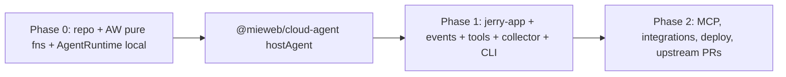
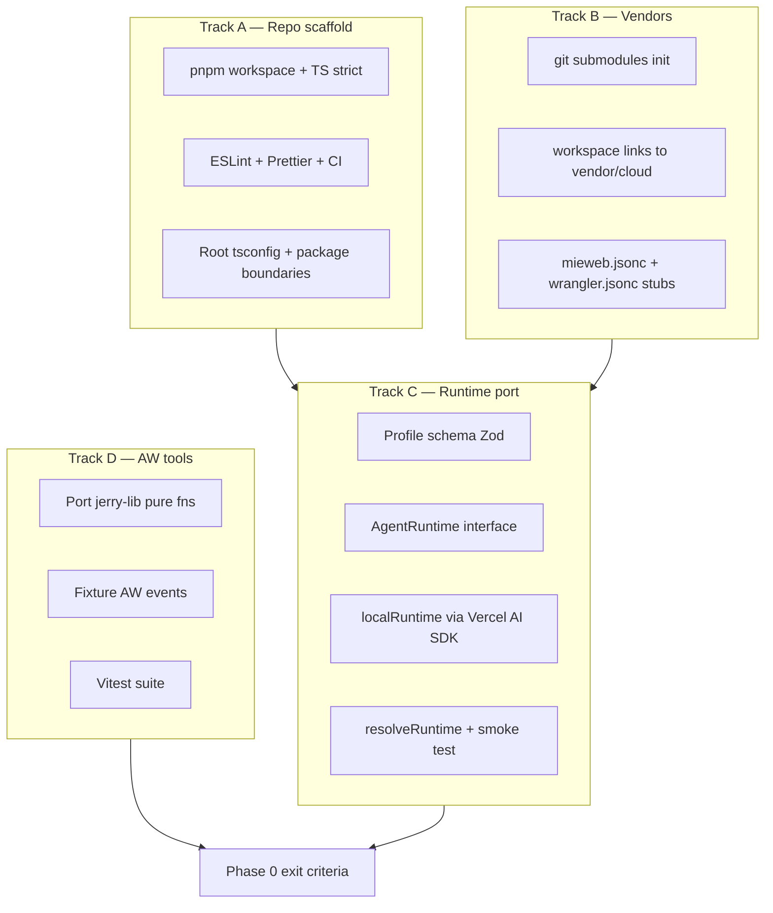

# Plan analysis request
_Exported on 6/30/2026 at 17:05:47 EDT from Cursor (3.9.16)_

---

**User**

@plan.md analyze the plan for me 

---

**Cursor**

I'll read `plan.md` and analyze its structure, goals, and feasibility.


Checking the README and repo state to compare the plan with what's already in place.


# Analysis of `plan.md`

`plan.md` is a **senior-engineer architecture document** for Jerry: not a task list, but a design rationale for an event-driven, portable agent that turns activity signals into a defensible “value narrative.” The repo today is mostly planning (`plan.md`, `README.md`, template scaffolding) — **no packages, submodules, or worker code yet**.

---

## What the plan is optimizing for

Three goals are woven together and kept in tension on purpose:

| Goal | How the plan achieves it |
|------|--------------------------|
| **Product** | Jerry interprets contribution (themes, obstacles, impact), not raw activity logs |
| **Privacy** | Default `local` runtime + explicit egress profiles; tools and data stay on Jerry’s side of the `AgentRuntime` port |
| **Portability** | Same code on laptop (`local`), self-hosted (`mieweb`), and Cloudflare — enforced by a shared test suite |

The central bet: **don’t build a custom agent runtime or event shell.** Reuse Cloudflare Worker + Durable Object semantics via `@mieweb/cloud`, and treat Ozwell as one optional backend behind a thin `AgentRuntime` port.

---

## Architectural spine (the load-bearing ideas)

### 1. Worker model = agent model

The mapping in §2 is the document’s strongest idea:

- **Durable Object** → one agent session (serialized turns, durable state, alarms)
- **`fetch` / `queue` / `scheduled`** → CLI, async messages, cron/self-wake
- **`CloudDatabase` / `CloudVectorIndex`** → events, summaries, semantic memory

That gives suspend/resume and “wake me in 1 hour” without a background daemon — if suspension is **persisted state**, not in-memory promises (§7, §15).

### 2. Clean separation: runtime vs host vs agent

```text
Agent definition (Jerry: instructions + tools)
        ↓
AgentRuntime port (local / byo-cloud / ozwell)  ← conversation/turn loop
        ↓
@mieweb/cloud-agent host (hostAgent)              ← wake/sleep/alarms/queue
        ↓
@mieweb/cloud substrate (DO, D1, queues)
```

This is the right cut:
- **L1** (loop, MCP, streaming): buy (Vercel AI SDK or Ozwell), don’t reinvent
- **L2** (event lifecycle): build thin, upstream to `@mieweb/cloud`
- **L3** (AW, footnote, files): Jerry-specific
- **L4–L5**: buy contracts from `@mieweb/cloud`

### 3. Collector sidecar (§11)

Local disk, screenshots, and `localhost:5600` (ActivityWatch) stay **out** of the portable worker. A sidecar pushes events over the same `fetch`/`queue` API as CLI and mobile. That preserves portability without pretending a Cloudflare worker can read your filesystem.

### 4. Privacy as architecture, not settings (§4)

The profile model (`runtime`, `model`, `egress`, per-tool `local`/`ask`/`allow`) is well thought out:
- Model egress and tool egress are **independent**
- `--debug` and `--dry-run` make paths auditable
- Sensitive data plane doesn’t move when you swap runtimes — only the model endpoint does

---

## Strengths

1. **Clear build-vs-buy line** — avoids the tar pit of hand-rolling tool-calling, MCP, and HITL approvals while still allowing runtime swap.

2. **§7 (event model)** — explicitly warns about the naive failure mode (blocking threads, duplicate transcripts, non-persisted suspension). The state diagram and “two stores, one timeline” (runtime owns conversation; Jerry owns lifecycle event log) are the right mental model.

3. **DuckDB reversal (§10)** — pragmatic. Analytical rollups via portable SQL keeps the Cloudflare/mobile story intact.

4. **Executable portability invariant (§12)** — “same tests on `local` and `mieweb`” is a concrete gate, not a slogan.

5. **Phasing (§13)** — Phase 0 front-loads deterministic AW pure functions (testable without LLM/DO). Phase 1 correctly blocks on `@mieweb/cloud-agent`.

6. **CLI design (§8)** — message-first + busybox multicall (`jerry` / `lisa` / `ozwell` as bin names) is simple and extensible. `-txt`/`--put` for fire-and-forget is a useful distinction from `--call`.

---

## Tensions and risks

### 1. Critical path is external: `@mieweb/cloud-agent`

Phase 1 item 1 **blocks 2–6**. Until `hostAgent` exists in `vendor/cloud` (branch → PR), Jerry can’t prove its core event/suspend story. Submodule co-evolution (§9) is sound strategically but **operationally heavy** — pin drift is called out in §15 for good reason.

**Risk level: High** — this is the gating dependency.

### 2. Two conversation stores on `ozwell` path

On `ozwell`, Ozwell owns message history; Jerry owns a parallel event log. The plan says “don’t duplicate the transcript” but also “key back into the runtime’s conversation.” That join semantics (IDs, consistency on resume, what happens if Ozwell and local event log diverge) is **underspecified** and will matter in production.

### 3. `AgentRuntime` port may be too thin

`runTurn(input): AsyncIterable<Event>` is a sketch. Real gaps:
- How tool approval (`waiting_for_approval`) surfaces through the runtime vs host
- Streaming back to CLI on `--call`
- MCP server lifecycle
- Error/retry boundaries between host and runtime

The port will grow; that’s fine, but “thin” may become “leaky” unless bounded early.

### 4. Skills vs tools (§5)

Skills as on-demand bundles are the right answer to tool bloat (§15), but there’s no schema for **when** the host attaches/detaches skills per trigger. Without that, Phase 1 may ship with a flat tool list and degrade model selection.

### 5. Submodule + pnpm + three vendor repos

`vendor/cloud`, `vendor/footnote`, `vendor/ozwellai-api` plus eventual npm publish is a **two-step dependency story**. New contributors need clear docs on clone/init/pin workflow (not in plan.md; worth adding when implementation starts).

### 6. README vs `plan.md` — product drift

`README.md` still frames Jerry as **“an Ozwell agent”** with a **Fastify ingestion service** and a **Daily Context Document** pipeline. `plan.md` reframes Jerry as:
- Ozwell-**optional**
- Event-driven worker (not a separate ingestion API)
- CLI-first, no UI required

The README’s phased MVP (TimeHarbor + AW + Pulse → JSON doc → Ozwell) is **product-aligned** but **architecturally superseded** by `plan.md`. Anyone reading only the README will misunderstand the build target.

### 7. TimeHarbor, Pulse, integrations — deferred

`plan.md` vision mentions TimeHarbor, Pulse, Drive, YouTube; Phase 0–1 focus is **AW + footnote + collector**. That’s reasonable for MVP, but the “value advocate” story in the README depends heavily on **declared intent** (TimeHarbor) and **artifacts** (Pulse). AW-only Jerry risks feeling like a smarter activity summarizer until Phase 2 integrations land.

### 8. Acceptance criteria vs Phase 1 scope

§14 walkthrough includes footnote search from collector-pushed screenshots and scheduled digests. Phase 1 lists those, but **footnote ingest + vector search + collector + DO alarms** in one phase is ambitious. The walkthrough is a good north star; it may be **Phase 1.5** unless scope is trimmed.

---

## Phase map (critical path)



| Phase | Delivers | Depends on |
|-------|----------|------------|
| **0** | Workspace, profiles, AW aggregation libs, local Ollama loop | Submodules, `@mieweb/cloud` local harness |
| **1** | End-to-end: `jerry summarize…`, suspend/resume, collector, portability tests | **`hostAgent` in cloud submodule** |
| **2** | Reach: MCP, Drive/YouTube, digests, Cloudflare deploy | Stable Phase 1 + upstream merge |

---

## Gaps the plan leaves open (intentionally or not)

1. **Session key strategy** — per user? per conversation? per machine? Affects DO addressing and multi-device resume (§7 says “any client” but not how sessions are named).

2. **Auth** — webhooks, remote `mieweb` target, mobile: no mention of tokens or session binding.

3. **Ozwell agent ID mapping** — `jerry` vs `ozwell` bin names vs Ozwell `agentId`; Lisa is mentioned as future config, not specified.

4. **Testing strategy** — portability invariant is stated; no detail on mock model, fixture AW data, or DO harness testing without Cloudflare.

5. **Migration** — retiring old Deno CLI (`jerry ask` / `report`) is noted; no bridge for existing users.

---

## Verdict

**`plan.md` is a strong, opinionated architecture** — not a generic “LLM app” plan. It makes hard choices correctly:

- Platform reuse over greenfield runtime
- Privacy as structural boundaries
- Local I/O quarantined in a sidecar
- Suspension as durable state

**Biggest execution risks:** (1) `cloud-agent` upstream work, (2) submodule discipline, (3) reconciling README product story with Ozwell-optional worker architecture, (4) Phase 1 scope vs §14 acceptance bar.

**Recommended next moves** (if you’re moving from plan to build):

1. Align or split README vs `plan.md` so contributors have one source of truth.
2. Initialize Phase 0 (pnpm workspace, submodules, AW pure functions) — can proceed **in parallel** with `cloud-agent` design.
3. Nail `AgentRuntime` + `hostAgent` interfaces with a **single** suspend/resume integration test before building all tools.
4. Treat §14 steps 1–2 as **MVP**; steps 3–4 as stretch for first shippable slice.

If you want, I can go deeper on any section — e.g. a concrete `AgentRuntime`/`hostAgent` API sketch, a trimmed Phase 1 scope, or a README rewrite outline aligned with this plan.

---

**User**

@plan.md I need to prepare for Phase 0 of the plan 
how do you want to proceed? 

---

**Cursor**

Reviewing Phase 0 requirements and the repo state to recommend a concrete preparation path.


Here’s how I’d proceed for **Phase 0**, given where the repo is today (plan + README only) and what the plan actually asks for.

---

## What Phase 0 is (and isn’t)

Phase 0 is **foundations only** — no worker, no `hostAgent`, no collector, no full `jerry` CLI UX. You’re building:

1. Monorepo skeleton (pnpm, strict TS, lint/CI)
2. Vendor submodules wired in
3. `AgentRuntime` port + `local` (Ollama) backend + privacy profiles
4. Config stubs (`mieweb.jsonc`, `wrangler.jsonc`)
5. **Deterministic AW pure functions** in `packages/tools`, fully unit-tested

Phase 1 starts when `@mieweb/cloud-agent` exists. Phase 0 should **not** wait on that.

---

## Decisions to lock before writing code

Answer these once; they unblock everything else:

| Decision | Plan says | Recommendation for Phase 0 |
|----------|-----------|----------------------------|
| Package manager | pnpm workspaces | **pnpm** — follow the plan |
| Node version | not specified | Pin **Node 22 LTS** in `.nvmrc` / `engines` |
| Runtime for dev scripts | collector “Bun or Node” later | **Node** for Phase 0 (matches `@mieweb/cloud` harness); Bun can wait for collector |
| Ollama | default `ollama:qwen2.5` | Install locally; document required model for CI (mock in unit tests) |
| Submodule access | `mieweb/cloud`, `footnote`, `ozwellai-api` | Confirm you can clone all three **before** day 1 |
| Prior AW code | `docs/chat0.md` references `@sarkarshubhdeep/jerry-lib` | **Port/adapt** those functions — don’t rewrite from scratch |

Also align README with `plan.md` mentally: product story stays in README; **build target is `plan.md`**.

---

## Recommended workstreams (parallel)



**Track A** and **Track B** can start immediately. **Track D** is fully independent (best early win). **Track C** needs A + enough of B to reference `@mieweb/cloud` types if you want profile resolution tied to targets.

---

## Suggested Phase 0 package layout

The plan’s full layout includes `jerry-app`, `collector`, `cli` — those are Phase 1. For Phase 0, create **stubs or only what you need**:

```
packages/
  runtime/          # AgentRuntime port, resolveRuntime, local/byo-cloud backends
  profile/          # optional: privacy profile schema + loader (or merge into runtime)
  tools/            # AW pure functions only (no HTTP client yet, or thin client behind interface)
```

Defer empty shells for `jerry-app`, `collector`, `cli` until Phase 1 unless you want folder placeholders for CI.

---

## Step-by-step order

### Week 0 — Pre-flight (you, not code)

1. **Access check**: clone `mieweb/cloud`, `mieweb/melvil-artipod-footnote`, `mieweb/ozwellai-api` locally.
2. **Read `vendor/cloud`**: how does the local harness work? What does `mieweb.jsonc` look like in other repos?
3. **Locate jerry-lib**: get the AW aggregation source (`buildActivitySummary`, `pickBucket`, etc.) for porting.
4. **Ollama**: `ollama pull qwen2.5` (or whatever model you standardize on).

### Step 1 — Monorepo scaffold (Track A)

- Root `package.json` with `pnpm-workspace.yaml` (`packages/*`, optionally `vendor/cloud/packages/*` depending on how cloud is structured)
- Shared `tsconfig.base.json` — `strict: true`, `noUncheckedIndexedAccess` if you want extra safety
- ESLint + Prettier aligned with mieweb template conventions
- GitHub Actions: `pnpm install` → `lint` → `typecheck` → `test` on PR
- Keep existing `plan.md` / `README.md`; add a short `CONTRIBUTING.md` only if the team needs submodule init docs

### Step 2 — Submodules (Track B)

```bash
git submodule add <cloud-url> vendor/cloud
git submodule add <footnote-url> vendor/footnote
git submodule add <ozwellai-api-url> vendor/ozwellai-api
```

- Document `git submodule update --init --recursive` in README or CONTRIBUTING
- Wire pnpm to consume `@mieweb/cloud` from `vendor/cloud` (workspace protocol or `file:` — match how other mieweb repos do it)
- Add minimal root `mieweb.jsonc` (target: `local`) and `wrangler.jsonc` (stub for Phase 1 deploy)

### Step 3 — Privacy profiles (Track C, part 1)

Implement the §4 shape as Zod + loader:

```jsonc
{
  "runtime": "local",
  "model": "ollama:qwen2.5",
  "egress": "deny",
  "tools": { "aw": "local", "footnote": "local", "drive": "ask", "youtube": "ask" }
}
```

- Default profile = fully local / deny
- `resolveRuntime(profile)` returns the right backend (Phase 0: implement `local` only; stub `byo-cloud` and `ozwell` with `throw new Error('not implemented')` or typed placeholders)
- Unit tests: profile parsing, defaults, invalid combinations

### Step 4 — `AgentRuntime` port (Track C, part 2)

From §5 sketch:

```ts
interface AgentRuntime {
  runTurn(input): AsyncIterable<Event>
}
```

Phase 0 scope:

- Define `TurnInput`, `RuntimeEvent` (text delta, tool-call, done, error) — keep minimal
- `localRuntime(modelConfig)` → Vercel AI SDK loop over Ollama (OpenAI-compatible URL `http://127.0.0.1:11434/v1`)
- **Smoke test** (manual or integration): one turn with no tools → streamed reply
- Optional: `byo-cloud` if trivial (same loop, different base URL + key)

Do **not** build suspend/resume, queue, or DO wiring in Phase 0 — that’s `hostAgent` in Phase 1.

### Step 5 — AW pure functions (Track D)

Port into `packages/tools` with **zero I/O**:

| Function | Role |
|----------|------|
| `pickBucket` | Choose AW bucket from available buckets |
| `resolveActivityRange` | Parse “last 2 hours” from natural language |
| `resolveRangeHours` | Numeric range helper |
| `buildActivitySummary` | Core aggregation |
| `formatActivityContext` | LLM-ready context string |
| `isWorkRelatedUrl` | Heuristic filter |
| `aggregateMeetingSessions` | Meeting clusters |
| `aggregateTopActivities` / `aggregateTopWebLinks` | Top-N rollups |

- Copy logic from jerry-lib; re-type with strict TS; add fixture JSON from real AW exports
- Vitest: deterministic snapshots; no network, no Ollama
- HTTP client for AW stays **out** of Phase 0 (or behind an interface you don’t implement yet)

This is the highest-value, lowest-risk chunk — do it early for morale and CI green.

### Step 6 — Ozwell client (Track C, thin)

Phase 0 says “consume” Ozwell client — interpret as:

- Add dependency on `@mieweb/ozwellai` or types from `vendor/ozwellai-api`
- Define `ozwellRuntime` **interface stub** that satisfies `AgentRuntime` but isn’t wired to production
- Ensures the port doesn’t bake in local-only assumptions

Full Ozwell path is Phase 1+.

---

## Phase 0 exit criteria (definition of done)

You’re ready for Phase 1 when:

- [ ] `pnpm install && pnpm lint && pnpm typecheck && pnpm test` passes in CI
- [ ] Submodules init cleanly on a fresh clone
- [ ] `resolveRuntime({ runtime: 'local', ... })` runs one turn against Ollama (local dev smoke test)
- [ ] Privacy profile defaults to `local` + `egress: deny`
- [ ] All listed AW pure functions exist with **full unit test coverage** on fixtures
- [ ] `mieweb.jsonc` + `wrangler.jsonc` exist at repo root (even if minimal)
- [ ] No Phase 1 scope crept in (no DO, no collector, no `jerry` CLI beyond maybe a dev script)

---

## What I’d explicitly defer

| Tempting | Why wait |
|----------|----------|
| `packages/jerry-app` worker | Blocked on `cloud-agent` |
| Full message-first CLI | Phase 1 item 6 |
| Footnote / vector ingest | Phase 1 tools |
| `byo-cloud` + `ozwell` fully working | Stubs OK in Phase 0 |
| DuckDB | Plan rejected it for portable core |
| TimeHarbor / Pulse | Phase 2 integrations |

---

## How I’d want to proceed with you

**Option A — Scaffold first (if you want structure before logic)**  
Switch to Agent mode and I implement Track A + B (monorepo, submodules, CI), then you review before runtime/tools.

**Option B — AW tools first (if you want fast CI green)**  
Port jerry-lib pure functions + Vitest in `packages/tools`, then wrap the monorepo around them.

**Option C — Runtime first (if Ollama/local privacy is the demo)**  
`AgentRuntime` + profiles + one Ollama smoke script, then AW tools in parallel.

My default recommendation: **B then A then C** — AW functions give immediate tested value; scaffold supports runtime; runtime smoke test proves the privacy story.

---

## Before you start — three questions for you

1. **Do you have clone access** to `mieweb/cloud`, footnote, and ozwellai-api? (Submodule step fails without this.)
2. **Can you point me at jerry-lib** (local path or repo)? That determines port vs rewrite for AW functions.
3. **Phase 0 goal**: internal foundation only, or a **demo** (“local Ollama answers one prompt with AW context formatted from fixtures”)?

Answer those and say whether you want **Option A, B, or C** (or Agent mode to execute). In Ask mode I can only guide; switch to Agent mode when you want the scaffold actually created in the repo.

