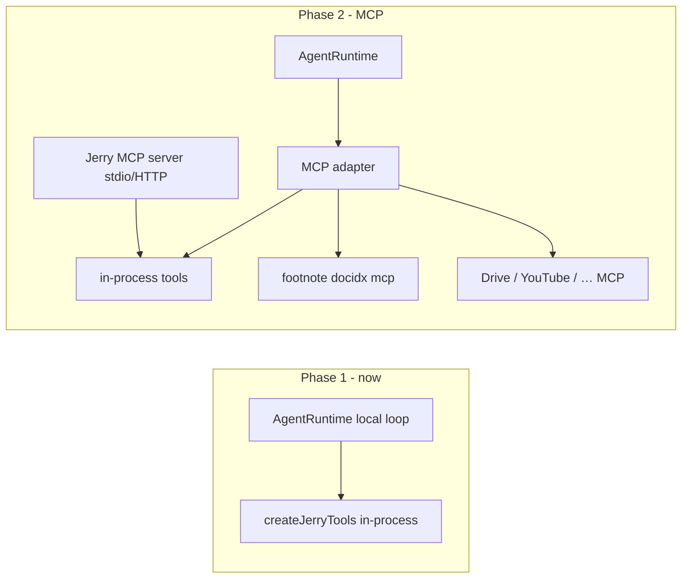

# Phase 2 plan details
_Exported on 6/30/2026 at 19:59:36 EDT from Cursor (3.9.16)_

---

**User**

whats next in phase 2 @plan.md 

---

**Cursor**

I'll read `plan.md` and any phase-2 docs to see what's planned next.


Checking Phase 1 status and any Phase 2 progress in the repo.


Per **`plan.md` §13**, Phase 2 is **“Capture & reach”**. Phase 1 (event host + Jerry MVP) is largely done per `docs/plans/phase-1.md`; Phase 2 is the next engineering phase.

## Phase 2 scope (from `plan.md`)

```510:520:plan.md
### Phase 2 — Capture & reach
- MCP: consume external MCP servers and expose Jerry tools as MCP (footnote ships
  a server already).
- Integrations as tools: Google Drive (read/fetch), YouTube (post/fetch),
  Time Huddle (read/post).
- Webhook event source = native `fetch` handler.
- SQL summary rollups (daily/weekly) + scheduled digests Jerry self-schedules via
  DO alarm; optional DuckDB local-only analytics.
- Deploy to `mieweb/os` (self-hosted) and Cloudflare; mobile thin client.
- Local models: Ollama embeddings (footnote) / CloudAI backend.
- Upstream: land the `@mieweb/cloud-agent` PR; footnote fixes as PRs.
```

## What’s next (suggested order)

`plan.md` doesn’t number these, but Phase 1 deferrals and dependencies suggest this sequence:

| Priority | Work item | Why it’s early |
| --- | --- | --- |
| **1** | **`read_file` / `list_watched`** | Only Phase 1 item still open; collector + footnote search need file/bucket access |
| **2** | **`byo-cloud` + `ozwell` runtimes** | Ozwell conversation mapping is stubbed; unlocks non-local profiles in `mieweb.jsonc` |
| **3** | **MCP (consume + expose)** | Footnote already ships an MCP server; extends the tool surface without bloating the in-process registry |
| **4** | **Webhook `fetch` handler** | Another event source; same worker contract as CLI/collector |
| **5** | **SQL rollups + scheduled digests** | Daily/weekly `GROUP BY` over events; DO alarms for self-scheduled digests (§10) |
| **6** | **Integrations** (Drive, YouTube, Time Huddle) | Network tools with per-tool egress/`ask` approval (§4) |
| **7** | **Deploy** (`mieweb/os`, Cloudflare, mobile client) | Portability is tested locally; production deploy is Phase 2 |
| **8** | **Ollama embeddings** | Local footnote vectors without cloud inference |
| **9** | **Upstream PRs** | Land `@mieweb/cloud-agent` + footnote fixes from submodule branches |

## Immediate next slice

The smallest bridge from Phase 1 → Phase 2 is probably:

1. **`read_file` / `list_watched`** — wired to bucket/collector metadata  
2. **MCP layer** — consume footnote’s existing server; expose Jerry tools outward  
3. **`byo-cloud` / `ozwell`** — complete the three-way `AgentRuntime` split from §1  

## Note: two “Phase 2” meanings

The **README** product roadmap has its own “Phase 2 — Pulse-powered proof of work” (TimeHarbor + Pulse clips). That’s product vision, not the engineering phase in `plan.md`. For build order, use **`plan.md` §13** as canonical.

There’s no `docs/plans/phase-2.md` yet — only Phase 0/1 tracking docs exist. If you want, I can sketch a Phase 2 plan doc structure in Agent mode.

---

**User**

tell me about MCPs to be used here 

---

**Cursor**

Searching the repo and vendor submodules for how MCP is planned and wired.


MCP (Model Context Protocol) in Jerry is a **Phase 2 concern**. Today Jerry uses **in-process AI SDK tools**; MCP is the planned way to plug in external tool servers and expose Jerry’s tools outward.

## Today vs Phase 2

| | **Phase 1 (now)** | **Phase 2 (planned)** |
| --- | --- | --- |
| Tool wiring | Vercel AI SDK `tool()` in `@mieweb/jerry-tools` | Same tools, plus MCP adapters on both sides |
| Footnote/memory | `search_memory` → `CloudVectorIndex` binding in-process | Can also **consume** footnote’s native MCP server |
| ActivityWatch | Collector pushes events → DB → `summarize_activity` | Optional: consume an AW MCP server for live reads |
| Ozwell path | Stubbed for Phase 2 | Ozwell runtime owns loop + MCP natively |

From `plan.md`:

```511:512:plan.md
- MCP: consume external MCP servers and expose Jerry tools as MCP (footnote ships
  a server already).
```

The agent definition is already shaped for both modes:

```203:207:plan.md
const jerry = {
  name: 'jerry',
  instructions: string,          // persona / value-advocate rubric
  tools: Tool[] | McpServer[],   // AW, footnote, files — as tool-calls or MCP
}
```

The `Tool` / `ToolContext` interface is the seam — an MCP adapter wraps in-process tools and external servers without changing the event host.

---

## Two MCP directions

### 1. Consume external MCP servers (Jerry as MCP client)

Jerry’s `AgentRuntime` loop would connect to MCP servers and surface their tools to the model, same as Cursor does.

**Footnote (`vendor/footnote`) — the main one already in-repo**

Runs as **stdio** MCP:

```bash
docidx mcp --db ./.footnote
```

Tools exposed:

- `search_hybrid`, `search_fts`, `search_literal`
- `read_document`, `find_related`, `list_documents`
- `search_grep` (if content was copied at build time)
- `build_index`, `rebuild_index`

Implementation: `@modelcontextprotocol/sdk` in `vendor/footnote/src/cli/mcp.ts`.

Jerry **does not call this MCP server yet**. Phase 1 uses a thinner in-process `search_memory` tool over `VECTORS` (`CloudVectorIndex`). Footnote MCP is richer (hybrid + FTS + literal + grep) and is the natural Phase 2 upgrade path.

**Ozwell (when `runtime: "ozwell"`)**

Ozwell is an agent system with MCP built in:

- Remote: `ws://…/mcp/ws` (Streamable HTTP / WebSocket transport)
- Embeds: inverted MCP over `postMessage` (host page provides tools to iframe agent)

On the Ozwell path, MCP plumbing lives in Ozwell, not Jerry’s local loop.

**Phase 2 integrations (not built yet)**

Google Drive, YouTube, Time Huddle from `plan.md` could ship as:

- In-process `@mieweb/jerry-tools` modules, or
- Separate MCP servers Jerry consumes

Privacy profile already reserves egress slots for network tools:

```25:31:packages/agent-runtime/src/profile.ts
  tools: {
    summarize_activity: "local",
    search_memory: "local",
    schedule_followup: "local",
    drive: "ask",
    youtube: "ask",
  },
```

`ask` = human approval before a network-reaching MCP tool runs (§4 in `plan.md`).

**ActivityWatch MCP (not in Jerry repo)**

You may have **`aw-mcp`** enabled in Cursor (`list_buckets`, `get_events`, `get_snapshot`). Jerry does **not** use that today — AW flows through the **collector sidecar** → `POST /v1/events` → DB → `summarize_activity`. An AW MCP server could be an alternative for live bucket reads in Phase 2, but it’s not part of the current architecture.

---

### 2. Expose Jerry tools as MCP (Jerry as MCP server)

Phase 2 also means Jerry exposes its own tool surface over MCP (likely **stdio** for desktop, **HTTP** when hosted on Cloudflare/`mieweb/os`).

Tools that would be exposed:

| Jerry tool (today) | MCP role |
| --- | --- |
| `summarize_activity` | Activity summaries from collector-pushed data |
| `search_memory` | Semantic search over indexed notes/screenshots |
| `schedule_followup` | DO alarm / self-wake scheduling |
| `read_file` / `list_watched` | Phase 2 — bucket/collector file access |

That lets **Cursor, Claude Desktop, VS Code Copilot**, etc. call Jerry without the `jerry` CLI — Jerry becomes another MCP server in the user’s config, similar to footnote:

```json
{
  "mcpServers": {
    "jerry": {
      "command": "node",
      "args": ["packages/cli/bin/jerry.js", "mcp"]
    }
  }
}
```

(Exact CLI shape is not implemented yet — illustrative.)

---

## How MCP fits the layered architecture



- **L1 (runtime)**: loop + tool dispatch — Vercel AI SDK locally; Ozwell handles MCP on managed path
- **L2 (event host)**: `@mieweb/cloud-agent` — does **not** implement MCP; only wake/sleep/queue
- **L3 (tools)**: Jerry-specific — in-process now, MCP-wrapped in Phase 2

---

## Transports you’ll see

| Transport | Used by | When |
| --- | --- | --- |
| **stdio** | footnote `docidx mcp`, future Jerry desktop MCP | Local sidecars, IDE integration |
| **Streamable HTTP / WebSocket** | Ozwell `mcp/ws` | Hosted / remote agent |
| **postMessage** | Ozwell embed widget | Browser host ↔ iframe agent |

---

## Practical takeaway

1. **No MCP in Jerry code yet** — only in-process tools in `packages/tools/src/runtime/`.
2. **Footnote is the first MCP to wire up** — already implemented in `vendor/footnote`; Jerry can consume it instead of (or alongside) the thin `search_memory` wrapper.
3. **Jerry-as-MCP-server** is Phase 2 — exposes AW/memory/scheduler to other clients.
4. **Ozwell runtime** delegates MCP to Ozwell; Jerry’s portable core stays the same.
5. **Egress policy** applies to MCP tools the same as in-process tools — `local` / `ask` / `allow` per tool name.

If you want to go deeper on one slice — e.g. “replace `search_memory` with footnote MCP” vs “expose Jerry as stdio MCP” — say which direction and we can sketch the integration steps (still Ask mode: guidance only).

