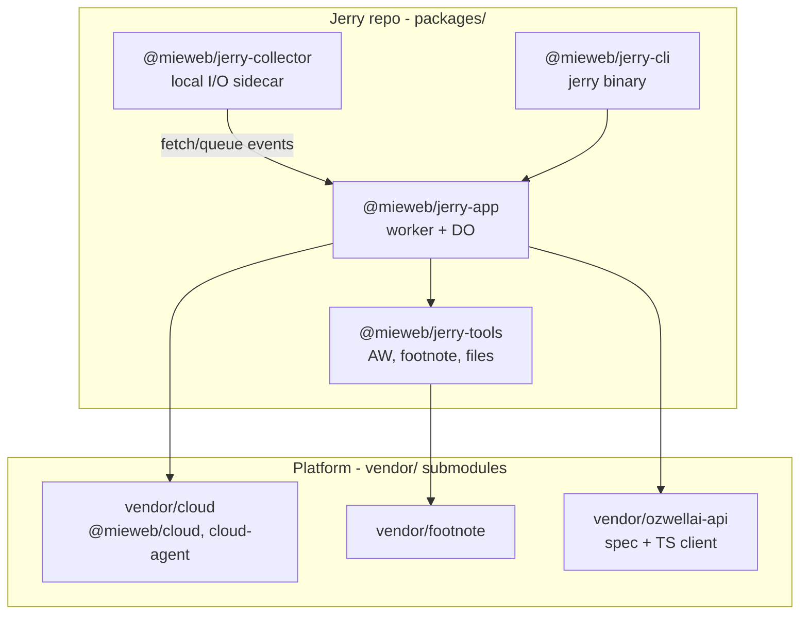

# Branch naming and strategy
_Exported on 6/30/2026 at 17:07:17 EDT from Cursor (3.9.16)_

---

**User**

how do we name the branches from here? 
what's the developement strategy that I should follow? 

I want to focus on clean dev AI prompting, documentation (readme, save plans for phases and features, locally in docs/plans), and safe commit, pushes, PR to github

Also give me step-by-step simple procedure for phase 0 foundation

---

**Cursor**

Reviewing your plan and repo conventions so I can recommend branch naming, workflow, and a Phase 0 procedure.


Here’s a practical workflow aligned with your repo today (`plan.md`, `.github/copilot-instructions.md`, and the early `mieweb/jerry` state on `main`).

---

## Branch naming

There’s no written branch policy in the repo yet. Existing remotes use Copilot-style names (`copilot/m1-completion`). Your **engineering plan** (`plan.md` §9, §13) implies a clearer scheme:

### Jerry repo (`mieweb/jerry`)

| Branch pattern | When to use |
|---|---|
| `main` | Always merge target; should stay green on CI |
| `phase-0/<short-slug>` | Phase 0 work (recommended while you’re in foundations) |
| `phase-1/<short-slug>` | Phase 1 slices (event host, CLI, etc.) |
| `docs/<topic>` | README, `docs/plans/`, architecture notes only |
| `chore/<topic>` | CI, lint, tooling, no product behavior |

**Slug rules:** lowercase, hyphenated, scoped to one PR-sized outcome.

Examples for Phase 0:
- `phase-0/workspace-scaffold`
- `phase-0/submodules`
- `phase-0/agent-runtime-port`
- `phase-0/privacy-profile`
- `phase-0/aw-pure-functions`

### Submodule repos (`vendor/cloud`, etc.)

Per `plan.md` §9, platform work happens **in the submodule repo**, not only in Jerry:

| Repo | Branch pattern | Example |
|---|---|---|
| `mieweb/cloud` | `feat/cloud-agent-<slug>` | `feat/cloud-agent-host-skeleton` |
| `mieweb/melvil-artipod-footnote` | `fix/<slug>` or `feat/<slug>` | `fix/vector-index-compat` |

Jerry then pins the submodule to that branch/commit until the upstream PR merges.

### What to avoid

- Long-lived `dev` / `develop` branches (you’re phase-based, not release-train)
- One giant `phase-0` branch for everything (hard to review, hard to revert)
- Mixing Jerry + submodule changes in one PR when they can be split

```mermaid
gitgraph
    commit id: "main"
    branch phase-0/workspace-scaffold
    checkout phase-0/workspace-scaffold
    commit id: "pnpm + TS"
    checkout main
    merge phase-0/workspace-scaffold
    branch phase-0/aw-pure-functions
    checkout phase-0/aw-pure-functions
    commit id: "AW tools"
    checkout main
    merge phase-0/aw-pure-functions
```

---

## Development strategy (your focus areas)

### 1. One phase, many small PRs

`plan.md` Phase 0 is one **milestone**, not one branch. Split into PR-sized slices (see procedure below). Each PR should:

- Do one thing completely
- Pass lint + tests locally before push
- Update the relevant plan doc when scope or decisions change

This matches `.github/copilot-instructions.md`: smallest viable change, fewest files, no sweeping edits.

### 2. Documentation layout (recommended)

| File | Role |
|---|---|
| `plan.md` | Canonical architecture + **why** (keep at repo root; already there) |
| `README.md` | Product story + quick start (user-facing) |
| `docs/plans/phase-0.md` | Checklist, decisions, “done when”, links to PRs |
| `docs/plans/phase-1.md` | Same for next phase |
| `docs/decisions/NNNN-<topic>.md` | Optional ADRs for non-obvious choices |

**Rule:** `plan.md` = stable architecture. `docs/plans/` = living execution log (checkboxes, PR links, blockers). Don’t duplicate long architecture prose in both.

### 3. Clean AI prompting (Cursor / Copilot)

Start each session with a **scoped prompt** tied to branch + plan slice:

```text
Context: mieweb/jerry, branch phase-0/workspace-scaffold
Plan: docs/plans/phase-0.md → slice "pnpm workspaces"
Constraints:
- Smallest viable change; match plan.md §6 layout
- No Phase 1 code (no DO host, no collector)
- Strict TS, script-first CI
Deliverable: pnpm-workspace.yaml, root package.json, packages/tools skeleton
Do not: refactor unrelated files, add features beyond this slice
```

After the agent finishes, verify: `pnpm install`, `pnpm lint`, `pnpm test` (once those exist).

`.github/copilot-instructions.md` is already your **agent contract** — reference it in prompts (“follow copilot-instructions: minimal PR, KISS, script-first CI”).

### 4. Safe git / PR workflow

**Per slice:**

1. `git checkout main && git pull`
2. `git checkout -b phase-0/<slug>`
3. Implement one slice; run local checks
4. Commit with conventional style: `feat(phase-0): add pnpm workspace scaffold`
5. `git push -u origin phase-0/<slug>`
6. Open PR → `main` with:
   - **Summary:** what + why (1–3 bullets)
   - **Plan link:** `docs/plans/phase-0.md` checkbox updated
   - **Test plan:** commands you ran
7. Merge only when CI is green; delete branch after merge

**Submodule safety:**

- Submodule pointer updates = explicit commits (`chore: pin vendor/cloud to abc1234`)
- Never commit secrets (`.env` is gitignored; use `.env.example` only)
- If a PR spans Jerry + `mieweb/cloud`, prefer **two PRs**: cloud first, then Jerry pin

**Before every push:** `git status`, `git diff`, confirm no `.env` / keys / local paths.

---

## Phase 0 — step-by-step procedure

From `plan.md` §13 (Phase 0 — Foundations). Order matters: scaffold → deps → ports → config → pure tools.

### Slice 0 — Repo hygiene (can be first PR)

1. Create `docs/plans/phase-0.md` with checkboxes for all slices below
2. Add `docs/decisions/` if you want ADRs
3. Run `apply.sh` if you want template files from `mieweb/template-mieweb-opensource`
4. Branch: `docs/phase-0-plan` or fold into next slice

### Slice 1 — Workspace scaffold

**Branch:** `phase-0/workspace-scaffold`

1. `pnpm-workspace.yaml` + root `package.json`
2. Package layout per `plan.md` §6:
   - `packages/jerry-app/`
   - `packages/tools/`
   - `packages/collector/` (skeleton only)
   - `packages/cli/` (skeleton only)
3. Strict TypeScript (`tsconfig` base + per-package extends)
4. ESLint + Prettier (or org standard)
5. Script-first CI: e.g. `scripts/ci.sh` that runs `lint` + `test`; thin `.github/workflows/ci.yml`
6. **Done when:** `pnpm install` and `pnpm lint` succeed from root

### Slice 2 — Submodules

**Branch:** `phase-0/submodules`

1. `git submodule add` for:
   - `vendor/cloud` → `mieweb/cloud`
   - `vendor/footnote` → `mieweb/melvil-artipod-footnote`
   - `vendor/ozwellai-api` → `mieweb/ozwellai-api`
2. Document init in README: `git submodule update --init --recursive`
3. Wire workspace references if consuming local packages from submodules
4. **Done when:** clean clone + submodule init works; no broken pins

### Slice 3 — `AgentRuntime` port + privacy profile

**Branch:** `phase-0/agent-runtime-port`

1. Define `AgentRuntime` interface (`runTurn` → async iterable events) per `plan.md` §5
2. Implement `resolveRuntime(profile)` for at least `local` (Ollama via Vercel AI SDK)
3. Privacy profile config shape per `plan.md` §4 (`runtime`, `model`, `egress`, `tools`)
4. Default profile: `local` + `egress: deny`
5. Stub `byo-cloud` and `ozwell` if needed (throw “not implemented” or minimal wiring)
6. **Done when:** unit tests can call `resolveRuntime` with a fixture profile and get a local runtime

### Slice 4 — Target config (local default)

**Branch:** `phase-0/target-config`

1. `mieweb.jsonc` — default target `local`
2. `wrangler.jsonc` — Cloudflare target stub (doesn’t need to deploy yet)
3. Hook packages to `@mieweb/cloud` local harness from submodule
4. **Done when:** `mieweb` CLI (or placeholder) reads config without error

### Slice 5 — AW pure functions (highest-value Phase 0 code)

**Branch:** `phase-0/aw-pure-functions`

**Package:** `packages/tools`

Implement deterministic, side-effect-free functions (full unit test coverage):

- `buildActivitySummary`
- `resolveActivityRange`
- `resolveRangeHours`
- `pickBucket`
- `formatActivityContext`
- `isWorkRelatedUrl`
- `aggregateMeetingSessions`
- `aggregateTopActivities` / `aggregateTopWebLinks`

**Done when:** tests pass with fixtures (no live ActivityWatch, no network)

### Slice 6 — Phase 0 closeout

**Branch:** `docs/phase-0-complete` or last PR in a slice

1. Mark all checkboxes in `docs/plans/phase-0.md`
2. README: “Phase 0 status”, how to install, run tests
3. Tag optional: `v0.0.1-phase0` (only if you want milestones)

---

## Phase 0 “done” checklist

| Item | Source |
|---|---|
| pnpm monorepo + strict TS + lint/CI | `plan.md` §13 |
| Submodules pinned | `plan.md` §6, §9 |
| `AgentRuntime` + `local` default + privacy profile | `plan.md` §4–5 |
| `mieweb.jsonc` + `wrangler.jsonc` | `plan.md` §13 |
| AW pure functions + unit tests | `plan.md` §13 |
| **Not** in Phase 0: DO event host, collector, CLI `--call`, Ozwell integration beyond stubs | `plan.md` §13 vs Phase 1 |

---

## Note: two “Phase 0” definitions

`README.md` describes an older product MVP phase (“Minimal Jerry, 1–2 weeks”). **`plan.md` §13 is the engineering Phase 0** for this greenfield repo — foundations before the event-driven agent. Use `plan.md` as source of truth for implementation; treat README Phase 0 as product narrative until you reconcile them in `docs/plans/`.

---

## Suggested first week

| Day | Branch | Outcome |
|---|---|---|
| 1 | `docs/phase-0-plan` + `phase-0/workspace-scaffold` | Plan doc + monorepo skeleton |
| 2 | `phase-0/submodules` | Vendors pinned |
| 3–4 | `phase-0/agent-runtime-port` | Runtime port + local profile |
| 5 | `phase-0/aw-pure-functions` | Tested AW utilities |

If you want, in Agent mode I can draft `docs/plans/phase-0.md` with the full checkbox template and example PR bodies for each slice.

---

**User**

What do you need for phase 0? 

---

**Cursor**

Checking the repo state against Phase 0 requirements in the plan.


Phase 0 is **foundations only** — no working agent, CLI `--call`, collector, or Durable Object host yet. Those are Phase 1.

Right now the repo has planning/docs only (`plan.md`, `README.md`, `docs/chat0.md`). **None of the Phase 0 code exists yet.**

---

## What Phase 0 must produce (from `plan.md` §13)

Five deliverable groups:

### 1. Monorepo + quality bar
- pnpm workspaces
- Strict TypeScript
- Lint + script-first CI (local commands = CI commands)
- Target layout from §6:

```
packages/jerry-app/   (skeleton)
packages/tools/       (real code here)
packages/collector/   (skeleton)
packages/cli/         (skeleton)
vendor/cloud/
vendor/footnote/
vendor/ozwellai-api/
mieweb.jsonc
wrangler.jsonc
```

### 2. Submodule pins
- `vendor/cloud` → `mieweb/cloud`
- `vendor/footnote` → `mieweb/melvil-artipod-footnote`
- `vendor/ozwellai-api` → `mieweb/ozwellai-api`

Phase 0 **consumes** these; it does **not** build `@mieweb/cloud-agent` (that’s Phase 1 in the cloud submodule).

### 3. `AgentRuntime` port + privacy profiles
- `AgentRuntime` interface (`runTurn` → async iterable events)
- `resolveRuntime(profile)` switching on `local | byo-cloud | ozwell`
- **`local` backend shipped and working** (Vercel AI SDK → Ollama)
- Privacy profile config per §4:

```jsonc
{
  "runtime": "local",
  "model": "ollama:qwen2.5",
  "egress": "deny",
  "tools": { "aw": "local", "footnote": "local", "drive": "ask", "youtube": "ask" }
}
```

- Wire in Ozwell client + `byo-cloud`/`ozwell` paths (stubs OK if typed and tested)

### 4. Target config
- `mieweb.jsonc` — default target `local`
- `wrangler.jsonc` — Cloudflare stub
- Enough wiring that the `mieweb` CLI harness from `@mieweb/cloud` can read config (full deploy not required)

### 5. AW pure functions (the main product code in Phase 0)
In `packages/tools`, deterministic, side-effect-free, **fully unit-tested**:

| Function | Role |
|---|---|
| `buildActivitySummary` | Core AW rollup |
| `resolveActivityRange` | Parse “last 2 hours” etc. from text |
| `resolveRangeHours` | Time window math |
| `pickBucket` | Choose the right AW bucket |
| `formatActivityContext` | Format for agent context |
| `isWorkRelatedUrl` | Heuristic filter |
| `aggregateMeetingSessions` | Meeting clusters |
| `aggregateTopActivities` | Top apps/activities |
| `aggregateTopWebLinks` | Top URLs |

Tests use **fixtures**, not live ActivityWatch.

---

## What you need on your machine / org

| Prerequisite | Why |
|---|---|
| **Node 20+** and **pnpm** | Monorepo toolchain |
| **Git access** to `mieweb/cloud`, `mieweb/melvil-artipod-footnote`, `mieweb/ozwellai-api` | Submodules |
| **Ollama** + a model (e.g. `qwen2.5`) | Manual check of `local` runtime |
| **GitHub push access** to `mieweb/jerry` | PR workflow |
| Optional: **ActivityWatch** running locally | Only for manual sanity checks; not for unit tests |

No Cloudflare account required for Phase 0. No Ozwell API key required if `ozwell` is stubbed.

---

## What I’d need from you to execute Phase 0 well

If you’re asking what to give an AI agent (or yourself) before starting:

1. **Which slice first** — e.g. `phase-0/workspace-scaffold` vs all at once (prefer one slice per PR).
2. **Submodule access confirmed** — can you clone those three `mieweb/*` repos?
3. **Reference for AW functions** — `docs/chat0.md` points at old `@sarkarshubhdeep/jerry-lib` / `jerry-client`. Either:
   - grant access to that code as a porting reference, or
   - say “implement fresh from plan + AW API docs”
4. **Default Ollama model name** — plan uses `ollama:qwen2.5`; confirm or pick another.
5. **Org conventions** — ESLint/Prettier/CI patterns from another `mieweb/*` repo to copy, or greenfield.
6. **`docs/plans/phase-0.md`** — living checklist (you asked for this layout earlier; it doesn’t exist yet).

---

## Explicitly **not** Phase 0

These are Phase 1+ — don’t build them yet:

- `hostAgent` / Durable Object event shell
- `packages/jerry-app` worker (`fetch`/`queue`/`scheduled`)
- Collector sidecar
- CLI `--call` / `-txt` message flow
- Footnote vector ingest/search
- Suspend/resume, event log, summaries
- Portability tests on `mieweb` docker target

---

## Phase 0 “done” in one sentence

You can `pnpm install`, `pnpm lint`, `pnpm test` from root; submodules init cleanly; `resolveRuntime({ runtime: "local", egress: "deny", ... })` talks to Ollama; config files exist; and all AW pure functions pass fixture-based unit tests.

---

## Suggested build order

1. Workspace scaffold + CI  
2. Submodules  
3. `AgentRuntime` + privacy profile + local Ollama  
4. `mieweb.jsonc` / `wrangler.jsonc`  
5. AW pure functions + tests  

If you want to start immediately, the only hard blocker is **read access to the three vendor repos** and a decision on whether to **port AW logic from jerry-lib** or rewrite it. Everything else can proceed from `plan.md` alone.

---

**User**

plan phase-0/workspace-scaffold let's work on one slice at a time 

---

**Cursor**

Researching the repo and mieweb conventions to draft a focused plan for the workspace-scaffold slice.


Aligning the scaffold with `mieweb/cloud` conventions and scoping it to monorepo tooling only—no submodules or runtime code.


**Workspace scaffold preferences**

> **Which test runner should the scaffold use? (All packages need a passing `test` script for CI.)**
> - Node built-in test runner (`node --test` + tsx) — minimal deps, matches mieweb/cloud style ✔
> - Vitest — faster DX, common in TS monorepos

> **mieweb/cloud CI runs typecheck + test only (no ESLint). plan.md asks for lint. Include ESLint in this slice?**
> - Yes — add ESLint flat config + `pnpm lint` in CI ✔
> - No — typecheck + test only for now; add lint in a later slice

---

**User**

tell me about the @phase_0_workspace_scaffold_369da314.plan.md (57-58) @phase_0_workspace_scaffold_369da314.plan.md (62-63) @phase_0_workspace_scaffold_369da314.plan.md (65-67) @phase_0_workspace_scaffold_369da314.plan.md (67) 

and where will the mieweb/cloud,  and ozwell packcage will be placed? 

---

**Cursor**

## The four `@mieweb/jerry-*` packages (workspace scaffold)

These are **Jerry-owned** packages under `packages/`. They are members of the pnpm workspace (`packages/*`). In the scaffold slice they are **empty shells** — a placeholder export + one test each — so CI can run before real code lands.

| npm name | Folder | Role (from [plan.md](plan.md) §6) | When it gets real code |
|---|---|---|---|
| **`@mieweb/jerry-app`** | `packages/jerry-app/` | The deployable **worker**: `fetch` / `queue` / `scheduled`, Jerry `AgentSession` Durable Object, agent definition (instructions + tools) | Phase 1 |
| **`@mieweb/jerry-tools`** | `packages/tools/` | Jerry-specific **tools**: AW aggregation, footnote search, file ops, scheduler | Phase 0 (AW pure functions), Phase 1 (wired as runtime tools) |
| **`@mieweb/jerry-collector`** | `packages/collector/` | **Local sidecar** only: watches folders, polls ActivityWatch, pushes events into Jerry | Phase 1 |
| **`@mieweb/jerry-cli`** | `packages/cli/` | **Message-first CLI** (`jerry <words…>`, flags); thin wrapper over `@mieweb/cloud-agent-cli` | Phase 1 |

Think of the layout as:



**`jerry-app`** is the anchor. **`tools`** is portable core logic. **`collector`** is host-specific (disk, localhost AW). **`cli`** is the user-facing entry point.

---

## Where `@mieweb/cloud` and Ozwell go

They do **not** live under `packages/`. Per [plan.md](plan.md) §6 and §9, platform repos are **git submodules under `vendor/`**:

```
jerry/
  vendor/
    cloud/              ← submodule: github.com/mieweb/cloud
    footnote/           ← submodule: github.com/mieweb/melvil-artipod-footnote
    ozwellai-api/       ← submodule: github.com/mieweb/ozwellai-api
  packages/
    jerry-app/
    tools/
    collector/
    cli/
```

### `@mieweb/cloud`

- **Physical location:** `vendor/cloud/`
- **What’s inside:** its own monorepo (`vendor/cloud/packages/cloud`, `cloud-types`, `cloud-workers`, `cli`, etc.)
- **How Jerry uses it:** Jerry packages depend on published/workspace paths into the submodule, e.g. `@mieweb/cloud`, `@mieweb/cloud-types`, and later `@mieweb/cloud-agent` (built on a branch inside `vendor/cloud`, then upstream PR)
- **Not copied into Jerry** — pinned by submodule commit

### Ozwell

Two related pieces:

| Piece | Location | Purpose |
|---|---|---|
| **API spec / contract** | `vendor/ozwellai-api/` | Zod spec, OpenAPI, reference server |
| **TypeScript client** (`ozwellai` / `@mieweb/ozwellai`) | Inside that submodule, typically `vendor/ozwellai-api/clients/typescript/` | HTTP client for the `ozwell` `AgentRuntime` backend |

Ozwell is **optional** at runtime ([plan.md](plan.md) §1): Jerry must work with local Ollama alone. The Ozwell client is wired behind `resolveRuntime(profile)` when `runtime: "ozwell"`.

There is **no** separate `packages/ozwell/` in Jerry — Ozwell stays in its own repo, consumed like cloud.

---

## Workspace scaffold vs submodules slice

The scaffold plan **explicitly excludes** `vendor/`:

- No submodules yet
- No `@mieweb/cloud` dependency wiring
- `pnpm-workspace.yaml` only lists `packages/*`

The **next slice** (`phase-0/submodules`) adds:

1. `git submodule add` for the three `vendor/*` paths  
2. README instructions: `git submodule update --init --recursive`  
3. pnpm workspace links so Jerry packages can import from submodule packages  

---

## Summary

| What | Where | In workspace scaffold? |
|---|---|---|
| `@mieweb/jerry-app` | `packages/jerry-app/` | Yes (stub) |
| `@mieweb/jerry-tools` | `packages/tools/` | Yes (stub) |
| `@mieweb/jerry-collector` | `packages/collector/` | Yes (stub) |
| `@mieweb/jerry-cli` | `packages/cli/` | Yes (stub) |
| `@mieweb/cloud` (+ related) | `vendor/cloud/packages/*` | No — next slice |
| Ozwell spec + client | `vendor/ozwellai-api/` | No — next slice |
| Footnote | `vendor/footnote/` | No — next slice |

**Rule of thumb:** `packages/` = code Jerry writes; `vendor/` = platform repos Jerry pins and imports from, developed upstream with PRs back to `mieweb/cloud`, etc.

---

**User**

Implement the plan as specified, it is attached for your reference. Do NOT edit the plan file itself.

To-do's from the plan have already been created. Do not create them again. Mark them as in_progress as you work, starting with the first one. Don't stop until you have completed all the to-dos.

---

**Cursor**

I'll implement the workspace scaffold plan. Let me start by creating the branch and working through each todo.

Now I'll create the root workspace files. Let me start with the root `package.json`, `pnpm-workspace.yaml`, TypeScript configs, and ESLint config.

Now I'll create the package skeletons. First the packages README, then all four packages.

Now I'll create the CI scripts.

Let me try a different approach for the README update.

Now let me update `.gitignore` to add `.wrangler/`.

Now let me verify the setup by running `pnpm install` and the CI script.

I need to add the `@eslint/js` package. Let me update the package.json.

All tests pass. Let me run the full CI script to verify everything works together.

CI passes. Now let me check the git status and create the commit.

Now let me push the branch and create a PR.

All done. The workspace scaffold is complete.

## Summary

**Branch:** `phase-0/workspace-scaffold`  
**PR:** https://github.com/mieweb/jerry/pull/2

### What was created

| Category | Files |
|----------|-------|
| **Root tooling** | `package.json`, `pnpm-workspace.yaml`, `tsconfig.json`, `tsconfig.base.json`, `eslint.config.js` |
| **Package skeletons** | `packages/jerry-app/`, `packages/tools/`, `packages/collector/`, `packages/cli/` — each with `package.json`, `tsconfig.json`, `README.md`, `src/index.ts`, `src/index.test.ts` |
| **CI** | `scripts/ci.sh`, `.github/workflows/ci.yml` |
| **Docs** | `docs/plans/phase-0.md`, Development section in `README.md` |

### Verification

```
pnpm install       ✓
pnpm typecheck     ✓
pnpm lint          ✓
pnpm test          ✓ (4 tests pass)
bash scripts/ci.sh ✓
```

### Next slice

`phase-0/submodules` — add `vendor/cloud`, `vendor/footnote`, `vendor/ozwellai-api` as git submodules.

