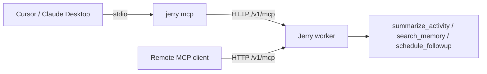

# Jerry as an MCP Server (Slice 3: MCP Expose)

Jerry can expose a subset of its tools over the [Model Context Protocol](https://modelcontextprotocol.io)
so external agents — Cursor, Claude Desktop, or any MCP client — can call them.

This is the inverse of MCP Consume (Slice 2, where Jerry calls footnote): here Jerry
_is_ the server.

## Exposed tools

| Tool                 | Description                                                        |
| -------------------- | ----------------------------------------------------------------- |
| `summarize_activity` | Summarize the user's activity for a natural-language time range.  |
| `search_memory`      | Semantic search over the user's indexed documents / screenshots.  |
| `schedule_followup`  | Schedule a future follow-up (agent-session only — see below).     |

File and index tools (`read_file`, `list_watched`, `index_document`) stay internal
and are not exposed.

## Two transports



- **stdio** (`jerry mcp`): recommended for Cursor / Claude Desktop. The command
  serves MCP over stdin/stdout and forwards tool execution to the running Jerry
  worker's `/v1/mcp` endpoint (which owns the database and vector index).
- **HTTP** (`/v1/mcp`): the worker serves the MCP Streamable HTTP transport
  directly (stateless, JSON responses). Useful for hosted/remote consumers.

Because the worker owns the data bindings, the Jerry worker must be running for
either transport to return results (default `http://127.0.0.1:8787`, override
with `JERRY_URL`).

## Setup: Cursor (stdio)

Add Jerry to your Cursor MCP config (`~/.cursor/mcp.json` or the project
`.cursor/mcp.json`):

```json
{
  "mcpServers": {
    "jerry": {
      "command": "jerry-mcp",
      "env": {
        "JERRY_URL": "http://127.0.0.1:8787"
      }
    }
  }
}
```

If you are running from the monorepo without a global install, point at the bin
directly:

```json
{
  "mcpServers": {
    "jerry": {
      "command": "node",
      "args": ["packages/cli/bin/jerry-mcp.js"],
      "env": { "JERRY_URL": "http://127.0.0.1:8787" }
    }
  }
}
```

`jerry mcp` (via the `jerry` binary) is equivalent to the `jerry-mcp` binary.

## Setup: Claude Desktop (stdio)

In `claude_desktop_config.json`:

```json
{
  "mcpServers": {
    "jerry": {
      "command": "jerry-mcp"
    }
  }
}
```

## Setup: remote / HTTP client

Point a Streamable HTTP MCP client at:

```
http://127.0.0.1:8787/v1/mcp
```

## Verifying

1. Start the worker: `pnpm dev` (listens on `:8787`).
2. From your MCP client, list tools — you should see `summarize_activity`,
   `search_memory`, and `schedule_followup`.
3. Invoke `summarize_activity` with e.g. `{ "range": "last 2 hours" }`.

## Notes and limitations

- **`schedule_followup`** requires an agent session (Durable Object alarm) and
  is not fully functional over the hosted `/v1/mcp` endpoint; it returns a clear
  error there. Use it from a normal Jerry session.
- **`search_memory`** needs the vector index configured and Ollama running for
  query embeddings; otherwise it returns a descriptive error.
- The HTTP endpoint runs in **stateless** mode (fresh server per request), which
  matches the Cloudflare Workers execution model.
