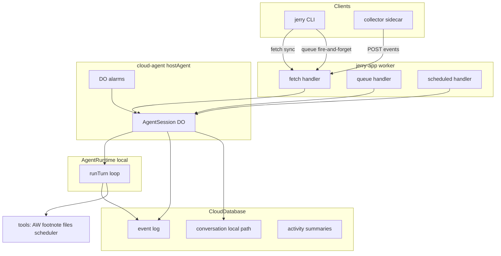
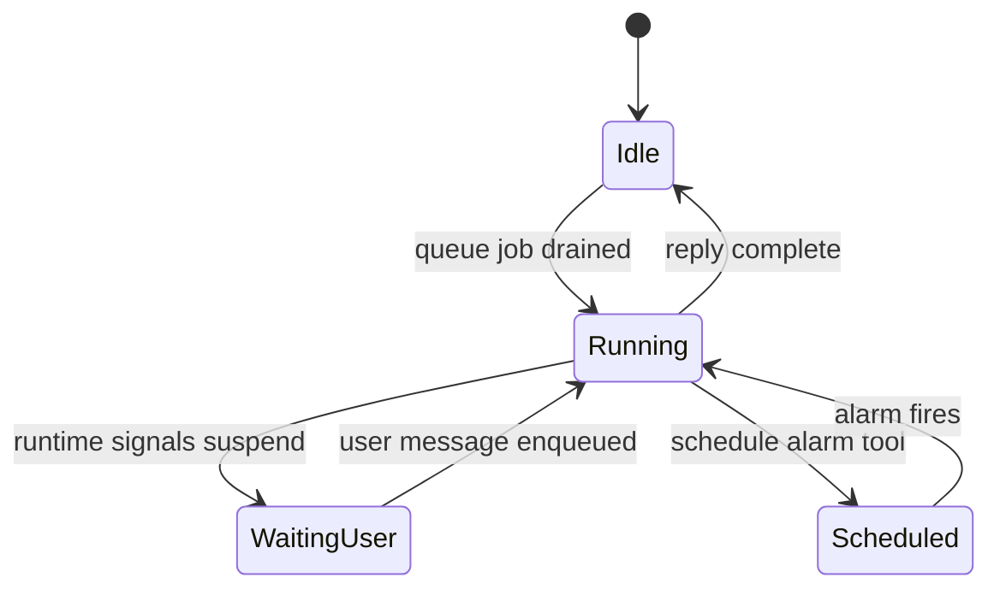
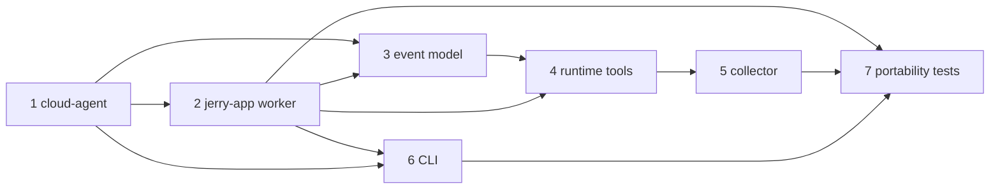

# Phase 1 — Event Host + Jerry MVP

This document tracks Phase 1 implementation progress. See [plan.md §13](../../plan.md) for the canonical architecture definition.

Phase 0 is complete ([phase-0.md](./phase-0.md)): `AgentRuntime` port, `local` backend, AW pure functions, target config. Phase 1 is **greenfield** for the event shell and Jerry integration. Item 1 blocks items 2–6.

## Slices

### cloud-agent-core

Create `@mieweb/cloud-agent` in `vendor/cloud` (branch → upstream PR).

- [x] New package `vendor/cloud/packages/cloud-agent` with `hostAgent()` API
- [x] Session DO — one instance per session key
- [x] Queue-driven turns — event log write → enqueue `TurnJob` → DO drains one at a time
- [x] Turn runner — load messages → `runtime.runTurn()` → persist reply
- [x] Suspend/resume — persist `continuation` in DO storage + DB; no in-memory blocking
- [x] Alarms — `alarm()` handler + `scheduleWake()` for tools
- [x] Conversation mapping — host-owned on `local`/`byo-cloud` (ozwell stub for Phase 2)
- [x] Unit + integration tests via `@mieweb/cloud-local` harness

**Status:** Implemented on `feature/cloud-agent` branch; [upstream PR #1](https://github.com/mieweb/cloud/pull/1) open (pin `ecb8aa7`)

### cloud-agent-cli

Generic message-first CLI dispatcher in `vendor/cloud/packages/cloud-agent-cli`.

- [x] `run({ agent, baseUrl, profile })` — message-first arg parsing
- [x] `--call` (default) — streaming fetch to session route
- [x] `-txt` / `--put` — enqueue via queue, return immediately
- [x] `--help`, `--version`, `--debug`, `--report`, `--config`
- [x] Agent name from `basename(argv[0])` (multicall pattern)

**Status:** Implemented on `feature/cloud-agent` branch; consumed via [upstream PR #1](https://github.com/mieweb/cloud/pull/1)

### jerry-bindings

Extend target config and database schema.

- [x] `wrangler.jsonc` — `SESSION` (DO), `JOBS` (queue), `VECTORS` (vectorize)
- [x] `mieweb.jsonc` — adapter drivers for new bindings (mirror test-app)
- [x] D1 migrations — `packages/jerry-app/migrations/0001_events.sql`

**Status:** Complete

### jerry-worker

Refactor `packages/jerry-app` into the deployable Jerry worker.

- [x] Worker exports `fetch`, `queue`, `scheduled` handlers
- [x] `AgentSession` DO class from `hostAgent()`
- [x] Jerry agent definition — instructions + tools via `resolveRuntime(profile)`
- [x] Routes: `POST /v1/sessions/:id/messages`, `POST /v1/sessions/:id/enqueue`, `POST /v1/events`, `GET /health`
- [x] Package deps: `@mieweb/cloud-agent`, `@mieweb/jerry-agent-runtime`, `@mieweb/jerry-tools`

**Status:** Complete

### event-model

Event log, session state, and summaries on `CloudDatabase`.

- [x] `sessions` table — status, conversation_id, continuation JSON
- [x] `events` table — lifecycle types (`user_message`, `agent_message`, `external`, `waiting_for_user`, `resumed`, …)
- [x] `messages` table — local/byo-cloud conversation store
- [x] `activity_events` table — collector-pushed AW/watcher data
- [x] `summaries` table — AW rollup output from tool runs
- [x] Queue-driven turn integration in host

**Status:** Complete

### runtime-tools

AI SDK tool wrappers in `packages/tools`.

- [x] `summarize_activity` — read `activity_events`, run pure AW functions, write `summaries`
- [x] `search_memory` — footnote via `CloudVectorIndex`
- [ ] `read_file` / `list_watched` — bucket/collector metadata (deferred to Phase 2)
- [x] `schedule_followup` — DO alarm via host `scheduleWake()`
- [x] `createJerryTools(ctx)` export with egress filtering

**Status:** Core tools complete; file tools deferred

### collector

Local sidecar in `packages/collector`.

- [x] AW poller — `localhost:5600` buckets, diff cursor, POST to `/v1/events`
- [x] Folder watcher — configurable watch dir for screenshots/notes
- [x] Config — `JERRY_URL`, watch paths, poll interval
- [x] CLI entry — `jerry-collector` or `pnpm collector dev`

**Status:** Complete

### cli

Message-first Jerry CLI in `packages/cli`.

- [x] `bin/jerry.js` — thin wrapper over `@mieweb/cloud-agent-cli`
- [x] Profile/target resolution — default `local` at `:8787`
- [x] Send `cwd` as context for folder-relative prompts

**Status:** Complete

### portability

Cross-target verification (plan.md §12, §14).

- [x] Integration test harness with mock model (no Ollama required in CI)
- [x] `scripts/test-portability.sh` — run suite on `local` and `mieweb` targets
- [x] Acceptance scenarios: AW summarize, suspend/resume, collector→footnote search, DO alarm (test stubs)
- [x] CI extension — local target in CI; mieweb target documented or scheduled

**Status:** Complete

---

## Current baseline

| Area | Status |
| --- | --- |
| `packages/agent-runtime` | `AgentRuntime`, `resolveRuntime`, `local` backend — ready to inject |
| `packages/tools` | AW pure functions only — no `tool()` wrappers or I/O |
| `packages/jerry-app/worker/index.mjs` | `fetch` only (`/`, `/health`, `/hits`) — no DO/queue |
| `wrangler.jsonc` / `mieweb.jsonc` | D1 + KV only |
| `vendor/cloud` | L4 substrate + `@mieweb/cloud-agent` on `feature/cloud-agent` ([PR #1](https://github.com/mieweb/cloud/pull/1), pin `ecb8aa7`) |
| `packages/cli`, `packages/collector` | Placeholder exports |

Reference worker: `vendor/cloud/packages/test-app/worker/index.mjs` — `fetch`/`queue`/`scheduled` + DO class pattern Jerry should mirror.

---

## Architecture (target end state)



**Turn lifecycle** (from [plan.md §7](../../plan.md)):



---

## Build order and dependencies



---

## Item 1 — `@mieweb/cloud-agent` (vendor/cloud branch → PR)

**Location:** new package `vendor/cloud/packages/cloud-agent` (+ companion `cloud-agent-cli`).

**Branch workflow:** create `feature/cloud-agent` in `vendor/cloud` submodule; pin Jerry to that commit; open upstream PR to `mieweb/cloud` per [plan.md §9](../../plan.md).

**Upstream PR:** [mieweb/cloud#1](https://github.com/mieweb/cloud/pull/1) — `feature/cloud-agent` → `main` (`ecb8aa7`, 2 commits, +2,137 lines). Jerry pin: `vendor/cloud` @ `ecb8aa7` on `development`.

### Core API

Implement `hostAgent()` per [plan.md §5](../../plan.md):

```ts
hostAgent({
  agent: { name, instructions, tools },
  runtime: AgentRuntime,
  store: { db: CloudDatabase, vectors?: CloudVectorIndex },
  triggers: Trigger[],
})
```

Returns: DO class + worker wiring helpers (route dispatch, queue consumer binding).

### Host responsibilities

1. **Session DO** — one DO instance per session key
2. **Queue-driven turns** — inbound event → write to event log → enqueue `TurnJob` → DO drains one job at a time
3. **Turn runner** — load conversation messages → call `runtime.runTurn()` → stream events → persist assistant reply
4. **Suspend/resume** — when runtime yields `waiting_for_user`, persist continuation in DO storage + DB; return without blocking
5. **Alarms** — `alarm()` handler re-enqueues a scheduled turn; expose `scheduleWake(at, payload)` to tools
6. **Conversation mapping** — on `local`/`byo-cloud`: host stores messages in `CloudDatabase`; ozwell delegated in Phase 2

### Expected Env shape

| Binding | Type | Purpose |
| --- | --- | --- |
| `DB` | `CloudDatabase` | Events, sessions, local conversation history |
| `JOBS` | `CloudQueue<TurnJob>` | Async turn queue |
| `SESSION` | `CloudStatefulNamespace` | AgentSession DO |
| `VECTORS` | `CloudVectorIndex` | Footnote |
| `BUCKET` | `CloudBucket` | File ingest (optional Phase 1) |

---

## Item 2 — `packages/jerry-app` worker + agent definition

Update [wrangler.jsonc](../../wrangler.jsonc) and [mieweb.jsonc](../../mieweb.jsonc) to match test-app bindings. Refactor [packages/jerry-app/worker/index.mjs](../../packages/jerry-app/worker/index.mjs) to export `fetch`/`queue`/`scheduled` + `AgentSession` DO.

New `packages/jerry-app/src/agent.ts`:

- **Instructions:** value-advocate persona (MVP rubric from README product framing)
- **Tools:** wired from `@mieweb/jerry-tools`
- **Profile:** default `DEFAULT_PRIVACY_PROFILE`; overridable per request
- **Dispatch:** `resolveRuntime(profile)` per turn

| Route | Handler | CLI mode |
| --- | --- | --- |
| `POST /v1/sessions/:id/messages` | fetch → DO | `--call` |
| `POST /v1/sessions/:id/enqueue` | queue producer | `-txt`/`--put` |
| `GET /health` | health | — |
| `POST /v1/events` | collector push | — |

---

## Item 3 — Event model + summaries

Schema in `packages/jerry-app/migrations/0001_events.sql`:

- **`sessions`** — `id`, `user_id`, `status`, `conversation_id`, `continuation` JSON, timestamps
- **`events`** — lifecycle types per [plan.md §7](../../plan.md)
- **`messages`** — local/byo-cloud conversation store
- **`activity_events`** — collector-pushed raw AW/watcher events
- **`summaries`** — AW rollup output linked to session

MVP summaries: persist `buildActivitySummary()` output when AW tool runs. Daily/weekly SQL rollups deferred to Phase 2.

---

## Item 4 — Runtime tools

Extend [packages/tools](../../packages/tools) with AI SDK `tool()` definitions receiving host-injected context (DB, vectors, scheduleWake, sessionId).

- **`summarize_activity`** — query `activity_events`, reuse pure AW functions, write `summaries`
- **`index_document` / `search_memory`** — footnote via `CloudVectorIndex`
- **`read_file` / `list_watched`** — bucket/collector metadata only
- **`schedule_followup`** — host `scheduleWake()` → DO `setAlarm`

Export `createJerryTools(ctx: ToolContext): ToolSet` from `packages/tools/src/index.ts`.

---

## Item 5 — `packages/collector` sidecar

Host-specific Node/Bun process:

1. **AW poller** — poll `localhost:5600`, POST to `POST /v1/events`
2. **Folder watcher** — watch dir for screenshots/notes
3. **Config** — `JERRY_URL` (default `http://127.0.0.1:8787`), watch paths, poll interval

---

## Item 6 — `packages/cli`

Per [plan.md §8](../../plan.md):

```
packages/cli/
  bin/jerry.js          → run({ agent: 'jerry' })
  src/run.ts            → thin wrapper over @mieweb/cloud-agent-cli
  src/profile.ts        → load privacy profile from config file / env
```

| Flag | Behavior |
| --- | --- |
| (default) | `--call`, stream reply to stdout |
| `-txt` / `--put` | enqueue, exit 0 immediately |
| `--help` / `--version` / `--debug` | meta |
| `--report` / `--config` | stub or minimal MVP (profile dump) |

---

## Item 7 — Portability verification

1. **`scripts/test-portability.sh`** — integration suite on `local` and `mieweb` targets
2. **Mock model path** — reuse agent-runtime mock; no Ollama required in CI
3. **Acceptance scenarios** from [plan.md §14](../../plan.md):
   - `jerry summarize my last 2 hours` → AW tool, summary in thread, reply printed
   - Clarifying question → `waiting_for_user` → later `jerry yes do it` resumes
   - Collector push → footnote index → search cites document
   - DO alarm fires scheduled turn without external trigger

---

## Out of scope (Phase 2)

- `ozwell` and `byo-cloud` runtime backends
- Daily/weekly SQL digest rollups + scheduled digests
- MCP server exposure/consumption
- Cloudflare production deploy
- DuckDB analytics

---

## Risks and mitigations

| Risk | Mitigation |
| --- | --- |
| Submodule branch drift | Pin commit in Jerry; track upstream PR in this file |
| Suspension as in-memory promise | Persist `continuation` in DO storage + DB before returning |
| DO alarm semantics differ by target | Test alarm path on `local` and `mieweb` |
| Tool surface bloat | Register only MVP tools; use egress filtering |
| Footnote/Vectorize gaps on cloudflare local | Use `501 skipped` pattern from test-app |

---

## Done when

- [x] `hostAgent` lands in `vendor/cloud` (branch pinned; [upstream PR #1](https://github.com/mieweb/cloud/pull/1) open)
- `jerry summarize my last 2 hours` (mock model on `local`) completes end-to-end
- Agent question parks at `waiting_for_user`; later reply resumes same session
- Collector push → footnote index → `jerry find …` cites document
- DO alarm fires a scheduled turn with no external trigger
- Same integration suite passes on `local` and `mieweb` targets
