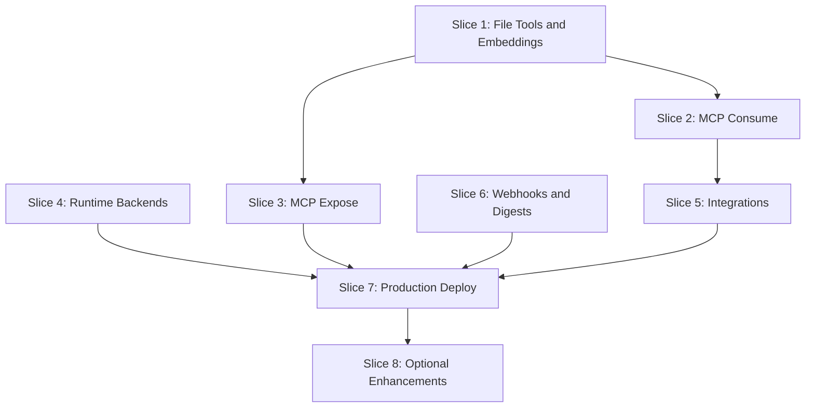
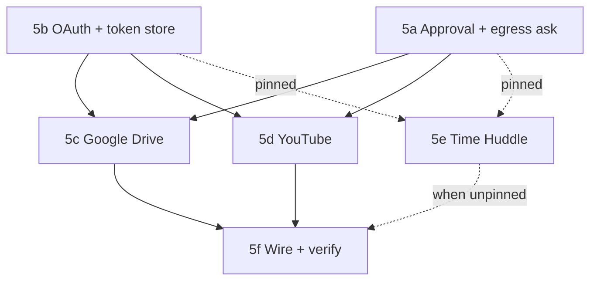

# Phase 2 — Capture and Reach

Phase 2 extends Jerry from a working local MVP to a production-ready system with MCP integration, external service connectors, and multi-target deployment. This plan consolidates all Phase 2 items from [plan.md](../../plan.md) and deferred items from [phase-0.md](./phase-0.md) and [phase-1.md](./phase-1.md).

---

## Deferred Items Consolidated

From **phase-1.md**:

- `read_file` / `list_watched` tools (bucket/collector metadata)
- `ozwell` and `byo-cloud` runtime backends
- Daily/weekly SQL digest rollups + scheduled digests
- MCP server exposure/consumption
- Cloudflare production deploy
- DuckDB analytics

From **plan.md §13**:

- Ollama embeddings (footnote) / CloudAI backend
- Integrations: Google Drive, YouTube, Time Huddle
- Webhook event source
- Mobile thin client
- Upstream: land `@mieweb/cloud-agent` PR

---

## Dependency Graph



---

## Branching Strategy and PR Workflow

**Base branch:** `development` (Phase 1 complete)

**Branch naming:** `phase2/<slice-name>` — each slice gets its own feature branch

**PR workflow:**

1. Create branch from `development` (or dependency branch if needed)
2. Implement slice tasks
3. Run tests and verify acceptance criteria
4. Open PR against `development` with descriptive summary using template below
5. **DO NOT merge without explicit review approval**
6. Tag reviewer and wait for approval before merging

**PR template for each slice:**

```markdown
## Phase 2 Slice [N]: [Slice Name]

### Summary

[High-level description of what this slice achieves]

### Changes

- [Key file/feature 1]
- [Key file/feature 2]
- ...

### Acceptance Criteria

- [ ] [Acceptance criterion 1]
- [ ] [Acceptance criterion 2]

### Dependencies

- Depends on: [prior slice PRs or "None"]
- Blocks: [future slice PRs]

### Testing

- Unit tests: [summary]
- Integration tests: [summary]
- Manual verification: [steps taken]

### Notes

[Any risks, deviations from plan, or follow-up needed]
```

---

## Slice 1: File Tools and Real Embeddings

**Status:** Merged — [PR #4](https://github.com/mieweb/jerry/pull/4) (2026-07-08). Hotfix PR for worker ingest routes: [PR #5](https://github.com/mieweb/jerry/pull/5).

**Branch:** `phase2/file-tools-embeddings`

**PR target:** `development`

**Depends on:** None

**Goal:** Complete deferred Phase 1 file tools and replace embedding placeholder with real Ollama embeddings.

**Why first:** Unblocks footnote search acceptance scenario; required for MCP consume.

**Files:**

- `packages/tools/src/runtime/file-tools.ts` (new)
- `packages/tools/src/runtime/index-document.ts` (new)
- `packages/tools/src/runtime/search-memory.ts` (fix placeholder)
- `packages/collector/src/ingest.ts` (new: collector → footnote pipeline)

**Tasks:**

- Wire `BUCKET` binding for file operations
- Implement `read_file` tool — read from bucket by path
- Implement `list_watched` tool — list collector-tracked files with metadata
- Implement `index_document` tool — ingest document into `CloudVectorIndex`
- Replace random-vector placeholder in `search_memory` with real Ollama embeddings
- Add collector → footnote ingest pipeline (collector pushes, Jerry indexes)
- Unit tests with mock bucket/embeddings; integration test with real Ollama (opt-in)

**Acceptance:**

- Drop screenshot in watched folder → collector pushes → `index_document` indexes → `jerry find that diagram` returns it

**PR checklist:**

- [x] `read_file` and `list_watched` tools implemented and tested
- [x] `index_document` tool working with real embeddings
- [x] `search_memory` uses Ollama embeddings (no random vectors)
- [x] Collector → footnote pipeline functional (client side; worker routes in hotfix)
- [x] Unit tests pass; Ollama integration test documented
- [ ] Acceptance scenario verified manually (after hotfix deploy)

**Notes / deviations:**

- Final merge uses **direct Ollama API** for embeddings (`nomic-embed-text`), not footnote embedder — reverted for CI hermeticity in `64d1481`
- Footnote hybrid search deferred to **Slice 2** via MCP consume
- Worker HTTP routes (`/v1/files`, `/v1/index`) landed in hotfix PR (not in original #4)
- **Follow-up (`phase2/collector-footnote-ingest`, merged into `phase2/slice-5` at `4cfca80`):** collector → footnote pipeline only indexed files that changed *while the collector was running*; anything already on disk at startup, or the vector-only `VECTORS` write, stayed invisible to `search_memory`/`search_hybrid`. Reworked the folder watcher to:
  - Backfill-ingest every file already present at startup, then keep the existing incremental watch for later edits
  - Drive an incremental `docidx` build directly (chunking, BM25, keyword search all work without an embedder — the vector write is now opt-in via `--legacy-vector-ingest`)
  - Skip `node_modules`/`.git`/`.data`/`dist`/etc., which previously exhausted file descriptors when pointed at a repo root
  - Reject unknown CLI arguments (a shell-mangled `' --watch'` used to silently start with no watcher at all)
  - Add `--footnote-root`, `--embedding-model`, `--no-footnote`, `--no-backfill` flags
  - Debounce and serialize `docidx` builds (footnote's sqlite index has no WAL/app-level locking), and add `POST /v1/mcp/reload` so the worker respawns its footnote MCP child after a build instead of holding a stale handle
  - Documented end-to-end in `docs/manual.md` §20 ("Adding a Folder to Collector Ingestion") and `README.md`

---

## Slice 2: MCP Consume

**Status:** Open — [PR #6](https://github.com/mieweb/jerry/pull/6) (awaiting review). Worker/CLI MCP startup wiring landed; acceptance scenario verified manually (2026-07-13).

**Branch:** `phase2/mcp-consume`

**PR target:** `development`

**Depends on:** Slice 1 (phase2/file-tools-embeddings) — merged via PR #4 + hotfix PR #5

**Goal:** Consume external MCP servers, starting with footnote's hybrid search.

**Why:** Enables richer search (FTS, grep, related docs) without reimplementing in Jerry; foundation for future MCP integrations.

**Files:**

- `packages/tools/src/mcp/client.ts` (new)
- `packages/tools/src/mcp/footnote-adapter.ts` (new)
- `packages/jerry-app/src/mcp-config.ts` (new)
- `packages/tools/package.json` — add `@modelcontextprotocol/sdk`
- `vendor/cloud` — stay pinned to `ecb8aa7` (same as `development` / [mieweb/cloud#1](https://github.com/mieweb/cloud/pull/1)); do not pin unpushed local commits

**Tasks:**

- Add MCP client dependency
- Create `McpClient` wrapper for stdio transport (footnote runs as `docidx mcp`)
- Map footnote MCP tools to Jerry `ToolSet` shape
- Wire MCP tools into `createJerryTools()` as optional provider
- Config: `mcp.servers[]` in privacy profile for server paths
- Handle MCP tool errors gracefully (fallback to in-process if server unavailable)
- Test: mock MCP server; integration test with real footnote (opt-in)
- Worker/CLI startup wiring: `create-tools.ts` + `prepareMcpForRequest` / queue preload

**Acceptance:**

- `jerry search my notes about kubernetes` → invokes footnote `search_hybrid` via MCP → returns results

**PR checklist:**

- [x] `@modelcontextprotocol/sdk` added as dependency
- [x] `McpClient` wrapper implemented with stdio transport
- [x] Footnote MCP tools mapped to Jerry `ToolSet`
- [x] MCP config wired into privacy profiles (`McpServerConfig` type + `resolveMcpServers`)
- [x] `createJerryTools` accepts optional `mcpTools` merge hook
- [x] Worker/CLI startup wiring (spawn footnote MCP child, pass merged tools)
- [x] Graceful fallback when MCP server unavailable (`createMcpClient` → null; `ensureMcpTools` keeps `search_memory`)
- [x] Mock MCP tests pass; footnote integration test documented (opt-in: `JERRY_INTEGRATION=mcp`)
- [ ] CLI `--verbose` / `JERRY_VERBOSE` tool activity display — blocked on pushing SSE/verbose commit to `mieweb/cloud` (`feature/cloud-agent`)
- [ ] SSE streaming of tool-call events to CLI — same upstream dependency
- [x] Typecheck/CI fixes for MCP exports and test strictness (post-PR)
- [x] Acceptance scenario verified manually (2026-07-13)

**Notes / deviations:**

- Worker wires MCP via `packages/jerry-app/src/create-tools.ts`: `ensureMcpTools` before `/messages` + `/enqueue` and queue turns; `createJerryToolsWithMcp` merges tools (drops `search_memory` when `search_hybrid` loads)
- CLI path: local `jerry` / `pnpm jerry:ask` hits the same worker; helper `scripts/jerry-footnote.sh` sets `FOOTNOTE_DB` and starts the worker
- Footnote hybrid search uses footnote's `.footnote` index (separate from Jerry's Slice 1 vector store)
- MCP requires stdio transport (local/CLI); Cloudflare Workers cannot spawn child processes
- `vendor/cloud` pin stays at `ecb8aa7` (fetchable). Local SSE/`--verbose` commit `63e0642` was never pushed to `mieweb/cloud` and broke CI submodule checkout; leave that work for an upstream cloud PR / later Jerry pin bump
- **Follow-up (`phase2/collector-footnote-ingest`):** added `POST /v1/mcp/reload` and MCP client tracking in `create-tools.ts` so a `docidx` rebuild (triggered by the Slice 1 collector startup backfill) respawns the footnote MCP child instead of leaving the worker holding a stale handle on a since-rebuilt index

---

## Slice 3: MCP Expose

**Status:** Implemented on `phase2/mcp-expose` (branched from `development` after PR #6 merge). Both transports verified end-to-end against a live worker (2026-07-13).

**Branch:** `phase2/mcp-expose`

**PR target:** `development`

**Depends on:** Slice 1 (phase2/file-tools-embeddings)

**Goal:** Expose Jerry tools as an MCP server for external consumption (Cursor, Claude Desktop, other agents).

**Files:**

- `packages/tools/src/mcp/server.ts` (new: `createJerryMcpServer` + `handleJerryMcpHttp`)
- `packages/cli/src/mcp-server.ts` (new: stdio proxy to worker `/v1/mcp`)
- `packages/cli/bin/jerry-mcp.js` (new: stdio entry)
- `packages/jerry-app/src/mcp-handler.ts` (new: worker `/v1/mcp` handler)
- `packages/jerry-app/worker/index.mjs` (route `/v1/mcp`)
- `packages/cli/src/run.ts` (early-dispatch `jerry mcp`)
- `docs/mcp-server.md` (new: setup docs)

**Tasks:**

- Implement Jerry MCP server using `@modelcontextprotocol/sdk` `McpServer` class
- Expose tool subset: `summarize_activity`, `search_memory`, `schedule_followup`
- CLI mode: `jerry mcp` (or `jerry-mcp` binary) starts stdio server
- Hosted mode: `/v1/mcp` HTTP endpoint (Streamable HTTP, Web Standard transport)
- Document MCP server setup for Cursor/Claude Desktop integration
- Test: MCP client → Jerry server → tool execution

**Acceptance:**

- Configure Jerry as MCP server in Cursor; invoke `summarize_activity` from Cursor agent

**PR checklist:**

- [x] Jerry MCP server implemented with `@modelcontextprotocol/sdk`
- [x] Tools exposed: `summarize_activity`, `search_memory`, `schedule_followup`
- [x] `jerry mcp` CLI command starts stdio server
- [x] HTTP endpoint `/v1/mcp` (Streamable HTTP / Web Standard transport)
- [x] Documentation for Cursor/Claude Desktop setup (`docs/mcp-server.md`)
- [x] MCP client tests pass (`server.test.ts`, `mcp-handler.test.ts`)
- [x] Acceptance scenario verified manually (stdio proxy → worker → `summarize_activity` returned live activity, 2026-07-13)

**Notes / deviations:**

- **Single MCP engine in the worker.** The CLI stays a thin client (consistent with the rest of Jerry): `jerry mcp` is a stdio↔HTTP **proxy** that forwards tool calls to the worker's `/v1/mcp`, which owns `DB`/`VECTORS`. A self-contained CLI server would read a different (empty) local DB than the collector/worker, so proxying is more correct. The worker must be running (`JERRY_URL`, default `http://127.0.0.1:8787`).
- **Shared factory** `createJerryMcpServer(ctx)` in `@mieweb/jerry-tools/mcp` builds the `McpServer`; `handleJerryMcpHttp(request, ctx)` wraps it with the Web Standard Streamable HTTP transport so the SDK dependency stays in `jerry-tools` (as in Slice 2) and jerry-app imports no SDK directly.
- **HTTP transport is stateless** (`sessionIdGenerator: undefined`, `enableJsonResponse: true`) — a fresh server/transport per request, matching the Cloudflare Workers model. Not long-lived SSE.
- **`schedule_followup` over hosted `/v1/mcp`** has no Durable Object session, so `scheduleWake` throws a clear error there; the tool still works from a normal Jerry agent session. `summarize_activity` and `search_memory` are fully functional over both transports.

---

## Slice 4: Runtime Backends

**Status:** Implemented on `phase2/runtime-backends` (branched from `development` after PR #7 merge).

**Branch:** `phase2/runtime-backends`

**PR target:** `development`

**Depends on:** None (independent of Slices 1-3)

**Goal:** Complete the three-way runtime split: `local`, `byo-cloud`, `ozwell`.

**Files:**

- `packages/agent-runtime/src/backends/byo-cloud.ts` (new)
- `packages/agent-runtime/src/backends/ozwell.ts` (new)
- `packages/agent-runtime/src/backends/filter-tools.ts` (new: shared filterTools extract)
- `packages/agent-runtime/src/resolve-runtime.ts` (update)
- `packages/agent-runtime/src/profile.ts` (update: add helpers)
- `packages/agent-runtime/src/types.ts` (update: add apiKey field)
- `packages/cli/src/profile.ts` (update: env var wiring)

**Tasks:**

- Implement `byo-cloud` backend — same AI SDK loop, user-provided OpenAI-compatible endpoint
- Implement `ozwell` backend — AI SDK over Ozwell Manager endpoint with local Ollama fallback
- ~~Initialize `vendor/ozwellai-api` submodule~~ (already done; consume existing `ozwellai` package)
- Update `resolveRuntime()` to handle all three profiles
- Test: mock tests for byo-cloud and ozwell; opt-in live Ozwell test (`JERRY_OZWELL_TEST=1`)
- Document profile configuration for each runtime

**Acceptance:**

- `JERRY_RUNTIME=byo-cloud JERRY_MODEL=https://api.openai.com/v1#gpt-4o OPENAI_API_KEY=... jerry "hello"` → model calls go to user's configured endpoint
- `JERRY_RUNTIME=ozwell OZWELL_API_KEY=ozw_... jerry "hello"` → conversation via Ozwell Manager
- Ozwell unavailable with Ollama running → fallback local with warning message

**PR checklist:**

- [x] `byo-cloud` backend implemented with AI SDK
- [x] `ozwell` backend implemented with AI SDK + `ozwellai` for probe; Ollama fallback
- [x] `vendor/ozwellai-api` submodule already initialized (consume-only)
- [x] `resolveRuntime()` handles all three profiles
- [x] Mock tests for both backends pass (79 tests total)
- [x] Profile configuration documented (README.md)
- [x] Acceptance scenarios verified manually

**Notes / deviations:**

- **Default Ozwell endpoint:** `https://ozwellapi.os.mieweb.org` (Manager host). Not `tryozwell` (demo UI) or `api.ozwell.ai` (separate DB).
- **Egress normalization:** When runtime is `byo-cloud` or `ozwell` and egress was left at default `deny`, it is automatically coerced to `allow-model` so model calls are legal.
- **Ozwell fallback:** If Ozwell is unreachable (network/auth/5xx), the runtime emits a warning and falls back to local Ollama. Both backends must fail before an error is returned.
- **API key resolution:** `profile.apiKey` → `OZWELL_API_KEY` / `OZWELL_AGENT_KEY` (ozwell; **parent `ozw_` preferred**) or `JERRY_API_KEY` / `OPENAI_API_KEY` (byo-cloud). Agent keys (`agnt_key-`) inject Ozwell-side persona/tools and break Jerry's local tool loop — prefer unset `OZWELL_AGENT_KEY` when using a parent key.
- **Ozwell probe:** Uses a tiny chat completion (not `/v1/models`, which is unauthenticated on Manager). Auth failures in the AI SDK stream also trigger Ollama fallback.
- **Shared filterTools:** Extracted to `filter-tools.ts` and re-exported from `local.ts` for backwards compatibility.
- **No vendor changes:** Consumed existing `ozwellai: workspace:*` package from `vendor/ozwellai-api/clients/typescript`.

---

## Slice 5: External Integrations

**Status:** In progress — 5a–5d + 5f docs done on `phase2/slice-5`. Live acceptance pending manual verification before PR.

**Umbrella branch:** `phase2/slice-5` (subslices merge here; final PR targets `development`)

**PR target:** `development`

**Depends on:** Slice 2 (`phase2/mcp-consume`, merged) — tool factory / `ToolContext` patterns. Integrations themselves are native OAuth tools, not MCP servers.

**Goal:** Add Google Drive and YouTube as tools with egress approval flow. Shared OAuth + encrypted token storage. Time Huddle pinned until API availability is confirmed.

**Pinned — Time Huddle:** Do **not** implement `read_timehuddle` / `post_timehuddle` until we confirm Time Huddle (vs TimeHarbor) API availability, auth model, and test accounts. Track as subslice **5e** below; un-pin when API is confirmed.



### Subslice 5a: Approval & `ask` egress

**Status:** Done — on `phase2/slice-5` (`7a05be2`)

**Branch:** `phase2/integrations-approval`

**Depends on:** None (Slice 2 already on `development`)

**Goal:** Make per-tool `egress: "ask"` real at call time.

**Tasks:**

- Wrapper before outbound tool execute: `suspendForApproval()` → session parks → user confirms → resume and run tool
- Align profile disposition keys with tool names (`read_drive` / `post_youtube` / … vs legacy `drive` / `youtube`)
- Surface `waiting_for_approval` clearly in CLI/host responses
- Unit tests with a mock “ask” tool

**Acceptance:** Dummy outbound tool suspends → user confirms → tool runs → session resumes.

**PR checklist:**

- [x] Call-time `ask` wrapper implemented (`wrap-ask.ts` + worker resume grant)
- [x] Profile tool disposition keys aligned with tool names (`read_drive` / `post_youtube` / `fetch_youtube`)
- [x] `waiting_for_approval` surfaced to user (tool result + `suspendForApproval`)
- [x] Mock ask-tool tests pass (`wrap-ask.test.ts`)

**Notes / deviations:**

- **Follow-up (`phase2/collector-footnote-ingest`):** `packages/cli/src/approve.ts` and `vendor/cloud`'s `cloud-agent-cli` printed `session: <id>` only when a turn suspended, so a normal (non-approval) reply gave the user no way to resume it. Both now print `session: <id>` unconditionally after every turn.

---

### Subslice 5b: Shared OAuth + encrypted tokens

**Status:** Done — on `phase2/slice-5` (`5d88861`)

**Branch:** `phase2/integrations-oauth`

**Depends on:** None (can parallel 5a)

**Goal:** Shared auth plumbing for Google (and later Time Huddle if OAuth).

**Files:**

- `packages/tools/src/integrations/oauth.ts` (new)

**Tasks:**

- OAuth helper (authorize, refresh, load/store)
- Encrypt-at-rest token store in session/profile; never log secrets
- Mock OAuth tests (no live Google required)

**Acceptance:** Obtain → store → refresh → load token works in unit tests.

**PR checklist:**

- [x] Shared OAuth helper module functional (`createOAuthClient`)
- [x] OAuth token storage encrypted at rest (AES-GCM via `JERRY_OAUTH_ENCRYPTION_KEY`)
- [x] Mock OAuth tests pass (`oauth.test.ts`)

---

### Subslice 5c: Google Drive

**Status:** Done — on `phase2/slice-5`

**Branch:** `phase2/integrations-drive`

**Depends on:** 5a + 5b (satisfied on `phase2/slice-5`)

**Goal:** `read_drive` (list/fetch files) via Google OAuth2.

**Files:**

- `packages/tools/src/integrations/drive.ts` (new)
- `packages/tools/src/integrations/drive.test.ts` (new)
- `packages/jerry-app/src/google-oauth.ts` (new)

**Env vars (new for Google OAuth):**

- `GOOGLE_CLIENT_ID` — Google OAuth2 client ID
- `GOOGLE_CLIENT_SECRET` — Google OAuth2 client secret
- `GOOGLE_OAUTH_REDIRECT_URI` — Callback URL (e.g. `http://127.0.0.1:8787/v1/oauth/google/callback`)
- `JERRY_OAUTH_ENCRYPTION_KEY` — 32-byte key (64 hex or 44 base64) for token encryption (existing)

**OAuth routes added:**

- `GET /v1/oauth/google/start?userId=` — Redirects to Google consent screen
- `GET /v1/oauth/google/callback` — Exchanges code for tokens, stores encrypted

**Tasks:**

- Implement `read_drive`; register in `createJerryTools()` with `ask` disposition
- Mock Drive API tests
- Manual: `jerry what files did I share today`

**Acceptance:** Drive query runs after approval and returns results.

**PR checklist:**

- [x] `read_drive` implemented with OAuth2 (`drive.ts`)
- [x] Wired into `createJerryTools()` with `ask` (via `IntegrationDeps` in `ToolContext`)
- [x] Mock API tests pass (`drive.test.ts` — 16 tests); manual scenario pending 5f

---

### Subslice 5d: YouTube

**Status:** Done — on `phase2/slice-5`

**Branch:** `phase2/integrations-youtube`

**Depends on:** 5a + 5b (can parallel 5c after those land)

**Goal:** `post_youtube` (upload), `fetch_youtube` (metadata), `fetch_youtube_transcript` (captions/transcript).

**Files:**

- `packages/tools/src/integrations/youtube.ts` (new)
- `packages/tools/src/integrations/youtube.test.ts` (new)

**Tasks:**

- Implement upload + metadata tools; `ask` by default
- Implement `fetch_youtube_transcript` (captions.list/download) with query→video resolution
- Mock YouTube API tests
- Manual upload with approval

**Acceptance:** `jerry upload this to youtube` → approval prompt → user confirms → video uploaded.
`jerry get me a transcript of the <title keywords> video` → approval prompt → user confirms → transcript returned.

**PR checklist:**

- [x] `post_youtube` and `fetch_youtube` implemented
- [x] `fetch_youtube_transcript` implemented
- [x] Wired into `createJerryTools()` with `ask`
- [x] Mock API tests pass (41 tests); manual upload pending 5f

**Notes:**

- OAuth scopes now include both Drive (`drive.readonly`) and YouTube (`youtube.upload`, `youtube.readonly`, `youtube.force-ssl`). Existing Drive-only tokens require re-consent via `/v1/oauth/google/start`.
- Upload limited to 100MB (multipart); larger files need YouTube Studio or resumable upload (out of scope).
- `readVideoFile` injected via `IntegrationDeps` in `create-tools.ts` (Node `fs/promises`).
- `fetch_youtube_transcript` only works for videos owned by the authenticated account (Captions API restriction) and resolves a bare `query` (title/keywords) to a `videoId` in the same call, so the model never needs a separate lookup step.
- Video resolution by `query` scans the user's ~50 most recent uploads and scores titles by keyword overlap (filler words like "video"/"youtube"/"transcript" stripped) rather than exact-title search — YouTube's `search.list` with `forMine=true` matches private uploads too literally for natural-language requests (e.g. "get me a transcript of the Jerry command line tool video" now matches "Jerry Command line tool: generate work reports from the terminal").
- Agent instructions (`packages/jerry-app/src/agent.ts`) explicitly steer transcript/caption requests to `fetch_youtube_transcript` instead of `fetch_youtube`, which previously got misselected for natural-language requests without an explicit video ID.

---

### Subslice 5e: Time Huddle — **PINNED**

**Branch:** `phase2/integrations-timehuddle` (when unpinned)

**Depends on:** 5a + 5b, **plus** confirmed API availability / auth / test accounts

**Status:** Pinned — confirm Time Huddle (vs TimeHarbor) API before starting.

**Goal (when unpinned):** `read_timehuddle` (meetings), `post_timehuddle` (create note).

**Files:**

- `packages/tools/src/integrations/timehuddle.ts` (new)

**Tasks (when unpinned):**

- Confirm product surface, API docs, and auth model
- Implement tools; reuse 5b patterns; `ask` by default
- Mock + documented manual test

**Acceptance (when unpinned):** Read meetings and create note both work behind approval.

**PR checklist:**

- [ ] API availability and auth model confirmed (unblocks this subslice)
- [ ] `read_timehuddle` / `post_timehuddle` implemented
- [ ] Mock API tests pass; manual integration documented

---

### Subslice 5f: Wire, docs, slice closeout

**Status:** Docs complete — on `phase2/slice-5`. Live acceptance pending manual verification.

**Branch:** `phase2/slice-5` (final PR to `development` after live verification)

**Depends on:** 5c + 5d (and 5e only if unpinned)

**Goal:** Slice 5 acceptance for Drive + YouTube; update plan status.

**Tasks:**

- Default profile dispositions for shipped integration tools
- Document mock vs live manual integration tests
- Update this plan’s checklist / status
- Time Huddle remains out of scope until 5e is unpinned

**Acceptance:**

- `jerry upload this to youtube` → approval → upload
- `jerry what files did I share today` → Drive results

**PR checklist:**

- [x] Drive + YouTube acceptance scenarios verified manually
- [x] Manual integration tests documented (`docs/manual.md` §19, `packages/jerry-app/README.md`)
- [x] Time Huddle still pinned (5e unchanged)

---

## Slice 6: Webhooks and Scheduled Digests

**Branch:** `phase2/webhooks-digests`

**PR target:** `development`

**Depends on:** None (independent of other slices)

**Goal:** Add webhook event source and scheduled digest generation.

**Files:**

- `packages/jerry-app/src/webhook-handler.ts` (new)
- `packages/jerry-app/src/scheduled-handler.ts` (update)
- `packages/tools/src/runtime/rollup.ts` (new)
- `packages/jerry-app/migrations/0002_rollups.sql` (new)

**Tasks:**

- **Webhooks:** Parse incoming webhook payloads, normalize to `activity_events`, enqueue turn
- **SQL rollups:** `daily_summary`, `weekly_summary` tables; `GROUP BY` over events/activity
- **Scheduled digests:** Implement `handleScheduled()` — cron-triggered digest generation
- Jerry self-schedules: tool or startup sets DO alarm for next digest
- Test: mock cron trigger; verify rollup output

**Acceptance:**

- GitHub webhook → Jerry receives push event → logs as activity
- Every morning at 8am → Jerry generates daily digest without external trigger

**PR checklist:**

- [ ] Webhook handler parses common webhook formats
- [ ] Webhooks normalized to `activity_events`
- [ ] SQL rollup functions implemented
- [ ] `daily_summary` and `weekly_summary` tables created
- [ ] `handleScheduled()` generates digests on cron
- [ ] Jerry self-schedules next digest via DO alarm
- [ ] Mock cron tests pass
- [ ] Acceptance scenarios verified manually

---

## Slice 7: Production Deploy and Upstream

**Branch:** `phase2/production-deploy`

**PR target:** `development`

**Depends on:** Slices 3, 5, 6 (all features ready for production)

**Goal:** Deploy to production targets and land upstream PRs.

**Files:**

- `wrangler.jsonc` (production config)
- `deploy/mieweb-os/` (new: docker-compose, env templates)
- `vendor/cloud` submodule (upstream PR land)
- `.github/workflows/deploy.yml` (new)

**Tasks:**

- **Upstream PR:** Coordinate merge of [mieweb/cloud#1](https://github.com/mieweb/cloud/pull/1); update submodule pin
- **Cloudflare deploy:** Production `wrangler.jsonc`; D1, Vectorize, DO bindings
- **mieweb/os deploy:** Docker Compose with libSQL, MinIO, Valkey; env vars for profile
- **CI/CD:** Deploy workflow for both targets
- **Footnote fixes:** Any PRs needed to `mieweb/melvil-artipod-footnote`
- Smoke test on each target

**Acceptance:**

- `jerry summarize my last 2 hours` works on Cloudflare production
- Same on mieweb/os self-hosted instance

**PR checklist:**

- [ ] Upstream `@mieweb/cloud-agent` PR coordinated/merged
- [ ] Cloudflare production config complete
- [ ] mieweb/os docker-compose working
- [ ] Deploy CI/CD workflows functional
- [ ] Footnote PRs (if any) submitted
- [ ] Smoke tests pass on Cloudflare
- [ ] Smoke tests pass on mieweb/os
- [ ] Acceptance scenarios verified on both targets

**Note:** This PR may wait on upstream coordination; if blocked, document status and defer merge.

---

## Slice 8: Optional Enhancements

**Branch:** `phase2/optional-enhancements`

**PR target:** `development`

**Depends on:** Slice 7 (phase2/production-deploy)

**Goal:** Nice-to-have features that can follow the core Phase 2.

**Tasks:**

- **DuckDB local analytics:** Optional local-only analytical queries (not in portable core)
- **Mobile thin client:** React Native or PWA stub for mobile Jerry access
- **CloudAI embeddings:** Alternative to Ollama embeddings via Cloudflare AI binding

**Acceptance:**

- `jerry --analytics` runs DuckDB query locally
- Mobile app can send messages and view thread

**PR checklist:**

- [ ] DuckDB local analytics optional flag implemented
- [ ] Mobile client stub functional (or documented as future work)
- [ ] CloudAI embeddings alternative implemented (or documented)
- [ ] Tests pass
- [ ] Acceptance scenarios verified

**Note:** This slice is optional and may be split into separate PRs or deferred post-Phase 2.

---

## Risk Mitigations

| Risk                          | Mitigation                                                         |
| ----------------------------- | ------------------------------------------------------------------ |
| MCP SDK version drift         | Pin `@modelcontextprotocol/sdk` version; test on upgrade           |
| OAuth token storage security  | Encrypt tokens; never log; document security model                 |
| Upstream PR delay             | Keep working on branch; merge when ready; don't block other slices |
| Integration API rate limits   | Implement backoff; cache responses where appropriate               |
| Scheduled handler reliability | Test alarm firing on all targets; alert on missed digests          |

---

## Slice Summary

| Slice                        | Branch                         | Dependencies | Est. Files | Key Deliverable                                              |
| ---------------------------- | ------------------------------ | ------------ | ---------- | ------------------------------------------------------------ |
| 1. File Tools and Embeddings | `phase2/file-tools-embeddings` | None         | 5          | Complete deferred tools; real vector search                  |
| 2. MCP Consume               | `phase2/mcp-consume`           | Slice 1      | 4          | Footnote MCP integration                                     |
| 3. MCP Expose                | `phase2/mcp-expose`            | Slice 1      | 3          | Jerry as MCP server                                          |
| 4. Runtime Backends          | `phase2/runtime-backends`      | None         | 3          | byo-cloud + ozwell working                                   |
| 5. Integrations              | `phase2/slice-5`               | Slice 2      | 5a–5f      | 5a–5d ✅ + docs; live acceptance pending; Time Huddle pinned |
| 6. Webhooks and Digests      | `phase2/webhooks-digests`      | None         | 4          | Scheduled digests working                                    |
| 7. Production Deploy         | `phase2/production-deploy`     | Slices 3-6   | 4          | Live on Cloudflare + mieweb/os                               |
| 8. Optional Enhancements     | `phase2/optional-enhancements` | Slice 7      | 3          | DuckDB, mobile stub                                          |

---

## Done When

- File tools and real embeddings working (screenshot → search scenario passes)
- Jerry consumes footnote MCP server for hybrid search
- Jerry exposes tools as MCP server (Cursor integration documented)
- All three runtime backends (`local`, `byo-cloud`, `ozwell`) functional
- Drive and YouTube integrations with approval flow (Time Huddle pinned until API confirmed)
- Webhooks trigger agent turns
- Scheduled digests fire without external trigger
- Production deploy on Cloudflare and mieweb/os
- Upstream `@mieweb/cloud-agent` PR merged
