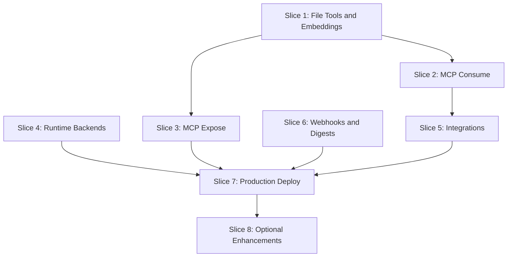

# Phase 2 — Capture and Reach

Phase 2 extends Jerry from a working local MVP to a production-ready system with MCP integration, external service connectors, and multi-target deployment. This plan consolidates all Phase 2 items from [plan.md](../../plan.md) and deferred items from [phase-0.md](./phase-0.md) and [phase-1.md](./phase-1.md).

---

## Deferred Items Consolidated

From **phase-1.md**:
- `read_file` / `list_watched` tools (bucket/collector metadata)
- `ozwell` and `byo-cloud` runtime backends
- Daily/weekly SQL digest rollups + scheduled digests
- MCP server exposure/consumption
- Cloudflare production deploy
- DuckDB analytics

From **plan.md §13**:
- Ollama embeddings (footnote) / CloudAI backend
- Integrations: Google Drive, YouTube, Time Huddle
- Webhook event source
- Mobile thin client
- Upstream: land `@mieweb/cloud-agent` PR

---

## Dependency Graph



---

## Branching Strategy and PR Workflow

**Base branch:** `development` (Phase 1 complete)

**Branch naming:** `phase2/<slice-name>` — each slice gets its own feature branch

**PR workflow:**
1. Create branch from `development` (or dependency branch if needed)
2. Implement slice tasks
3. Run tests and verify acceptance criteria
4. Open PR against `development` with descriptive summary using template below
5. **DO NOT merge without explicit review approval**
6. Tag reviewer and wait for approval before merging

**PR template for each slice:**
```markdown
## Phase 2 Slice [N]: [Slice Name]

### Summary
[High-level description of what this slice achieves]

### Changes
- [Key file/feature 1]
- [Key file/feature 2]
- ...

### Acceptance Criteria
- [ ] [Acceptance criterion 1]
- [ ] [Acceptance criterion 2]

### Dependencies
- Depends on: [prior slice PRs or "None"]
- Blocks: [future slice PRs]

### Testing
- Unit tests: [summary]
- Integration tests: [summary]
- Manual verification: [steps taken]

### Notes
[Any risks, deviations from plan, or follow-up needed]
```

---

## Slice 1: File Tools and Real Embeddings

**Status:** Merged — [PR #4](https://github.com/mieweb/jerry/pull/4) (2026-07-08). Hotfix PR for worker ingest routes: [PR #5](https://github.com/mieweb/jerry/pull/5).

**Branch:** `phase2/file-tools-embeddings`

**PR target:** `development`

**Depends on:** None

**Goal:** Complete deferred Phase 1 file tools and replace embedding placeholder with real Ollama embeddings.

**Why first:** Unblocks footnote search acceptance scenario; required for MCP consume.

**Files:**
- `packages/tools/src/runtime/file-tools.ts` (new)
- `packages/tools/src/runtime/index-document.ts` (new)
- `packages/tools/src/runtime/search-memory.ts` (fix placeholder)
- `packages/collector/src/ingest.ts` (new: collector → footnote pipeline)

**Tasks:**
- Wire `BUCKET` binding for file operations
- Implement `read_file` tool — read from bucket by path
- Implement `list_watched` tool — list collector-tracked files with metadata
- Implement `index_document` tool — ingest document into `CloudVectorIndex`
- Replace random-vector placeholder in `search_memory` with real Ollama embeddings
- Add collector → footnote ingest pipeline (collector pushes, Jerry indexes)
- Unit tests with mock bucket/embeddings; integration test with real Ollama (opt-in)

**Acceptance:**
- Drop screenshot in watched folder → collector pushes → `index_document` indexes → `jerry find that diagram` returns it

**PR checklist:**
- [x] `read_file` and `list_watched` tools implemented and tested
- [x] `index_document` tool working with real embeddings
- [x] `search_memory` uses Ollama embeddings (no random vectors)
- [x] Collector → footnote pipeline functional (client side; worker routes in hotfix)
- [x] Unit tests pass; Ollama integration test documented
- [ ] Acceptance scenario verified manually (after hotfix deploy)

**Notes / deviations:**
- Final merge uses **direct Ollama API** for embeddings (`nomic-embed-text`), not footnote embedder — reverted for CI hermeticity in `64d1481`
- Footnote hybrid search deferred to **Slice 2** via MCP consume
- Worker HTTP routes (`/v1/files`, `/v1/index`) landed in hotfix PR (not in original #4)

---

## Slice 2: MCP Consume

**Status:** Open — [PR #6](https://github.com/mieweb/jerry/pull/6) (awaiting review, 2026-07-09).

**Branch:** `phase2/mcp-consume`

**PR target:** `development`

**Depends on:** Slice 1 (phase2/file-tools-embeddings) — merged via PR #4 + hotfix PR #5

**Goal:** Consume external MCP servers, starting with footnote's hybrid search.

**Why:** Enables richer search (FTS, grep, related docs) without reimplementing in Jerry; foundation for future MCP integrations.

**Files:**
- `packages/tools/src/mcp/client.ts` (new)
- `packages/tools/src/mcp/footnote-adapter.ts` (new)
- `packages/jerry-app/src/mcp-config.ts` (new)
- `packages/tools/package.json` — add `@modelcontextprotocol/sdk`
- `vendor/cloud` — SSE tool streaming + `--verbose` CLI (post-PR follow-up, submodule)

**Tasks:**
- Add MCP client dependency
- Create `McpClient` wrapper for stdio transport (footnote runs as `docidx mcp`)
- Map footnote MCP tools to Jerry `ToolSet` shape
- Wire MCP tools into `createJerryTools()` as optional provider
- Config: `mcp.servers[]` in privacy profile for server paths
- Handle MCP tool errors gracefully (fallback to in-process if server unavailable)
- Test: mock MCP server; integration test with real footnote (opt-in)
- **Remaining:** Worker/CLI startup wiring to spawn footnote MCP and merge tools at session start

**Acceptance:**
- `jerry search my notes about kubernetes` → invokes footnote `search_hybrid` via MCP → returns results

**PR checklist:**
- [x] `@modelcontextprotocol/sdk` added as dependency
- [x] `McpClient` wrapper implemented with stdio transport
- [x] Footnote MCP tools mapped to Jerry `ToolSet`
- [x] MCP config wired into privacy profiles (`McpServerConfig` type + `resolveMcpServers`)
- [x] `createJerryTools` accepts optional `mcpTools` merge hook
- [ ] Worker/CLI startup wiring (spawn footnote MCP child, pass merged tools) — **gap before acceptance**
- [ ] Graceful fallback when MCP server unavailable (logic in `createMcpClient`; needs startup wiring)
- [x] Mock MCP tests pass; footnote integration test documented (opt-in: `JERRY_INTEGRATION=mcp`)
- [x] CLI `--verbose` / `JERRY_VERBOSE` tool activity display (post-PR, `vendor/cloud`)
- [x] SSE streaming of tool-call events to CLI (post-PR, `vendor/cloud`)
- [x] Typecheck/CI fixes for MCP exports and test strictness (post-PR)
- [ ] Acceptance scenario verified manually

**Notes / deviations:**
- PR #6 lands MCP **library** and config scaffolding; end-to-end `search_hybrid` requires worker wiring commit
- Footnote hybrid search uses footnote's `.footnote` index (separate from Jerry's Slice 1 vector store)
- MCP requires stdio transport (local/CLI); Cloudflare Workers cannot spawn child processes
- Post-PR: `jerry --verbose` shows tool/MCP activity; `--debug` adds raw JSON

---

## Slice 3: MCP Expose

**Branch:** `phase2/mcp-expose`

**PR target:** `development`

**Depends on:** Slice 1 (phase2/file-tools-embeddings)

**Goal:** Expose Jerry tools as an MCP server for external consumption (Cursor, Claude Desktop, other agents).

**Files:**
- `packages/cli/src/mcp-server.ts` (new)
- `packages/jerry-app/src/mcp-handler.ts` (new)
- `bin/jerry-mcp.js` (new: stdio entry)

**Tasks:**
- Implement Jerry MCP server using `@modelcontextprotocol/sdk` Server class
- Expose tool subset: `summarize_activity`, `search_memory`, `schedule_followup`
- CLI mode: `jerry mcp` (or `jerry-mcp` binary) starts stdio server
- Hosted mode: `/v1/mcp` HTTP endpoint with SSE streaming
- Document MCP server setup for Cursor/Claude Desktop integration
- Test: MCP client → Jerry server → tool execution

**Acceptance:**
- Configure Jerry as MCP server in Cursor; invoke `summarize_activity` from Cursor agent

**PR checklist:**
- [ ] Jerry MCP server implemented with `@modelcontextprotocol/sdk`
- [ ] Tools exposed: `summarize_activity`, `search_memory`, `schedule_followup`
- [ ] `jerry mcp` CLI command starts stdio server
- [ ] HTTP endpoint `/v1/mcp` with SSE streaming
- [ ] Documentation for Cursor/Claude Desktop setup
- [ ] MCP client tests pass
- [ ] Acceptance scenario verified manually

---

## Slice 4: Runtime Backends

**Branch:** `phase2/runtime-backends`

**PR target:** `development`

**Depends on:** None (independent of Slices 1-3)

**Goal:** Complete the three-way runtime split: `local`, `byo-cloud`, `ozwell`.

**Files:**
- `packages/agent-runtime/src/backends/byo-cloud.ts` (new)
- `packages/agent-runtime/src/backends/ozwell.ts` (new)
- `packages/agent-runtime/src/resolve-runtime.ts` (update)

**Tasks:**
- Implement `byo-cloud` backend — same AI SDK loop, user-provided OpenAI-compatible endpoint
- Implement `ozwell` backend — delegate to Ozwell agent system via `@mieweb/ozwellai` client
- Initialize `vendor/ozwellai-api` submodule; generate client if needed
- Update `resolveRuntime()` to handle all three profiles
- Test: mock model endpoint for byo-cloud; mock Ozwell API for ozwell
- Document profile configuration for each runtime

**Acceptance:**
- `jerry --profile byo-cloud` → model calls go to user's configured endpoint
- `jerry --profile ozwell` → conversation delegated to Ozwell system

**PR checklist:**
- [ ] `byo-cloud` backend implemented with AI SDK
- [ ] `ozwell` backend implemented with Ozwell client
- [ ] `vendor/ozwellai-api` submodule initialized
- [ ] `resolveRuntime()` handles all three profiles
- [ ] Mock tests for both backends pass
- [ ] Profile configuration documented
- [ ] Acceptance scenarios verified manually

---

## Slice 5: External Integrations

**Branch:** `phase2/external-integrations`

**PR target:** `development`

**Depends on:** Slice 2 (phase2/mcp-consume) for MCP-based integration patterns

**Goal:** Add Google Drive, YouTube, and Time Huddle as tools with egress approval flow.

**Files:**
- `packages/tools/src/integrations/drive.ts` (new)
- `packages/tools/src/integrations/youtube.ts` (new)
- `packages/tools/src/integrations/timehuddle.ts` (new)
- `packages/tools/src/integrations/oauth.ts` (new: shared OAuth helper)

**Tasks:**
- **Google Drive:** `read_drive` (list/fetch files), OAuth2 flow
- **YouTube:** `post_youtube` (upload video), `fetch_youtube` (get video metadata)
- **Time Huddle:** `read_timehuddle` (get meetings), `post_timehuddle` (create note)
- Wire into `createJerryTools()` with `egress: "ask"` disposition by default
- Implement `suspendForApproval()` flow — tool requests approval, session suspends, user grants, session resumes
- Store OAuth tokens in session/profile (encrypted at rest)
- Test: mock API responses; manual integration test with real accounts

**Acceptance:**
- `jerry upload this to youtube` → approval prompt → user confirms → video uploaded
- `jerry what files did I share today` → Drive API queried → results returned

**PR checklist:**
- [ ] Google Drive tools (`read_drive`) implemented with OAuth2
- [ ] YouTube tools (`post_youtube`, `fetch_youtube`) implemented
- [ ] Time Huddle tools (`read_timehuddle`, `post_timehuddle`) implemented
- [ ] Shared OAuth helper module functional
- [ ] `suspendForApproval()` flow working end-to-end
- [ ] OAuth token storage encrypted
- [ ] Mock API tests pass; manual integration tests documented
- [ ] Acceptance scenarios verified manually

---

## Slice 6: Webhooks and Scheduled Digests

**Branch:** `phase2/webhooks-digests`

**PR target:** `development`

**Depends on:** None (independent of other slices)

**Goal:** Add webhook event source and scheduled digest generation.

**Files:**
- `packages/jerry-app/src/webhook-handler.ts` (new)
- `packages/jerry-app/src/scheduled-handler.ts` (update)
- `packages/tools/src/runtime/rollup.ts` (new)
- `packages/jerry-app/migrations/0002_rollups.sql` (new)

**Tasks:**
- **Webhooks:** Parse incoming webhook payloads, normalize to `activity_events`, enqueue turn
- **SQL rollups:** `daily_summary`, `weekly_summary` tables; `GROUP BY` over events/activity
- **Scheduled digests:** Implement `handleScheduled()` — cron-triggered digest generation
- Jerry self-schedules: tool or startup sets DO alarm for next digest
- Test: mock cron trigger; verify rollup output

**Acceptance:**
- GitHub webhook → Jerry receives push event → logs as activity
- Every morning at 8am → Jerry generates daily digest without external trigger

**PR checklist:**
- [ ] Webhook handler parses common webhook formats
- [ ] Webhooks normalized to `activity_events`
- [ ] SQL rollup functions implemented
- [ ] `daily_summary` and `weekly_summary` tables created
- [ ] `handleScheduled()` generates digests on cron
- [ ] Jerry self-schedules next digest via DO alarm
- [ ] Mock cron tests pass
- [ ] Acceptance scenarios verified manually

---

## Slice 7: Production Deploy and Upstream

**Branch:** `phase2/production-deploy`

**PR target:** `development`

**Depends on:** Slices 3, 5, 6 (all features ready for production)

**Goal:** Deploy to production targets and land upstream PRs.

**Files:**
- `wrangler.jsonc` (production config)
- `deploy/mieweb-os/` (new: docker-compose, env templates)
- `vendor/cloud` submodule (upstream PR land)
- `.github/workflows/deploy.yml` (new)

**Tasks:**
- **Upstream PR:** Coordinate merge of [mieweb/cloud#1](https://github.com/mieweb/cloud/pull/1); update submodule pin
- **Cloudflare deploy:** Production `wrangler.jsonc`; D1, Vectorize, DO bindings
- **mieweb/os deploy:** Docker Compose with libSQL, MinIO, Valkey; env vars for profile
- **CI/CD:** Deploy workflow for both targets
- **Footnote fixes:** Any PRs needed to `mieweb/melvil-artipod-footnote`
- Smoke test on each target

**Acceptance:**
- `jerry summarize my last 2 hours` works on Cloudflare production
- Same on mieweb/os self-hosted instance

**PR checklist:**
- [ ] Upstream `@mieweb/cloud-agent` PR coordinated/merged
- [ ] Cloudflare production config complete
- [ ] mieweb/os docker-compose working
- [ ] Deploy CI/CD workflows functional
- [ ] Footnote PRs (if any) submitted
- [ ] Smoke tests pass on Cloudflare
- [ ] Smoke tests pass on mieweb/os
- [ ] Acceptance scenarios verified on both targets

**Note:** This PR may wait on upstream coordination; if blocked, document status and defer merge.

---

## Slice 8: Optional Enhancements

**Branch:** `phase2/optional-enhancements`

**PR target:** `development`

**Depends on:** Slice 7 (phase2/production-deploy)

**Goal:** Nice-to-have features that can follow the core Phase 2.

**Tasks:**
- **DuckDB local analytics:** Optional local-only analytical queries (not in portable core)
- **Mobile thin client:** React Native or PWA stub for mobile Jerry access
- **CloudAI embeddings:** Alternative to Ollama embeddings via Cloudflare AI binding

**Acceptance:**
- `jerry --analytics` runs DuckDB query locally
- Mobile app can send messages and view thread

**PR checklist:**
- [ ] DuckDB local analytics optional flag implemented
- [ ] Mobile client stub functional (or documented as future work)
- [ ] CloudAI embeddings alternative implemented (or documented)
- [ ] Tests pass
- [ ] Acceptance scenarios verified

**Note:** This slice is optional and may be split into separate PRs or deferred post-Phase 2.

---

## Risk Mitigations

| Risk | Mitigation |
| --- | --- |
| MCP SDK version drift | Pin `@modelcontextprotocol/sdk` version; test on upgrade |
| OAuth token storage security | Encrypt tokens; never log; document security model |
| Upstream PR delay | Keep working on branch; merge when ready; don't block other slices |
| Integration API rate limits | Implement backoff; cache responses where appropriate |
| Scheduled handler reliability | Test alarm firing on all targets; alert on missed digests |

---

## Slice Summary

| Slice | Branch | Dependencies | Est. Files | Key Deliverable |
| --- | --- | --- | --- | --- |
| 1. File Tools and Embeddings | `phase2/file-tools-embeddings` | None | 5 | Complete deferred tools; real vector search |
| 2. MCP Consume | `phase2/mcp-consume` | Slice 1 | 4 | Footnote MCP integration |
| 3. MCP Expose | `phase2/mcp-expose` | Slice 1 | 3 | Jerry as MCP server |
| 4. Runtime Backends | `phase2/runtime-backends` | None | 3 | byo-cloud + ozwell working |
| 5. Integrations | `phase2/external-integrations` | Slice 2 | 5 | Drive, YouTube, Time Huddle |
| 6. Webhooks and Digests | `phase2/webhooks-digests` | None | 4 | Scheduled digests working |
| 7. Production Deploy | `phase2/production-deploy` | Slices 3-6 | 4 | Live on Cloudflare + mieweb/os |
| 8. Optional Enhancements | `phase2/optional-enhancements` | Slice 7 | 3 | DuckDB, mobile stub |

---

## Done When

- File tools and real embeddings working (screenshot → search scenario passes)
- Jerry consumes footnote MCP server for hybrid search
- Jerry exposes tools as MCP server (Cursor integration documented)
- All three runtime backends (`local`, `byo-cloud`, `ozwell`) functional
- Drive, YouTube, Time Huddle integrations with approval flow
- Webhooks trigger agent turns
- Scheduled digests fire without external trigger
- Production deploy on Cloudflare and mieweb/os
- Upstream `@mieweb/cloud-agent` PR merged
