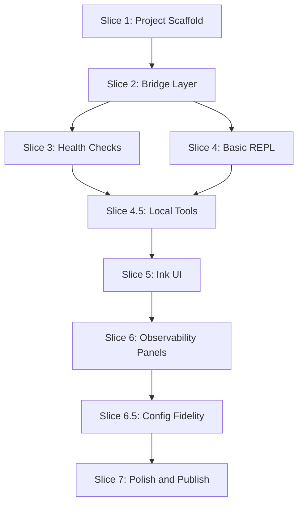

# Phase 3 — Jerry Terminal CLI

Phase 3 delivers `jerry-term`, a standalone, interactive CLI application that provides a user-friendly terminal interface for the Jerry system. The CLI is designed to be installed globally via `npm i -g jerry-term` and serve as the primary way for end users to interact with Jerry's capabilities directly from their terminal.

---

## Goals

1. **Standalone Distribution:** Users install with `npm i -g jerry-term` — no additional setup required
2. **Runtime Flexibility:** Dynamic switching between `local`, `byo-cloud`, and `ozwell` backends
3. **System Observability:** Real-time visibility into thinking steps, tool execution, and agent reasoning
4. **Health Diagnostics:** Built-in checks for Ollama, ActivityWatch, Footnote, and MCP tools
5. **Strict Isolation:** Developed in isolation from core Jerry; consumes Jerry packages as bundled dependencies

---

## Architecture Overview

### Bundled Distribution (Self-Contained)

The CLI bundles all `@mieweb/*` code at build time, eliminating external Jerry package dependencies:

```
jerry-term (npm package)
├── dist/
│   └── index.js          ← Bundled: agent-runtime + tools code
├── bin/
│   └── jerry-term.js     ← CLI entry point
└── package.json          ← Only lists: ink, react, ai, zod (no @mieweb/*)
```

**Why bundled?**

| Approach       | Requirement                          | Issue                          |
| -------------- | ------------------------------------ | ------------------------------ |
| Published deps | `@mieweb/jerry-agent-runtime` on npm | Not published yet              |
| Git deps       | `github:mieweb/jerry#development`    | Slow installs, fragile         |
| **Bundled**    | Build-time inclusion                 | **Zero external @mieweb deps** |

### Bridge Pattern

The CLI uses a bridge layer to abstract the underlying Jerry system:

```
┌─────────────────────────────────────────────────────────────────┐
│                         jerry-term CLI                          │
├─────────────────────────────────────────────────────────────────┤
│  REPL Layer                                                     │
│  ┌──────────┐ ┌──────────┐ ┌──────────┐ ┌──────────┐           │
│  │ /runtime │ │ /health  │ │ /config  │ │ /help    │           │
│  └────┬─────┘ └────┬─────┘ └────┬─────┘ └────┬─────┘           │
│       │            │            │            │                  │
├───────┴────────────┴────────────┴────────────┴──────────────────┤
│  Bridge Layer                                                   │
│  ┌─────────────────────────────────────────────────────────────┐│
│  │ JerryBridge                                                 ││
│  │  - resolveRuntime(profile) → AgentRuntime                   ││
│  │  - runTurn(input) → AsyncIterable<RuntimeEvent>             ││
│  │  - switchRuntime(kind) → void                               ││
│  └─────────────────────────────────────────────────────────────┘│
├─────────────────────────────────────────────────────────────────┤
│  Health Adapters                                                │
│  ┌──────────┐ ┌──────────┐ ┌──────────┐ ┌──────────┐           │
│  │  Ollama  │ │ActivityW │ │ Footnote │ │MCP Tools │           │
│  └──────────┘ └──────────┘ └──────────┘ └──────────┘           │
└─────────────────────────────────────────────────────────────────┘
                              │
                    ┌─────────┴─────────┐
                    │  Bundled Code     │
                    ├───────────────────┤
                    │ jerry-agent-      │
                    │   runtime (built) │
                    │ jerry-tools       │
                    │   (built)         │
                    └───────────────────┘
```

---

## Design System

Based on [CLI UI design guidelines](https://github.com/davila7/claude-code-templates/blob/main/cli-tool/components/agents/development-team/cli-ui-designer.md), jerry-term follows terminal-native aesthetic principles.

### Terminal Color Scheme

```typescript
// src/ui/theme/colors.ts
export const terminalColors = {
    // Background colors
    bgPrimary: "#0f0f0f",
    bgSecondary: "#1a1a1a",
    bgTertiary: "#2a2a2a",

    // Text colors
    textPrimary: "#ffffff",
    textSecondary: "#a0a0a0",
    textMuted: "#606060",

    // Accent colors
    accent: "#d97706", // Orange - primary accent
    success: "#10b981", // Green - success states
    warning: "#f59e0b", // Yellow - warnings
    error: "#ef4444", // Red - errors
    info: "#3b82f6", // Blue - information

    // Border colors
    borderPrimary: "#404040",
    borderSecondary: "#606060",
};
```

### Typography

```typescript
// src/ui/theme/typography.ts
export const fontStack =
    "'Monaco', 'Menlo', 'Ubuntu Mono', 'Consolas', monospace";
```

All text uses monospace fonts for authentic terminal feel. Ink handles this via the `Text` component.

### Terminal Symbols

| Symbol                       | Usage                           |
| ---------------------------- | ------------------------------- |
| `$`                          | System/shell prompts            |
| `>`                          | User input prompt               |
| `⎿`                          | Continuation/sub-item indicator |
| `•`                          | List item / separator           |
| `─`, `│`, `┌`, `┐`, `└`, `┘` | Box drawing                     |

### Status Indicators

```typescript
// src/ui/components/StatusDot.tsx
const statusColors = {
    ok: "#10b981", // Green dot
    warn: "#f59e0b", // Orange dot
    error: "#ef4444", // Red dot
    pending: "#3b82f6", // Blue dot (animated)
};
```

Visual indicators:

- **Status dots:** 8×8px colored circles
- **Checkmarks:** `✓` (success), `✗` (failure), `⚠` (warning)
- **Spinners:** Animated for pending operations
- **Progress:** `[████░░░░░░]` style bars

### Component Patterns

**Command Sections:**

```
┌─────────────────────────────────────────┐
│ ● command_name                          │
│ ⎿ Description of what this does         │
│                                         │
│   [command output here]                 │
│                                         │
└─────────────────────────────────────────┘
```

**Input Prompt:**

```
> _                          (cursor blinks)
```

**Tool Execution:**

```
🔧 Tools
├─ ✓ aw_get_activity (2.3s)
│  └─ Found 47 events
└─ ⏳ footnote_search "query"
```

### Accessibility

- High contrast color scheme (WCAG AA compliant)
- Keyboard navigation for all interactive elements
- Screen reader compatibility via semantic structure
- Focus indicators that match terminal aesthetics

### Theme Support

```typescript
// src/ui/theme/index.ts
export type ThemeMode = "dark" | "light";

export const themes = {
    dark: terminalColors,
    light: {
        bgPrimary: "#f8f9fa",
        bgSecondary: "#e9ecef",
        bgTertiary: "#dee2e6",
        textPrimary: "#1f2937",
        textSecondary: "#6b7280",
        // ... inverted scheme
    },
};
```

---

## Dependency Graph



---

## Branching Strategy and PR Workflow

**Base branch:** `development` (Phase 2 complete)

**Working branch:** `phase3/jerry-term` — **all Phase 3 slices land on this single branch**.

We are **not** opening a PR per slice. Slice boundaries remain the implementation and commit cadence (clear commit messages, local acceptance checks), but review and merge happen once via a **major PR** after the planned slices are complete (through Slice 7 polish, or when the branch is otherwise ready to ship against `development`).

| Slice                      | Work lands on       |
| -------------------------- | ------------------- |
| Slice 1–7 (incl. 4.5, 6.5) | `phase3/jerry-term` |

**Workflow:**

1. Implement each slice on `phase3/jerry-term` (commit as you go; keep commits scoped to the slice)
2. Run tests and verify that slice’s acceptance criteria locally
3. Continue to the next slice on the same branch
4. When Phase 3 work is complete, open **one major PR** against `development`
5. **DO NOT merge without explicit review approval**
6. Tag reviewer and wait for approval before merging

**Per-slice PR checklists** in this doc are self-check lists for the implementer (and for the final PR description), not separate GitHub PRs.

**npm publish ownership (important):**

GitHub collaborator/maintainer on `mieweb/jerry` does **not** grant npm publish rights. `jerry-term` is an unscoped public package name; the **first** successful `npm publish` owns that name on the registry. Collaborators must **not** publish under a personal npm account (that would make them the package owner instead of MIEWEB).

| Role                     | Responsibility                                                                                                                          |
| ------------------------ | --------------------------------------------------------------------------------------------------------------------------------------- |
| Collaborator / PR author | Prove installability locally; open PR with dry-run + pack demo; **do not** `npm publish` to the public registry                         |
| Repo / org owner         | Publish under the MIEWEB npm account (or CI with an org Automation/Granular token); optionally `npm owner add <collaborator>` afterward |

**Local install demo for PRs (no registry):**

Use this in PR description and/or a short screen recording so reviewers can see `npm install` behavior before the package is live:

```bash
pnpm --filter jerry-term build
cd packages/jerry-term
npm publish --dry-run          # proves tarball contents; does not upload
npm pack                       # → jerry-term-0.1.0.tgz
npm i -g ./jerry-term-0.1.0.tgz
jerry-term --version           # or --help / open REPL
```

Optional: `npm link` inside `packages/jerry-term` for a global binary without a tarball.

**Owner publish (after PR approval / Slice 7):**

```bash
cd packages/jerry-term
npm login                      # MIEWEB / org npm user
npm publish                    # or trigger publish-jerry-term.yml with NPM_TOKEN
# optional: npm owner add <collaborator-npm-user> jerry-term
```

After publish, real users get: `npm i -g jerry-term`.

**Major PR template** (single PR after all slices on `phase3/jerry-term`):

```markdown
## Phase 3: Jerry Terminal CLI

### Summary

Interactive terminal CLI for Jerry with runtime switching, health checks, and real-time observability. Delivers Phase 3 slices on `phase3/jerry-term` as one PR against `development`.

### Changes

- `packages/jerry-term/` — new package with bundled distribution
- Slice work: scaffold, bridge, health, REPL, local tools, Ink UI, observability, polish

### Acceptance Criteria

- [ ] Local global install works via `npm pack` + `npm i -g ./jerry-term-*.tgz` (or `npm link`)
- [ ] `npm publish --dry-run` succeeds (no registry upload from collaborator)
- [ ] `jerry-term` starts interactive REPL
- [ ] `/runtime local|ozwell|byo-cloud` switches backend
- [ ] `/health` shows system diagnostics
- [ ] Real-time tool execution visibility
- [ ] **Owner follow-up:** publish to npm under MIEWEB account / CI token after merge

### Dependencies

- Depends on: Phase 2 (agent-runtime, tools packages)
- Blocks: None

### Testing

- Unit tests: Bridge, health checks, command parsing
- Integration tests: Full REPL flow (opt-in)
- Manual verification: `npm publish --dry-run` + local `npm pack` / `npm i -g ./jerry-term-*.tgz`
- Demo (optional): short video of local install + CLI smoke test for owner review

### Notes

[Any risks, deviations from plan, or follow-up needed]
[If Slice 7: ask owner to publish; do not publish from personal npm account]
```

---

## Slice 1: Project Scaffold

**Status:** Done

**Goal:** Create the `packages/jerry-term/` directory with build configuration for bundled distribution.

**Files:**

- `packages/jerry-term/package.json`
- `packages/jerry-term/tsconfig.json`
- `packages/jerry-term/tsup.config.ts`
- `packages/jerry-term/bin/jerry-term.js`
- `packages/jerry-term/src/index.ts`
- `packages/jerry-term/README.md`

**Tasks:**

- Initialize package with correct metadata for npm publication
- Configure tsup for bundling `@mieweb/*` packages (noExternal)
- Set up bin entry point
- Verify `pnpm build` produces self-contained output
- Test local install via `npm link`

**Package.json:**

```json
{
    "name": "jerry-term",
    "version": "0.1.0",
    "description": "Interactive terminal CLI for Jerry AI agent",
    "type": "module",
    "license": "MIT",
    "author": "MIEWEB",
    "repository": {
        "type": "git",
        "url": "git+https://github.com/mieweb/jerry.git",
        "directory": "packages/jerry-term"
    },
    "bin": {
        "jerry-term": "./bin/jerry-term.js"
    },
    "exports": {
        ".": {
            "types": "./dist/index.d.ts",
            "import": "./dist/index.js"
        }
    },
    "files": ["dist", "bin"],
    "scripts": {
        "dev": "tsx src/index.ts",
        "build": "tsup",
        "typecheck": "tsc --noEmit",
        "test": "node --import tsx --test src/**/*.test.ts",
        "prepublishOnly": "pnpm build"
    },
    "engines": {
        "node": ">=22.0.0"
    },
    "dependencies": {
        "ink": "^5.0.1",
        "ink-spinner": "^5.0.0",
        "react": "^18.3.1",
        "ai": "^4.3.0",
        "@ai-sdk/openai-compatible": "^0.2.0",
        "zod": "^3.23.0",
        "conf": "^13.0.0"
    },
    "devDependencies": {
        "@mieweb/jerry-agent-runtime": "workspace:*",
        "@mieweb/jerry-tools": "workspace:*",
        "@types/node": "^22.0.0",
        "@types/react": "^18.3.0",
        "tsup": "^8.0.0",
        "tsx": "^4.19.0",
        "typescript": "^5.6.0"
    }
}
```

**tsup.config.ts:**

```typescript
import { defineConfig } from "tsup";

export default defineConfig({
    entry: ["src/index.ts"],
    format: ["esm"],
    target: "node22",
    dts: true,
    clean: true,
    sourcemap: true,
    // Bundle @mieweb/* packages INTO the output
    noExternal: ["@mieweb/jerry-agent-runtime", "@mieweb/jerry-tools"],
    // These remain as external npm dependencies
    external: [
        "ink",
        "ink-spinner",
        "react",
        "ai",
        "@ai-sdk/openai-compatible",
        "zod",
        "conf",
    ],
});
```

**Acceptance:**

- `pnpm --filter jerry-term build` succeeds
- `dist/index.js` contains bundled agent-runtime code (grep for `createLocalRuntime`)
- `npm link && jerry-term --version` prints version

**PR checklist:**

- [x] Package initialized with correct metadata
- [x] tsup config bundles @mieweb/ packages
- [x] Build produces self-contained output
- [x] Local install via npm link works
- [x] Typecheck passes

---

## Slice 2: Bridge Layer

**Status:** Done

**Goal:** Implement the JerryBridge abstraction that wraps agent-runtime for CLI consumption.

**Files:**

- `packages/jerry-term/src/bridge/index.ts`
- `packages/jerry-term/src/bridge/jerry-bridge.ts`
- `packages/jerry-term/src/bridge/jerry-bridge.test.ts`
- `packages/jerry-term/src/bridge/event-emitter.ts`

**Tasks:**

- Create `JerryBridge` class that wraps `resolveRuntime()`
- Implement `switchRuntime(kind, options)` for dynamic backend changes
- Implement `runTurn(input)` that yields `RuntimeEvent` objects
- Add observable event emitter for UI consumption
- Handle runtime switch during active turn (queue until complete)
- Unit tests with mock runtime

**Key Interface:**

```typescript
import type {
    AgentRuntime,
    PrivacyProfile,
    RuntimeEvent,
    TurnInput,
    RuntimeKind,
} from "@mieweb/jerry-agent-runtime";

export class JerryBridge {
    private runtime: AgentRuntime;
    private profile: PrivacyProfile;
    private activeTurn: boolean = false;
    private pendingSwitch: {
        kind: RuntimeKind;
        options?: Partial<PrivacyProfile>;
    } | null = null;

    constructor(initialProfile?: Partial<PrivacyProfile>);

    switchRuntime(kind: RuntimeKind, options?: Partial<PrivacyProfile>): void;

    async *runTurn(input: TurnInput): AsyncIterable<RuntimeEvent>;

    getProfile(): PrivacyProfile;
    getRuntimeKind(): RuntimeKind;
    isActive(): boolean;
}
```

**Acceptance:**

- `new JerryBridge()` creates runtime with default profile
- `bridge.switchRuntime("ozwell")` changes active runtime
- `bridge.runTurn({ messages: [...] })` yields events
- Switch during active turn queues and applies after completion

**PR checklist:**

- [x] JerryBridge class implemented
- [x] switchRuntime handles all three backends
- [x] runTurn yields RuntimeEvent stream
- [x] Active turn protection implemented
- [x] Unit tests pass

---

## Slice 3: Health Checks

**Status:** Done

**Goal:** Implement health check adapters for all system dependencies.

**Files:**

- `packages/jerry-term/src/health/index.ts`
- `packages/jerry-term/src/health/types.ts`
- `packages/jerry-term/src/health/ollama.ts`
- `packages/jerry-term/src/health/activity-watch.ts`
- `packages/jerry-term/src/health/footnote.ts`
- `packages/jerry-term/src/health/mcp-tools.ts`
- `packages/jerry-term/src/health/runner.ts`
- `packages/jerry-term/src/health/*.test.ts`

**Tasks:**

- Define `HealthCheck` interface with `check()` → `HealthResult`
- Implement Ollama check — probe `http://127.0.0.1:11434/api/tags`
- Implement ActivityWatch check — probe `http://127.0.0.1:5600/api/0/info`
- Implement Footnote check — verify `FOOTNOTE_DB` exists and has index
- Implement MCP tools check — verify configured MCP servers are reachable
- Create runner that executes all checks in parallel with timeout
- Format results for terminal display

**HealthCheck Interface:**

```typescript
export interface HealthCheck {
    name: string;
    description: string;
    required: boolean; // false = warning only
    check(): Promise<HealthResult>;
}

export interface HealthResult {
    status: "ok" | "warn" | "error";
    message: string;
    details?: Record<string, unknown>;
    latencyMs?: number;
}

export interface HealthReport {
    timestamp: Date;
    results: Array<{ check: HealthCheck; result: HealthResult }>;
    overall: "ok" | "degraded" | "error";
}
```

**Acceptance:**

- `/health` command shows status of all four services
- Ollama down → shows error with "Not running" message
- ActivityWatch down → shows warning (not required)
- All services up → shows "ok" with latencies

**PR checklist:**

- [x] HealthCheck interface defined
- [x] Ollama health check implemented
- [x] ActivityWatch health check implemented
- [x] Footnote health check implemented
- [x] MCP tools health check implemented
- [x] Parallel runner with timeout implemented
- [x] Unit tests with mocked responses pass

---

## Slice 4: Basic REPL

**Status:** Done

**Goal:** Implement the core REPL loop with command parsing (no fancy UI yet).

**Files:**

- `packages/jerry-term/src/repl/index.ts`
- `packages/jerry-term/src/repl/repl.ts`
- `packages/jerry-term/src/repl/input.ts`
- `packages/jerry-term/src/repl/output.ts`
- `packages/jerry-term/src/commands/index.ts`
- `packages/jerry-term/src/commands/types.ts`
- `packages/jerry-term/src/commands/runtime.ts`
- `packages/jerry-term/src/commands/health.ts`
- `packages/jerry-term/src/commands/config.ts`
- `packages/jerry-term/src/commands/help.ts`
- `packages/jerry-term/src/commands/exit.ts`

**Tasks:**

- Create REPL loop with readline-based input
- Parse slash commands (`/runtime`, `/health`, `/config`, `/help`, `/exit`)
- Dispatch non-command input to JerryBridge
- Stream response text to stdout
- Basic error handling and graceful shutdown
- Config loading from `~/.config/jerry-term/config.json` or env vars

**Command Registry:**

```typescript
export interface Command {
    name: string;
    aliases?: string[];
    description: string;
    usage?: string;
    execute(args: string[], ctx: CommandContext): Promise<void>;
}

export interface CommandContext {
    bridge: JerryBridge;
    config: TermConfig;
    output: OutputWriter;
    exit: () => void;
}
```

**Built-in Commands:**

| Command                 | Aliases       | Description                              |
| ----------------------- | ------------- | ---------------------------------------- |
| `/runtime <kind>`       | `/rt`         | Switch runtime: local, ozwell, byo-cloud |
| `/health`               | `/hc`         | Run system health checks                 |
| `/config [key] [value]` | `/cfg`        | View or update configuration             |
| `/help [command]`       | `/h`, `/?`    | Show help                                |
| `/exit`                 | `/q`, `/quit` | Exit the CLI                             |

**Acceptance:**

- `jerry-term` starts and shows prompt
- User types message → Jerry responds (streamed)
- `/runtime ozwell` → switches runtime, confirms
- `/health` → shows health check results
- `/exit` → exits cleanly
- Ctrl+C → graceful shutdown

**PR checklist:**

- [x] REPL loop implemented with readline
- [x] Command parser recognizes slash commands
- [x] All five built-in commands functional
- [x] Non-command input dispatched to bridge
- [x] Response streaming works
- [x] Config loading from file and env vars
- [x] Graceful shutdown on Ctrl+C
- [x] Unit tests for command parsing

---

## Slice 4.5: Local Tools

**Status:** Done

**Goal:** Enable Jerry tools in jerry-term by creating local tool adapters that work without Cloudflare Worker bindings.

**Background:**

Jerry's tools (`summarize_activity`, `search_memory`, etc.) require a `ToolContext` with Cloudflare bindings (`db`, `vectors`, `bucket`). The jerry-term CLI runs locally without these bindings, so tools don't work out of the box.

This slice creates a `LocalToolContext` that:

1. Calls ActivityWatch HTTP API directly (skip collector/D1 middleman)
2. Reuses existing AW aggregation logic from `packages/tools/src/aw/`
3. Stubs non-essential tools for local use

**Architecture:**

```
┌─────────────────────────────────────────────────────────────────┐
│                         jerry-term REPL                         │
├─────────────────────────────────────────────────────────────────┤
│  JerryBridge.runTurn({ messages, tools })                       │
│                              │                                  │
│                              ▼                                  │
│  ┌─────────────────────────────────────────────────────────────┐│
│  │ LocalToolContext                                            ││
│  │  - awUrl: "http://127.0.0.1:5600"                          ││
│  │  - fetchFn: fetch (injectable for tests)                   ││
│  └─────────────────────────────────────────────────────────────┘│
│                              │                                  │
│                              ▼                                  │
│  ┌──────────────────┐ ┌──────────────────┐ ┌──────────────────┐│
│  │summarize_activity│ │  search_memory   │ │schedule_followup ││
│  │ (AW HTTP direct) │ │    (stubbed)     │ │    (stubbed)     ││
│  └──────────────────┘ └──────────────────┘ └──────────────────┘│
└─────────────────────────────────────────────────────────────────┘
                              │
                              ▼
              ┌───────────────────────────────┐
              │     ActivityWatch HTTP API    │
              │   http://127.0.0.1:5600/api   │
              └───────────────────────────────┘
```

**Files:**

- `packages/jerry-term/src/tools/index.ts`
- `packages/jerry-term/src/tools/types.ts`
- `packages/jerry-term/src/tools/local-context.ts`
- `packages/jerry-term/src/tools/summarize-activity.ts`
- `packages/jerry-term/src/tools/stubs.ts`
- `packages/jerry-term/src/tools/*.test.ts`

**Tasks:**

- Define `LocalToolContext` interface (awUrl, fetchFn)
- Implement local `summarize_activity`:
    - Fetch buckets from `GET /api/0/buckets`
    - Fetch events from `GET /api/0/buckets/{id}/events?start=...&end=...`
    - Reuse `buildActivitySummary()` from `@mieweb/jerry-tools/aw`
    - Format with `formatActivitySummary()`
- Create stub tools for `search_memory`, `schedule_followup` that return helpful messages
- Create `createLocalTools(ctx: LocalToolContext): ToolSet`
- Wire tools into REPL's `runTurn()` call
- Unit tests with mocked fetch

**Local summarize_activity Implementation:**

```typescript
import {
    buildActivitySummary,
    formatActivitySummary,
} from "@mieweb/jerry-tools/aw";
import type { Bucket, RawEvent } from "@mieweb/jerry-tools/aw";

export function createLocalSummarizeActivityTool(ctx: LocalToolContext) {
    return tool({
        description: "Summarize user activity from ActivityWatch",
        parameters: z.object({
            startDate: z
                .string()
                .describe("Start date (ISO or natural language)"),
            endDate: z
                .string()
                .optional()
                .describe("End date (defaults to now)"),
        }),
        execute: async ({ startDate, endDate }) => {
            // Fetch buckets
            const bucketsRes = await ctx.fetchFn(`${ctx.awUrl}/api/0/buckets`);
            const buckets: Record<string, Bucket> = await bucketsRes.json();

            // Fetch events for each bucket
            const events: RawEvent[] = [];
            for (const bucket of Object.values(buckets)) {
                const eventsRes = await ctx.fetchFn(
                    `${ctx.awUrl}/api/0/buckets/${bucket.id}/events?start=${startDate}&end=${endDate}`,
                );
                events.push(...(await eventsRes.json()));
            }

            // Reuse existing aggregation
            const summary = buildActivitySummary(
                Object.values(buckets),
                events,
                {
                    start: new Date(startDate),
                    end: endDate ? new Date(endDate) : new Date(),
                },
            );

            return formatActivitySummary(summary);
        },
    });
}
```

**Stub Tools:**

```typescript
export function createStubSearchMemory() {
    return tool({
        description: "Search semantic memory (not available in local mode)",
        parameters: z.object({ query: z.string() }),
        execute: async () =>
            "Memory search requires the Jerry worker. Run 'jerry' CLI or use ozwell runtime.",
    });
}

export function createStubScheduleFollowup() {
    return tool({
        description:
            "Schedule a follow-up reminder (not available in local mode)",
        parameters: z.object({ message: z.string(), when: z.string() }),
        execute: async () =>
            "Scheduling requires the Jerry worker. Use '/remind' command instead (coming soon).",
    });
}
```

**REPL Integration:**

Update `repl.ts` to pass tools:

```typescript
import { createLocalTools } from "../tools/index.ts";

// In Repl constructor
this.tools = createLocalTools({ awUrl: "http://127.0.0.1:5600" });

// In handleChat
for await (const event of this.bridge.runTurn({
  messages: this.messages,
  tools: this.tools,  // Now includes local tools
})) {
```

**Acceptance:**

- `> summarize my July 13th work` → calls ActivityWatch HTTP → returns summary
- `> search for architecture notes` → returns stub message about worker mode
- Tool calls visible in response stream (`[tool] summarize_activity...`)
- Graceful handling when ActivityWatch is not running

**PR checklist:**

- [x] LocalToolContext interface defined
- [x] summarize_activity calls AW HTTP directly
- [x] Existing AW aggregation logic reused
- [x] Stub tools for search_memory, schedule_followup
- [x] createLocalTools() exported
- [x] REPL passes tools to runTurn()
- [x] Unit tests with mocked fetch
- [x] Works when ActivityWatch is running
- [x] Graceful error when ActivityWatch is down

---

## Slice 5: Ink UI Framework

**Status:** Done

**Goal:** Replace basic REPL with Ink-based React UI for rich terminal experience, following [CLI UI design guidelines](https://github.com/davila7/claude-code-templates/blob/main/cli-tool/components/agents/development-team/cli-ui-designer.md).

**Files:**

- `packages/jerry-term/src/ui/index.ts`
- `packages/jerry-term/src/ui/App.tsx`
- `packages/jerry-term/src/ui/hooks/useRepl.ts`
- `packages/jerry-term/src/ui/hooks/useBridge.ts`
- `packages/jerry-term/src/ui/theme/colors.ts`
- `packages/jerry-term/src/ui/theme/index.ts`
- `packages/jerry-term/src/ui/components/Header.tsx`
- `packages/jerry-term/src/ui/components/InputPrompt.tsx`
- `packages/jerry-term/src/ui/components/ResponseArea.tsx`
- `packages/jerry-term/src/ui/components/StatusBar.tsx`
- `packages/jerry-term/src/ui/components/StatusDot.tsx`
- `packages/jerry-term/src/ui/components/TerminalBox.tsx`

**Tasks:**

- Set up Ink renderer with full-screen mode
- Implement theme system with dark/light modes (see Design System section)
- Create App component with flexbox layout structure
- Implement Header with ASCII branding option and status dots
- Implement InputPrompt with `>` prompt symbol and blinking cursor
- Implement ResponseArea for streamed output with proper spacing
- Implement StatusBar with colored status indicators
- Create reusable TerminalBox component for bordered sections
- Wire to JerryBridge via React hooks
- Handle terminal resize gracefully
- Support keyboard shortcuts (Ctrl+L clear, Ctrl+C cancel)

**Component Implementation Patterns:**

```tsx
// Header.tsx - Terminal header with status
<Box borderStyle="single" borderColor="borderPrimary" paddingX={1}>
  <Text bold color="textPrimary">jerry-term</Text>
  <Text color="textSecondary"> v{version}</Text>
  <Box flexGrow={1} />
  <StatusDot status={connected ? "ok" : "error"} />
  <Text color="accent">[{runtime}]</Text>
  <Text color="textSecondary"> {model}</Text>
</Box>

// InputPrompt.tsx - Command input with prompt symbol
<Box>
  <Text color="accent" bold>{">"}</Text>
  <Text> </Text>
  <TextInput value={input} onChange={setInput} />
  <Text color="textMuted">_</Text> {/* Blinking cursor */}
</Box>

// StatusBar.tsx - Connection and timing info
<Box borderStyle="single" borderColor="borderSecondary" paddingX={1}>
  <StatusDot status="ok" />
  <Text color="textSecondary">Connected</Text>
  <Text color="textMuted"> • </Text>
  <Text color="textSecondary">Last: {latency}ms</Text>
  <Text color="textMuted"> • </Text>
  <Text color="textSecondary">Tools: {toolCount}</Text>
</Box>
```

**UI Layout:**

```
┌─────────────────────────────────────────────────────────────────┐
│ ● jerry-term v0.1.0                  [local] ollama:qwen2.5:3b  │  ← Header (with status dot)
├─────────────────────────────────────────────────────────────────┤
│                                                                 │
│ Based on your ActivityWatch data, you spent most of your time  │  ← ResponseArea
│ in VS Code working on the jerry-term project...                │
│                                                                 │
├─────────────────────────────────────────────────────────────────┤
│ > _                                                             │  ← InputPrompt (> symbol)
├─────────────────────────────────────────────────────────────────┤
│ ● Connected • Last: 2.3s • Tools: 4 available                  │  ← StatusBar
└─────────────────────────────────────────────────────────────────┘
```

**Visual Consistency Checklist:**

- [x] All text uses monospace font (Ink default)
- [x] Colors follow theme CSS custom properties pattern
- [x] Spacing follows 1-unit baseline (Ink's padding units)
- [x] Border styles consistent (`single` for primary, `round` for secondary)
- [x] Prompt symbols use proper glyphs (`>`, `$`, `⎿`)
- [x] Status indicators use colored dots

**Acceptance:**

- UI renders with proper layout and terminal aesthetics
- Header shows status dot, runtime badge, and model
- Input has `>` prompt with visible cursor
- Response streams character by character
- Command history with up/down arrows
- Colors match terminal color scheme
- Resize doesn't break layout

**PR checklist:**

- [x] Ink renderer set up with full-screen mode
- [x] Theme system implemented (colors, typography)
- [x] App layout structure with flexbox
- [x] Header component with status dot and runtime badge
- [x] InputPrompt with `>` symbol and cursor
- [x] ResponseArea with streaming display
- [x] StatusBar with connection indicators
- [x] TerminalBox reusable component
- [x] Terminal resize handled
- [x] Keyboard shortcuts working
- [x] All previous REPL functionality preserved

### Post-Slice Migration: Ink → OpenTUI

**Status:** Done (with open issue)

The UI was migrated from Ink to [OpenTUI](https://opentui.com/) to enable proper fixed-viewport layout with a native scrollable transcript area. Key changes:

- **Stack:** `@opentui/core` + `@opentui/react` (React reconciler) replacing `ink` + `ink-text-input`
- **Runtime:** Bun required for interactive UI; Node.js supported via `--no-ui` readline fallback
- **Layout:** Fixed header/input/status chrome with `scrollbox` for transcript (no more manual row slicing)
- **Components:** UI now rendered inline in App.tsx using OpenTUI lowercase elements (`box`, `text`, `scrollbox`, `input`)
- **Hooks:** `useBridge` and `useRepl` unchanged (standard React hooks work with OpenTUI reconciler)

The `--no-ui` readline REPL remains fully functional under Node.js for environments without Bun.

#### Open: Sticky fullscreen / transcript scroll (UNSOLVED)

**Status:** Unsolved

The OpenTUI session still does not reliably own a sticky alternate-screen viewport. Users can scroll the host terminal and see prior shell scrollback “behind” jerry-term, and the in-app transcript `scrollbox` does not receive wheel scroll reliably because the terminal steals it.

Attempted mitigations (still insufficient):

- Force `screenMode: "alternate-screen"` and `OTUI_USE_ALTERNATE_SCREEN=true`
- Hard-size layout from `useTerminalDimensions` with `minHeight: 0` / `overflow: "hidden"`
- Sticky bottom `scrollbox` + PgUp/PgDn / Shift+↑↓ transcript scrolling

**Follow-up:** Revisit OpenTUI screen-mode + mouse capture (and iTerm2 alternate-screen settings) until the TUI is fullscreen-sticky and only the center transcript scrolls.

---

## Slice 6: Observability Panels

**Status:** Done

**Goal:** Add real-time visibility into Jerry's internal processes, tool execution, and thinking steps using terminal-native visual patterns from the [CLI UI design guidelines](https://github.com/davila7/claude-code-templates/blob/main/cli-tool/components/agents/development-team/cli-ui-designer.md).

**Files:**

- `packages/jerry-term/src/ui/components/ThinkingPanel.tsx`
- `packages/jerry-term/src/ui/components/ToolPanel.tsx`
- `packages/jerry-term/src/ui/components/ToolCallItem.tsx`
- `packages/jerry-term/src/ui/components/TreeView.tsx`
- `packages/jerry-term/src/ui/components/CollapsibleSection.tsx`
- `packages/jerry-term/src/ui/hooks/useObservability.ts`
- `packages/jerry-term/src/ui/layout/PanelLayout.tsx`

**Tasks:**

- Create ThinkingPanel with animated spinner during inference
- Create ToolPanel showing active and completed tool calls in tree format
- Implement ToolCallItem with status dot, timing, and expandable output
- Create TreeView component for nested display (`├─`, `└─`, `│`)
- Create CollapsibleSection for toggle-able panels
- Add timing information with color-coded latency
- Keyboard shortcuts: `Ctrl+T` (tools), `Ctrl+K` (thinking), `Ctrl+E` (expand all)
- Auto-scroll to latest tool activity

**Component Patterns:**

```tsx
// ThinkingPanel.tsx - Shows agent reasoning
<CollapsibleSection title="Thinking" shortcut="Ctrl+K" icon="🤔">
  <Box flexDirection="column">
    <Box>
      <Spinner type="dots" />
      <Text color="textSecondary"> Analyzing user request...</Text>
    </Box>
    <TreeView>
      <TreeItem icon="⎿">Parsing intent: summarize activity</TreeItem>
      <TreeItem icon="⎿">Planning tool sequence</TreeItem>
    </TreeView>
  </Box>
</CollapsibleSection>

// ToolPanel.tsx - Tool execution display
<CollapsibleSection title="Tools" shortcut="Ctrl+T" icon="🔧" count={tools.length}>
  <TreeView>
    {tools.map(tool => (
      <ToolCallItem
        key={tool.id}
        name={tool.name}
        status={tool.status}
        duration={tool.durationMs}
        output={tool.output}
      />
    ))}
  </TreeView>
</CollapsibleSection>

// ToolCallItem.tsx - Individual tool call
<Box>
  <StatusIcon status={status} /> {/* ✓, ⏳, ✗, ⚠ */}
  <Text bold color={statusColor}>{name}</Text>
  {duration && <Text color="textMuted"> ({formatDuration(duration)})</Text>}
  {expanded && (
    <Box marginLeft={2} marginTop={1}>
      <Text color="textSecondary">⎿ {truncate(output, 200)}</Text>
    </Box>
  )}
</Box>
```

**Visual Hierarchy (Tree Drawing):**

```
🔧 Tools (3)                                              [Ctrl+T]
├─ ✓ aw_get_activity                                        2.3s
│  └─ Found 47 events in last 2 hours
├─ ✓ footnote_search                                        1.1s
│  └─ 3 documents matched "architecture"
└─ ⏳ summarize_context                                       ...
   └─ Processing...
```

Tree characters:

- `├─` Branch with siblings below
- `└─` Last branch (no siblings below)
- `│` Vertical continuation
- `⎿` Sub-item/detail indicator

**Status Indicators (with colors):**

| Icon | Status  | Color                 | Description            |
| ---- | ------- | --------------------- | ---------------------- |
| `⏳` | Running | `info` (#3b82f6)      | Currently executing    |
| `✓`  | Success | `success` (#10b981)   | Completed successfully |
| `⚠`  | Warning | `warning` (#f59e0b)   | Completed with issues  |
| `✗`  | Error   | `error` (#ef4444)     | Failed                 |
| `○`  | Pending | `textMuted` (#606060) | Queued, not started    |

**Latency Color Coding:**

```typescript
const getLatencyColor = (ms: number) => {
    if (ms < 500) return "success"; // Fast: green
    if (ms < 2000) return "warning"; // Moderate: yellow
    return "error"; // Slow: red
};
```

**Observability Layout:**

```
┌─────────────────────────────────────────────────────────────────┐
│ ● jerry-term v0.1.0                  [local] ollama:qwen2.5:3b  │
├─────────────────────────────────────────────────────────────────┤
│ 🤔 Thinking                                             [Ctrl+K]│
│ ├─ ⎿ Analyzing user request                                    │
│ └─ ⎿ Planning tool sequence                                    │
├─────────────────────────────────────────────────────────────────┤
│ 🔧 Tools (2/3)                                          [Ctrl+T]│
│ ├─ ✓ aw_get_activity                                      2.3s │
│ │  └─ Found 47 events in last 2 hours                          │
│ └─ ⏳ footnote_search "architecture notes"                      │
├─────────────────────────────────────────────────────────────────┤
│ 💬 Response                                                     │
│ Based on your ActivityWatch data, you spent most of your time  │
│ in VS Code working on the jerry-term project...                │
├─────────────────────────────────────────────────────────────────┤
│ > _                                                             │
└─────────────────────────────────────────────────────────────────┘
```

**Collapsed Panel View:**

```
│ 🔧 Tools (3) ▶                                          [Ctrl+T]│
```

**Keyboard Shortcuts:**

| Shortcut | Action                           |
| -------- | -------------------------------- |
| `Ctrl+T` | Toggle Tools panel               |
| `Ctrl+K` | Toggle Thinking panel            |
| `Ctrl+E` | Expand/collapse all tool outputs |
| `Tab`    | Cycle focus between panels       |
| `Enter`  | Expand focused tool output       |

**Acceptance:**

- Tool calls show in real-time with tree structure
- Status icons update as tools execute
- Execution time displayed with latency coloring
- Tool output visible (truncated at 200 chars, expandable)
- Panels collapsible with keyboard shortcuts
- Collapsed panels show count badge
- Tree drawing characters render correctly
- Auto-scroll follows latest activity

**PR checklist:**

- [x] ThinkingPanel with spinner animation
- [x] ToolPanel with tree structure
- [x] ToolCallItem with status icons and timing
- [x] TreeView component for nested display
- [x] CollapsibleSection with keyboard toggle
- [x] Latency color coding implemented
- [x] Tool output truncation with expand
- [x] Keyboard shortcuts working
- [x] Auto-scroll behavior
- [x] Unit tests for observability hooks

---

## Slice 6.5: Config Fidelity (Ozwell / OpenAI BYO)

**Status:** Implemented

**Goal:** Make runtime/model/API-key configuration actually drive the live bridge for Ozwell and OpenAI-compatible BYO cloud. agent-runtime already supports these backends; jerry-term’s `/config` and `/runtime` commands need to apply profile changes (and optionally persist them).

**Out of scope (deferred to Phase 3.1 / post-publish):**

- Cloud worker message queue (`/enqueue` → `JOBS`) — already owned by jerry-app + `jerry` CLI; jerry-term stays in-process agent-runtime for v0.1
- Session id in status bar + `-s <session-id>` resume — requires worker attach (`JERRY_URL` + cloud-agent client), not a local cosmetic UUID
- Bundling the cloud queue inside jerry-term — not viable without a running worker; call the worker later, do not embed it

**Files:**

- `packages/jerry-term/src/commands/runtime.ts`
- `packages/jerry-term/src/commands/config.ts`
- `packages/jerry-term/src/commands/apply-config.ts`
- `packages/jerry-term/src/bridge/jerry-bridge.ts` (profile-aware switch if needed)
- `packages/jerry-term/src/config/loader.ts` (write-back / save)
- `packages/jerry-term/src/config/types.ts`
- `packages/jerry-term/README.md` (Ozwell + OpenAI setup)
- `packages/jerry-term/src/commands/commands.test.ts`

**Tasks:**

- [x] When `/config model|apiKey|endpoint|egress` changes, rebuild/switch the bridge profile (not only in-memory TermConfig)
- [x] Extend `/runtime` so optional model / key / endpoint can be passed or pulled from current config
- [x] Persist editable config to `~/.config/jerry-term/config.json` (or existing loader paths) on successful `/config` set
- [x] Document Ozwell (`OZWELL_API_KEY`, endpoint) and OpenAI BYO (`OPENAI_API_KEY` / `JERRY_API_KEY`, model) setup in README
- [x] Keep header/status showing active runtime + model after switches
- [x] Unit tests for config → bridge apply + persist behavior

**Acceptance:**

- [x] `/runtime ozwell` with `OZWELL_API_KEY` set uses Ozwell (or documented local fallback)
- [x] `/config model …` and `/config apiKey …` take effect on the next turn without restarting
- [x] `/config` changes survive process restart when saved to the config file
- [x] README documents Ozwell + OpenAI BYO env/config paths
- [x] Local Ollama path unchanged

**PR checklist:**

- [x] `/config` updates apply to JerryBridge profile
- [x] `/runtime` uses current TermConfig (model/key/endpoint) when switching
- [x] Config persistence (save on set)
- [x] README: Ozwell + OpenAI BYO setup
- [x] Tests for config/runtime bridge wiring
- [x] Deferred items explicitly noted (queue, `-s` sessions → Phase 3.1)

---

## Slice 6.6: Runtime/Model Tree Picker

**Status:** Implemented

**Goal:** Simplify runtime and model selection with a multi-credential vault and interactive tree picker. Users can set up local / Ozwell / BYO providers once and switch between them seamlessly without re-entering API keys.

**Key features:**

1. **Credentials vault** - `~/.config/jerry-term/config.json` now stores multiple API keys:
    - `credentials.ozwell.apiKey` - Ozwell API key
    - `credentials.byo.openai.apiKey` - OpenAI key
    - `credentials.byo.moonshot.apiKey` - Moonshot/Kimi key
    - `credentials.byo.custom.apiKey` + `baseURL` - Custom provider

2. **Last model memory** - Remembers last-used model per runtime/provider:
    - `lastModel.local` - Last Ollama model
    - `lastModel.ozwell` - Last Ozwell model
    - `lastModel.byo.openai` - Last OpenAI model, etc.

3. **Provider registry** - Static definitions with curated model lists:
    - `ollama` (local) - Live from `/api/tags`
    - `ozwell` - Recommended chat models first (`gpt-4.1-mini`, `gpt-4o`, `gpt-5`, `claude-sonnet-5`, …); live `/v1/models` with collapsible “Other”
    - `openai` (BYO) - GPT-4o, GPT-4 Turbo, o1-preview, etc.
    - `moonshot` (BYO) - Moonshot v1 8K/32K/128K
    - `custom` (BYO) - User-defined baseURL + model

4. **Interactive picker** - TUI tree navigation:
    - `/runtime` or `/rt` opens picker (no args)
    - `/model` or `/m` opens model picker for current runtime
    - ↑↓ navigate, Enter/→ select, Esc/← back
    - Setup leaf for entering API keys with docs link
    - Ozwell: recommended models first; `▶ Other models (N)` expands/collapses the rest

5. **Commands enhanced:**
    - `/runtime byo openai` - Direct switch with saved credentials
    - `/model gpt-4o` - Set model, persists to lastModel
    - `/config apiKey <key>` - Routes to active credential slot

**Files:**

- `packages/jerry-term/src/config/types.ts` - CredentialsVault, LastModelMap types
- `packages/jerry-term/src/config/loader.ts` - Vault load/save, migration, availability
- `packages/jerry-term/src/config/providers.ts` - Provider registry, `partitionOzwellModels`, toWireModel
- `packages/jerry-term/src/config/list-ozwell-models.ts` - Live `GET /v1/models` + curated fallback
- `packages/jerry-term/src/config/select.ts` - Selection and apply helpers
- `packages/jerry-term/src/commands/runtime.ts` - Updated with tree picker
- `packages/jerry-term/src/commands/model.ts` - New model command
- `packages/jerry-term/src/commands/config.ts` - Routes apiKey to vault
- `packages/jerry-term/src/ui/components/RuntimePicker.tsx` - TUI picker

**Ozwell setup docs:** https://mieweb.github.io/ozwellai-api/backend/api-authentication/

**Open issue / follow-up:**

- [ ] **Confirm Ozwell model compatibility with Jerry** — Manager `/v1/models` returns a large enabled catalog (chat + embeddings/TTS/image/realtime/etc.). Listing ≠ Jerry-usable. Need to verify which models actually work end-to-end with Jerry’s Ozwell chat/streaming path (tool calling, SSE) under a typical `ozw_` key policy, and keep the recommended curated list aligned with that. Non-chat IDs should stay collapsed under “Other” until confirmed (or filtered out).

**Out of scope:**

- ~~Native Anthropic SDK (OpenAI-compatible only in v1)~~ — **Done**: Added `@ai-sdk/anthropic` backend, live `/v1/models` listing, and BYO picker support
- OS keychain integration (plain JSON, same trust model as before)

**Slice 6.6.1 - BYO Live Models + API Key Management (completed):**

- **OpenAI** — Live `/v1/models` fetches available models; auth/unavailable errors displayed gracefully
- **Anthropic** — Native `@ai-sdk/anthropic` runtime; live `/v1/models` with `x-api-key` header
- **Masked keys** — API keys displayed as `sk-pr****abcd` everywhere (config, picker, status)
- **Clear keys** — `/config clearKey [ozwell|openai|anthropic]` and picker "Remove API key"
- **BYO picker** — Shows OpenAI + Anthropic; "More coming soon" placeholder for deferred providers
- **Key-only setup** — No endpoint prompts for OpenAI/Anthropic (fixed base URLs)

---

## Slice 7: Polish and Publish

**Status:** Planned — ready to start (gated on the pre-publish green gate below)

**Goal:** Final polish, documentation, and ship-ready npm packaging. Collaborators prove installability in the PR; the **org/repo owner** performs the real registry publish.

**What changed since this slice was drafted (Slices 6 → 6.6.1):**

The publish surface grew well beyond the original REPL. Slice 7 must ship and document all of it:

- **Four runtime backends** now exist (agent-runtime `resolveRuntime`): `local` (Ollama), `byo-cloud` (OpenAI-compatible), `ozwell` (Managed), and native `anthropic` (`@ai-sdk/anthropic`). `RuntimeKind` is `local | byo-cloud | ozwell | anthropic`.
- **Credentials vault** persisted to `~/.config/jerry-term/config.json` (`credentials.ozwell`, `credentials.byo.{openai,anthropic,moonshot,custom}`) plus `lastModel` memory per runtime/provider.
- **Interactive tree picker** (`RuntimePicker.tsx`) driven by `/runtime` (`/rt`) and `/model` (`/m`); live model listing for Ollama, Ozwell, OpenAI, and Anthropic with curated fallbacks.
- **New/expanded commands:** `/model`, `/config clearKey [ozwell|openai|anthropic]`, `/config apiKey` routes to the active credential slot, masked-key display (`sk-pr****abcd`) everywhere.
- **New source files** that now form the shipped surface: `config/providers.ts`, `config/select.ts`, `config/list-{ozwell,openai,anthropic}-models.ts`, `config/mask.ts`, `config/validate-credentials.ts`, `commands/model.ts`, `commands/apply-config.ts`, `ui/components/{RuntimePicker,CommandDropdown}.tsx`.
- **New dependency:** `@ai-sdk/anthropic` (in `@mieweb/jerry-agent-runtime`).

**⚠️ Pre-publish green gate (blockers — must be fixed first):**

The branch is currently red; `npm publish --dry-run` cannot pass until these are green, because `prepublishOnly` runs `pnpm build`:

- [x] **`pnpm build` fails (DTS):** Fixed by removing unused `LastModelMap` import. `dist/index.d.ts` now emits correctly.
- [x] **`pnpm typecheck` fails (7 errors):** Fixed unused vars and `RuntimePicker.tsx` type errors (guarded undefined runtime, removed invalid `fg`/`mask` props).
- [x] **`pnpm test` fails (2 / 240):** `config.test.ts` "returns a valid runtime" and "ignores invalid runtime values from env" — root cause was non-hermetic tests (reading real `~/.config/jerry-term/config.json`) combined with stale allowed-runtime lists missing `anthropic`. Fixed by adding `JERRY_TERM_CONFIG` env override to loader and updating test assertions.
- [x] Confirm `pnpm build && pnpm typecheck && pnpm test` all pass and `dist/index.d.ts` is emitted before any dry-run.

**Files:**

- `packages/jerry-term/README.md` (complete — cover all four runtimes, vault, picker, `/model`, `/config clearKey`)
- `packages/jerry-term/CHANGELOG.md`
- `packages/jerry-term/src/cli.ts` (CLI argument parsing — extract from inline handling in `index.ts`)
- `packages/jerry-term/src/config/loader.ts` (runtime validation fix)
- `packages/jerry-term/src/config/loader.ts`, `RuntimePicker.tsx` (typecheck/build fixes)
- `docs/jerry-term.md` (user guide)
- `.github/workflows/publish-jerry-term.yml`

**Tasks:**

- Clear the pre-publish green gate above (build + typecheck + tests green; `.d.ts` emitted)
- Complete README: installation, usage, all four runtimes (local/ozwell/byo-cloud/anthropic), credentials vault + masked keys, tree picker keys (↑↓ / Enter→ / Esc←), `/model`, `/config clearKey`, live model listing, provider setup links (Ozwell + Anthropic + OpenAI)
- Add CLI argument parsing in `src/cli.ts` covering `-v/--version`, `-h/--help`, `-r/--runtime`, `--model`, `--verbose`, `--no-ui`, `--health`, `--config`, and a one-shot `[message]`; reconcile with the current inline `index.ts` handling (which only does `--version/-V`, `--health/-H`, `--no-ui` and ignores a positional message)
- Create user guide documentation (`docs/jerry-term.md`) including multi-provider setup and the picker workflow
- Set up npm publish workflow (manual trigger; uses org `NPM_TOKEN` secret — not a personal token)
- Test publish dry-run: `npm publish --dry-run`
- Prove local install path for PR demo: `npm pack` → `npm i -g ./jerry-term-*.tgz`
- Attach or link a short screen recording in the PR showing dry-run + local global install + CLI smoke test
- Verify Bun compatibility: `bun x jerry-term`
- Add CHANGELOG capturing Slices 5–6.6.1 (OpenTUI UI, observability panels, config fidelity, credentials vault, tree picker, Anthropic runtime, live model listing, masked keys) for the `0.1.0` line
- Final QA pass on all features and all four runtimes (include known open issues: sticky TUI / transcript scroll; Ozwell model↔Jerry compatibility from 6.6)
- After merge: owner publishes (CLI or workflow) under MIEWEB npm ownership; do **not** publish from a collaborator personal account

**CLI Arguments:**

```
jerry-term [options] [message]

Options:
  -v, --version          Show version
  -h, --help             Show help
  -r, --runtime <kind>   Set initial runtime (local|ozwell|byo-cloud|anthropic)
  --model <id>           Set initial model for the chosen runtime
  -H, --health           Run health diagnostics and exit
  --verbose              Enable debug output
  --no-ui                Use basic REPL instead of OpenTUI UI
  --config <path>        Custom config file path

Examples:
  jerry-term                          # Start interactive REPL
  jerry-term "summarize my day"       # One-shot query
  jerry-term -r ozwell                # Start with Ozwell runtime
  jerry-term -r anthropic --model claude-sonnet-4-20250514
  jerry-term --health                 # Diagnostics only
  jerry-term --no-ui                  # Basic mode (no OpenTUI)
```

**Acceptance:**

- `pnpm build`, `pnpm typecheck`, and `pnpm test` all pass; `dist/index.d.ts` is emitted
- `npm publish --dry-run` succeeds without errors
- Local global install works: `npm pack` + `npm i -g ./jerry-term-*.tgz` (stand-in for registry until owner publishes)
- PR includes demo notes and/or short video of local install for owner review
- `jerry-term --help` shows usage (incl. all four runtimes)
- `jerry-term "hello"` runs one-shot query
- `bun x jerry-term` works (Bun compatibility)
- README + `docs/jerry-term.md` document all four runtimes, the credentials vault, masked keys, and the tree picker
- Owner publishes to npm (or approves/triggers publish workflow); `npm i -g jerry-term` works on a clean machine afterward

**PR checklist:**

- [ ] Pre-publish green gate cleared (build + typecheck + tests green; `.d.ts` emitted)
- [ ] README complete with examples and all four runtimes + vault + picker
- [ ] CLI argument parsing implemented in `src/cli.ts` (incl. `--model`, `-r anthropic`, one-shot message)
- [ ] User guide in docs/ (multi-provider setup + picker workflow)
- [ ] Publish workflow created (manual; org `NPM_TOKEN`)
- [ ] Dry-run publish succeeds
- [ ] Local pack install demo documented (and optional video attached)
- [ ] Bun compatibility verified
- [ ] CHANGELOG created (covers Slices 5–6.6.1)
- [ ] Final QA completed across all four runtimes
- [ ] PR explicitly asks owner to publish — collaborator does **not** `npm publish` from a personal account

---

## Directory Structure

```
packages/jerry-term/
├── bin/
│   └── jerry-term.js           # CLI entry: #!/usr/bin/env node
├── src/
│   ├── index.ts                # Main export and entry
│   ├── cli.ts                  # CLI argument parsing
│   ├── bridge/
│   │   ├── index.ts
│   │   ├── jerry-bridge.ts     # Core bridge to Jerry runtime
│   │   ├── jerry-bridge.test.ts
│   │   └── event-emitter.ts    # Observable event bus
│   ├── commands/
│   │   ├── index.ts            # Command registry
│   │   ├── types.ts
│   │   ├── runtime.ts          # /runtime command
│   │   ├── health.ts           # /health command
│   │   ├── config.ts           # /config command
│   │   ├── help.ts             # /help command
│   │   └── exit.ts             # /exit command
│   ├── health/
│   │   ├── index.ts            # Health check exports
│   │   ├── types.ts            # HealthCheck, HealthResult
│   │   ├── ollama.ts           # Ollama probe
│   │   ├── activity-watch.ts   # ActivityWatch probe
│   │   ├── footnote.ts         # Footnote index check
│   │   ├── mcp-tools.ts        # MCP server check
│   │   └── runner.ts           # Parallel check runner
│   ├── repl/
│   │   ├── index.ts
│   │   ├── repl.ts             # Basic REPL loop
│   │   ├── input.ts            # Input handling
│   │   └── output.ts           # Output formatting
│   ├── ui/
│   │   ├── index.ts
│   │   ├── App.tsx             # Main Ink app
│   │   ├── theme/
│   │   │   ├── index.ts        # Theme exports
│   │   │   ├── colors.ts       # Terminal color scheme
│   │   │   └── types.ts        # Theme types
│   │   ├── hooks/
│   │   │   ├── useRepl.ts
│   │   │   ├── useBridge.ts
│   │   │   ├── useTheme.ts     # Theme context hook
│   │   │   └── useObservability.ts
│   │   ├── components/
│   │   │   ├── Header.tsx
│   │   │   ├── InputPrompt.tsx
│   │   │   ├── ResponseArea.tsx
│   │   │   ├── StatusBar.tsx
│   │   │   ├── StatusDot.tsx   # Colored status indicator
│   │   │   ├── TerminalBox.tsx # Bordered container
│   │   │   ├── TreeView.tsx    # Tree structure (├─ └─ │)
│   │   │   ├── CollapsibleSection.tsx
│   │   │   ├── ThinkingPanel.tsx
│   │   │   ├── ToolPanel.tsx
│   │   │   └── ToolCallItem.tsx
│   │   └── layout/
│   │       └── PanelLayout.tsx
│   ├── config/
│   │   ├── index.ts
│   │   ├── schema.ts           # Zod config schema
│   │   └── loader.ts           # Config file handling
│   └── utils/
│       ├── logger.ts
│       └── format.ts
├── tsconfig.json
├── tsup.config.ts
├── package.json
├── README.md
└── CHANGELOG.md
```

---

## Risk Mitigations

| Risk                                 | Severity | Mitigation                                           |
| ------------------------------------ | -------- | ---------------------------------------------------- |
| Bundle size too large                | Medium   | Tree-shake unused code; analyze with `bundlephobia`  |
| Ink rendering issues on Windows      | Medium   | Test on Windows; provide `--no-ui` fallback          |
| Runtime API changes in agent-runtime | High     | Bridge layer absorbs changes; pin workspace versions |
| MCP server lifecycle management      | Medium   | Health checks detect; graceful error messages        |
| Node.js version compatibility        | Low      | Require Node 22+; document in engines                |
| Bun compatibility issues             | Low      | Avoid Node-specific APIs; test both runtimes         |

### Edge Cases

1. **Runtime switch during active turn:** Queue switch, apply after turn completes
2. **Health check timeout:** 5s timeout per check; show "timeout" status
3. **Large tool outputs:** Truncate at 500 chars; "..." with expand option
4. **MCP server not running:** Show warning; continue without those tools
5. **Config file invalid:** Log warning; fall back to defaults
6. **Terminal too narrow:** Graceful degradation; hide panels

---

## Slice Summary

| Slice                | Goal                  | Est. Files | Key Deliverable                     |
| -------------------- | --------------------- | ---------- | ----------------------------------- |
| 1. Project Scaffold  | Build setup           | 6          | Bundled package that builds         |
| 2. Bridge Layer      | Jerry abstraction     | 4          | JerryBridge class                   |
| 3. Health Checks     | Diagnostics           | 8          | `/health` command                   |
| 4. Basic REPL        | Core interaction      | 11         | Working CLI with commands           |
| 4.5. Local Tools     | Tool enablement       | 6          | summarize_activity via AW HTTP      |
| 5. Ink UI            | Rich terminal + theme | 12         | Full-screen UI with design system   |
| 6. Observability     | Real-time visibility  | 7          | Tool/thinking panels with tree view |
| 6.5. Config Fidelity | Ozwell / OpenAI BYO   | 6          | `/config` + `/runtime` drive bridge |
| 6.6. Runtime Picker  | Vault + tree picker   | 9          | `/runtime` + `/model` picker, vault |
| 6.6.1. BYO Live      | OpenAI/Anthropic BYO  | 6          | Anthropic runtime, live models, masked keys |
| 7. Polish & Publish  | Ship it               | 7          | Green gate + pack-ready PR + owner publish |

---

## Done When

- Local install path proven in Slice 7 PR (`npm pack` / dry-run); owner then publishes under MIEWEB
- `npm i -g jerry-term` installs successfully on clean machine (after owner publish)
- `jerry-term` starts interactive REPL with OpenTUI UI
- `/runtime local|ozwell|byo-cloud|anthropic` switches backend dynamically (tree picker + saved-credential vault)
- `/model` switches model for the active runtime (live listing with curated fallback)
- `/health` shows status of Ollama, ActivityWatch, Footnote, MCP tools
- Tool execution visible in real-time with timing
- `jerry-term "summarize my day"` works as one-shot query
- Bun compatible (`bun x jerry-term` works)
- Documentation complete in README and docs/
- Published to npm registry (org-owned package, not personal collaborator account)

---

## Post-Phase 3 Considerations

- **Mobile thin client:** Could share bridge logic with React Native
- **Web UI:** OpenTUI / terminal patterns may inform web terminal design
- **Plugin system:** Commands could be extensible via npm packages
- **Themes:** Color schemes configurable in config file
- **Cloud attach (Phase 3.1):** `JERRY_URL` + cloud-agent client for worker `/messages` and `/enqueue`; status-bar session id; `-s <session-id>` resume (reuse main `jerry` CLI patterns — do not bundle the worker into jerry-term)
- **Local session persistence:** Optional disk-backed transcripts without worker (separate from cloud resume)
