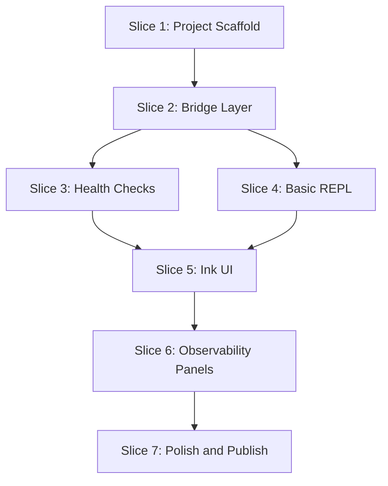

# Phase 3 — Jerry Terminal CLI

Phase 3 delivers `jerry-term`, a standalone, interactive CLI application that provides a user-friendly terminal interface for the Jerry system. The CLI is designed to be installed globally via `npm i -g jerry-term` and serve as the primary way for end users to interact with Jerry's capabilities directly from their terminal.

---

## Goals

1. **Standalone Distribution:** Users install with `npm i -g jerry-term` — no additional setup required
2. **Runtime Flexibility:** Dynamic switching between `local`, `byo-cloud`, and `ozwell` backends
3. **System Observability:** Real-time visibility into thinking steps, tool execution, and agent reasoning
4. **Health Diagnostics:** Built-in checks for Ollama, ActivityWatch, Footnote, and MCP tools
5. **Strict Isolation:** Developed in isolation from core Jerry; consumes Jerry packages as bundled dependencies

---

## Architecture Overview

### Bundled Distribution (Self-Contained)

The CLI bundles all `@mieweb/*` code at build time, eliminating external Jerry package dependencies:

```
jerry-term (npm package)
├── dist/
│   └── index.js          ← Bundled: agent-runtime + tools code
├── bin/
│   └── jerry-term.js     ← CLI entry point
└── package.json          ← Only lists: ink, react, ai, zod (no @mieweb/*)
```

**Why bundled?**

| Approach       | Requirement                          | Issue                          |
| -------------- | ------------------------------------ | ------------------------------ |
| Published deps | `@mieweb/jerry-agent-runtime` on npm | Not published yet              |
| Git deps       | `github:mieweb/jerry#development`    | Slow installs, fragile         |
| **Bundled**    | Build-time inclusion                 | **Zero external @mieweb deps** |

### Bridge Pattern

The CLI uses a bridge layer to abstract the underlying Jerry system:

```
┌─────────────────────────────────────────────────────────────────┐
│                         jerry-term CLI                          │
├─────────────────────────────────────────────────────────────────┤
│  REPL Layer                                                     │
│  ┌──────────┐ ┌──────────┐ ┌──────────┐ ┌──────────┐           │
│  │ /runtime │ │ /health  │ │ /config  │ │ /help    │           │
│  └────┬─────┘ └────┬─────┘ └────┬─────┘ └────┬─────┘           │
│       │            │            │            │                  │
├───────┴────────────┴────────────┴────────────┴──────────────────┤
│  Bridge Layer                                                   │
│  ┌─────────────────────────────────────────────────────────────┐│
│  │ JerryBridge                                                 ││
│  │  - resolveRuntime(profile) → AgentRuntime                   ││
│  │  - runTurn(input) → AsyncIterable<RuntimeEvent>             ││
│  │  - switchRuntime(kind) → void                               ││
│  └─────────────────────────────────────────────────────────────┘│
├─────────────────────────────────────────────────────────────────┤
│  Health Adapters                                                │
│  ┌──────────┐ ┌──────────┐ ┌──────────┐ ┌──────────┐           │
│  │  Ollama  │ │ActivityW │ │ Footnote │ │MCP Tools │           │
│  └──────────┘ └──────────┘ └──────────┘ └──────────┘           │
└─────────────────────────────────────────────────────────────────┘
                              │
                    ┌─────────┴─────────┐
                    │  Bundled Code     │
                    ├───────────────────┤
                    │ jerry-agent-      │
                    │   runtime (built) │
                    │ jerry-tools       │
                    │   (built)         │
                    └───────────────────┘
```

---

## Design System

Based on [CLI UI design guidelines](https://github.com/davila7/claude-code-templates/blob/main/cli-tool/components/agents/development-team/cli-ui-designer.md), jerry-term follows terminal-native aesthetic principles.

### Terminal Color Scheme

```typescript
// src/ui/theme/colors.ts
export const terminalColors = {
  // Background colors
  bgPrimary: "#0f0f0f",
  bgSecondary: "#1a1a1a",
  bgTertiary: "#2a2a2a",

  // Text colors
  textPrimary: "#ffffff",
  textSecondary: "#a0a0a0",
  textMuted: "#606060",

  // Accent colors
  accent: "#d97706",        // Orange - primary accent
  success: "#10b981",       // Green - success states
  warning: "#f59e0b",       // Yellow - warnings
  error: "#ef4444",         // Red - errors
  info: "#3b82f6",          // Blue - information

  // Border colors
  borderPrimary: "#404040",
  borderSecondary: "#606060",
};
```

### Typography

```typescript
// src/ui/theme/typography.ts
export const fontStack = "'Monaco', 'Menlo', 'Ubuntu Mono', 'Consolas', monospace";
```

All text uses monospace fonts for authentic terminal feel. Ink handles this via the `Text` component.

### Terminal Symbols

| Symbol | Usage |
|--------|-------|
| `$` | System/shell prompts |
| `>` | User input prompt |
| `⎿` | Continuation/sub-item indicator |
| `•` | List item / separator |
| `─`, `│`, `┌`, `┐`, `└`, `┘` | Box drawing |

### Status Indicators

```typescript
// src/ui/components/StatusDot.tsx
const statusColors = {
  ok: "#10b981",      // Green dot
  warn: "#f59e0b",    // Orange dot
  error: "#ef4444",   // Red dot
  pending: "#3b82f6", // Blue dot (animated)
};
```

Visual indicators:
- **Status dots:** 8×8px colored circles
- **Checkmarks:** `✓` (success), `✗` (failure), `⚠` (warning)
- **Spinners:** Animated for pending operations
- **Progress:** `[████░░░░░░]` style bars

### Component Patterns

**Command Sections:**
```
┌─────────────────────────────────────────┐
│ ● command_name                          │
│ ⎿ Description of what this does         │
│                                         │
│   [command output here]                 │
│                                         │
└─────────────────────────────────────────┘
```

**Input Prompt:**
```
> _                          (cursor blinks)
```

**Tool Execution:**
```
🔧 Tools
├─ ✓ aw_get_activity (2.3s)
│  └─ Found 47 events
└─ ⏳ footnote_search "query"
```

### Accessibility

- High contrast color scheme (WCAG AA compliant)
- Keyboard navigation for all interactive elements
- Screen reader compatibility via semantic structure
- Focus indicators that match terminal aesthetics

### Theme Support

```typescript
// src/ui/theme/index.ts
export type ThemeMode = "dark" | "light";

export const themes = {
  dark: terminalColors,
  light: {
    bgPrimary: "#f8f9fa",
    bgSecondary: "#e9ecef",
    bgTertiary: "#dee2e6",
    textPrimary: "#1f2937",
    textSecondary: "#6b7280",
    // ... inverted scheme
  },
};
```

---

## Dependency Graph



---

## Branching Strategy and PR Workflow

**Base branch:** `development` (Phase 2 complete)

**Branch naming:** `phase3/jerry-term` — single feature branch for the CLI

**PR workflow:**

1. Create branch from `development`
2. Implement slices incrementally (commits per slice)
3. Run tests and verify acceptance criteria
4. Open PR against `development` with descriptive summary
5. **DO NOT merge without explicit review approval**
6. Tag reviewer and wait for approval before merging

**PR template:**

```markdown
## Phase 3: Jerry Terminal CLI

### Summary

Interactive terminal CLI for Jerry with runtime switching, health checks, and real-time observability.

### Changes

- `packages/jerry-term/` — new package with bundled distribution

### Acceptance Criteria

- [ ] `npm i -g jerry-term` installs globally
- [ ] `jerry-term` starts interactive REPL
- [ ] `/runtime local|ozwell|byo-cloud` switches backend
- [ ] `/health` shows system diagnostics
- [ ] Real-time tool execution visibility

### Dependencies

- Depends on: Phase 2 (agent-runtime, tools packages)
- Blocks: None

### Testing

- Unit tests: Bridge, health checks, command parsing
- Integration tests: Full REPL flow (opt-in)
- Manual verification: npm publish dry-run

### Notes

[Any risks, deviations from plan, or follow-up needed]
```

---

## Slice 1: Project Scaffold

**Status:** Done

**Goal:** Create the `packages/jerry-term/` directory with build configuration for bundled distribution.

**Files:**

- `packages/jerry-term/package.json`
- `packages/jerry-term/tsconfig.json`
- `packages/jerry-term/tsup.config.ts`
- `packages/jerry-term/bin/jerry-term.js`
- `packages/jerry-term/src/index.ts`
- `packages/jerry-term/README.md`

**Tasks:**

- Initialize package with correct metadata for npm publication
- Configure tsup for bundling `@mieweb/*` packages (noExternal)
- Set up bin entry point
- Verify `pnpm build` produces self-contained output
- Test local install via `npm link`

**Package.json:**

```json
{
    "name": "jerry-term",
    "version": "0.1.0",
    "description": "Interactive terminal CLI for Jerry AI agent",
    "type": "module",
    "license": "MIT",
    "author": "MIEWEB",
    "repository": {
        "type": "git",
        "url": "git+https://github.com/mieweb/jerry.git",
        "directory": "packages/jerry-term"
    },
    "bin": {
        "jerry-term": "./bin/jerry-term.js"
    },
    "exports": {
        ".": {
            "types": "./dist/index.d.ts",
            "import": "./dist/index.js"
        }
    },
    "files": ["dist", "bin"],
    "scripts": {
        "dev": "tsx src/index.ts",
        "build": "tsup",
        "typecheck": "tsc --noEmit",
        "test": "node --import tsx --test src/**/*.test.ts",
        "prepublishOnly": "pnpm build"
    },
    "engines": {
        "node": ">=22.0.0"
    },
    "dependencies": {
        "ink": "^5.0.1",
        "ink-spinner": "^5.0.0",
        "react": "^18.3.1",
        "ai": "^4.3.0",
        "@ai-sdk/openai-compatible": "^0.2.0",
        "zod": "^3.23.0",
        "conf": "^13.0.0"
    },
    "devDependencies": {
        "@mieweb/jerry-agent-runtime": "workspace:*",
        "@mieweb/jerry-tools": "workspace:*",
        "@types/node": "^22.0.0",
        "@types/react": "^18.3.0",
        "tsup": "^8.0.0",
        "tsx": "^4.19.0",
        "typescript": "^5.6.0"
    }
}
```

**tsup.config.ts:**

```typescript
import { defineConfig } from "tsup";

export default defineConfig({
    entry: ["src/index.ts"],
    format: ["esm"],
    target: "node22",
    dts: true,
    clean: true,
    sourcemap: true,
    // Bundle @mieweb/* packages INTO the output
    noExternal: ["@mieweb/jerry-agent-runtime", "@mieweb/jerry-tools"],
    // These remain as external npm dependencies
    external: [
        "ink",
        "ink-spinner",
        "react",
        "ai",
        "@ai-sdk/openai-compatible",
        "zod",
        "conf",
    ],
});
```

**Acceptance:**

- `pnpm --filter jerry-term build` succeeds
- `dist/index.js` contains bundled agent-runtime code (grep for `createLocalRuntime`)
- `npm link && jerry-term --version` prints version

**PR checklist:**

- [ ] Package initialized with correct metadata
- [ ] tsup config bundles @mieweb/\* packages
- [ ] Build produces self-contained output
- [ ] Local install via npm link works
- [ ] Typecheck passes

---

## Slice 2: Bridge Layer

**Status:** Not started

**Goal:** Implement the JerryBridge abstraction that wraps agent-runtime for CLI consumption.

**Files:**

- `packages/jerry-term/src/bridge/index.ts`
- `packages/jerry-term/src/bridge/jerry-bridge.ts`
- `packages/jerry-term/src/bridge/jerry-bridge.test.ts`
- `packages/jerry-term/src/bridge/event-emitter.ts`

**Tasks:**

- Create `JerryBridge` class that wraps `resolveRuntime()`
- Implement `switchRuntime(kind, options)` for dynamic backend changes
- Implement `runTurn(input)` that yields `RuntimeEvent` objects
- Add observable event emitter for UI consumption
- Handle runtime switch during active turn (queue until complete)
- Unit tests with mock runtime

**Key Interface:**

```typescript
import type {
    AgentRuntime,
    PrivacyProfile,
    RuntimeEvent,
    TurnInput,
    RuntimeKind,
} from "@mieweb/jerry-agent-runtime";

export class JerryBridge {
    private runtime: AgentRuntime;
    private profile: PrivacyProfile;
    private activeTurn: boolean = false;
    private pendingSwitch: {
        kind: RuntimeKind;
        options?: Partial<PrivacyProfile>;
    } | null = null;

    constructor(initialProfile?: Partial<PrivacyProfile>);

    switchRuntime(kind: RuntimeKind, options?: Partial<PrivacyProfile>): void;

    async *runTurn(input: TurnInput): AsyncIterable<RuntimeEvent>;

    getProfile(): PrivacyProfile;
    getRuntimeKind(): RuntimeKind;
    isActive(): boolean;
}
```

**Acceptance:**

- `new JerryBridge()` creates runtime with default profile
- `bridge.switchRuntime("ozwell")` changes active runtime
- `bridge.runTurn({ messages: [...] })` yields events
- Switch during active turn queues and applies after completion

**PR checklist:**

- [ ] JerryBridge class implemented
- [ ] switchRuntime handles all three backends
- [ ] runTurn yields RuntimeEvent stream
- [ ] Active turn protection implemented
- [ ] Unit tests pass

---

## Slice 3: Health Checks

**Status:** Not started

**Goal:** Implement health check adapters for all system dependencies.

**Files:**

- `packages/jerry-term/src/health/index.ts`
- `packages/jerry-term/src/health/types.ts`
- `packages/jerry-term/src/health/ollama.ts`
- `packages/jerry-term/src/health/activity-watch.ts`
- `packages/jerry-term/src/health/footnote.ts`
- `packages/jerry-term/src/health/mcp-tools.ts`
- `packages/jerry-term/src/health/runner.ts`
- `packages/jerry-term/src/health/*.test.ts`

**Tasks:**

- Define `HealthCheck` interface with `check()` → `HealthResult`
- Implement Ollama check — probe `http://127.0.0.1:11434/api/tags`
- Implement ActivityWatch check — probe `http://127.0.0.1:5600/api/0/info`
- Implement Footnote check — verify `FOOTNOTE_DB` exists and has index
- Implement MCP tools check — verify configured MCP servers are reachable
- Create runner that executes all checks in parallel with timeout
- Format results for terminal display

**HealthCheck Interface:**

```typescript
export interface HealthCheck {
    name: string;
    description: string;
    required: boolean; // false = warning only
    check(): Promise<HealthResult>;
}

export interface HealthResult {
    status: "ok" | "warn" | "error";
    message: string;
    details?: Record<string, unknown>;
    latencyMs?: number;
}

export interface HealthReport {
    timestamp: Date;
    results: Array<{ check: HealthCheck; result: HealthResult }>;
    overall: "ok" | "degraded" | "error";
}
```

**Acceptance:**

- `/health` command shows status of all four services
- Ollama down → shows error with "Not running" message
- ActivityWatch down → shows warning (not required)
- All services up → shows "ok" with latencies

**PR checklist:**

- [ ] HealthCheck interface defined
- [ ] Ollama health check implemented
- [ ] ActivityWatch health check implemented
- [ ] Footnote health check implemented
- [ ] MCP tools health check implemented
- [ ] Parallel runner with timeout implemented
- [ ] Unit tests with mocked responses pass

---

## Slice 4: Basic REPL

**Status:** Not started

**Goal:** Implement the core REPL loop with command parsing (no fancy UI yet).

**Files:**

- `packages/jerry-term/src/repl/index.ts`
- `packages/jerry-term/src/repl/repl.ts`
- `packages/jerry-term/src/repl/input.ts`
- `packages/jerry-term/src/repl/output.ts`
- `packages/jerry-term/src/commands/index.ts`
- `packages/jerry-term/src/commands/types.ts`
- `packages/jerry-term/src/commands/runtime.ts`
- `packages/jerry-term/src/commands/health.ts`
- `packages/jerry-term/src/commands/config.ts`
- `packages/jerry-term/src/commands/help.ts`
- `packages/jerry-term/src/commands/exit.ts`

**Tasks:**

- Create REPL loop with readline-based input
- Parse slash commands (`/runtime`, `/health`, `/config`, `/help`, `/exit`)
- Dispatch non-command input to JerryBridge
- Stream response text to stdout
- Basic error handling and graceful shutdown
- Config loading from `~/.config/jerry-term/config.json` or env vars

**Command Registry:**

```typescript
export interface Command {
    name: string;
    aliases?: string[];
    description: string;
    usage?: string;
    execute(args: string[], ctx: CommandContext): Promise<void>;
}

export interface CommandContext {
    bridge: JerryBridge;
    config: TermConfig;
    output: OutputWriter;
    exit: () => void;
}
```

**Built-in Commands:**

| Command                 | Aliases       | Description                              |
| ----------------------- | ------------- | ---------------------------------------- |
| `/runtime <kind>`       | `/rt`         | Switch runtime: local, ozwell, byo-cloud |
| `/health`               | `/hc`         | Run system health checks                 |
| `/config [key] [value]` | `/cfg`        | View or update configuration             |
| `/help [command]`       | `/h`, `/?`    | Show help                                |
| `/exit`                 | `/q`, `/quit` | Exit the CLI                             |

**Acceptance:**

- `jerry-term` starts and shows prompt
- User types message → Jerry responds (streamed)
- `/runtime ozwell` → switches runtime, confirms
- `/health` → shows health check results
- `/exit` → exits cleanly
- Ctrl+C → graceful shutdown

**PR checklist:**

- [ ] REPL loop implemented with readline
- [ ] Command parser recognizes slash commands
- [ ] All five built-in commands functional
- [ ] Non-command input dispatched to bridge
- [ ] Response streaming works
- [ ] Config loading from file and env vars
- [ ] Graceful shutdown on Ctrl+C
- [ ] Unit tests for command parsing

---

## Slice 5: Ink UI Framework

**Status:** Not started

**Goal:** Replace basic REPL with Ink-based React UI for rich terminal experience, following [CLI UI design guidelines](https://github.com/davila7/claude-code-templates/blob/main/cli-tool/components/agents/development-team/cli-ui-designer.md).

**Files:**

- `packages/jerry-term/src/ui/index.ts`
- `packages/jerry-term/src/ui/App.tsx`
- `packages/jerry-term/src/ui/hooks/useRepl.ts`
- `packages/jerry-term/src/ui/hooks/useBridge.ts`
- `packages/jerry-term/src/ui/theme/colors.ts`
- `packages/jerry-term/src/ui/theme/index.ts`
- `packages/jerry-term/src/ui/components/Header.tsx`
- `packages/jerry-term/src/ui/components/InputPrompt.tsx`
- `packages/jerry-term/src/ui/components/ResponseArea.tsx`
- `packages/jerry-term/src/ui/components/StatusBar.tsx`
- `packages/jerry-term/src/ui/components/StatusDot.tsx`
- `packages/jerry-term/src/ui/components/TerminalBox.tsx`

**Tasks:**

- Set up Ink renderer with full-screen mode
- Implement theme system with dark/light modes (see Design System section)
- Create App component with flexbox layout structure
- Implement Header with ASCII branding option and status dots
- Implement InputPrompt with `>` prompt symbol and blinking cursor
- Implement ResponseArea for streamed output with proper spacing
- Implement StatusBar with colored status indicators
- Create reusable TerminalBox component for bordered sections
- Wire to JerryBridge via React hooks
- Handle terminal resize gracefully
- Support keyboard shortcuts (Ctrl+L clear, Ctrl+C cancel)

**Component Implementation Patterns:**

```tsx
// Header.tsx - Terminal header with status
<Box borderStyle="single" borderColor="borderPrimary" paddingX={1}>
  <Text bold color="textPrimary">jerry-term</Text>
  <Text color="textSecondary"> v{version}</Text>
  <Box flexGrow={1} />
  <StatusDot status={connected ? "ok" : "error"} />
  <Text color="accent">[{runtime}]</Text>
  <Text color="textSecondary"> {model}</Text>
</Box>

// InputPrompt.tsx - Command input with prompt symbol
<Box>
  <Text color="accent" bold>{">"}</Text>
  <Text> </Text>
  <TextInput value={input} onChange={setInput} />
  <Text color="textMuted">_</Text> {/* Blinking cursor */}
</Box>

// StatusBar.tsx - Connection and timing info
<Box borderStyle="single" borderColor="borderSecondary" paddingX={1}>
  <StatusDot status="ok" />
  <Text color="textSecondary">Connected</Text>
  <Text color="textMuted"> • </Text>
  <Text color="textSecondary">Last: {latency}ms</Text>
  <Text color="textMuted"> • </Text>
  <Text color="textSecondary">Tools: {toolCount}</Text>
</Box>
```

**UI Layout:**

```
┌─────────────────────────────────────────────────────────────────┐
│ ● jerry-term v0.1.0                  [local] ollama:qwen2.5:3b  │  ← Header (with status dot)
├─────────────────────────────────────────────────────────────────┤
│                                                                 │
│ Based on your ActivityWatch data, you spent most of your time  │  ← ResponseArea
│ in VS Code working on the jerry-term project...                │
│                                                                 │
├─────────────────────────────────────────────────────────────────┤
│ > _                                                             │  ← InputPrompt (> symbol)
├─────────────────────────────────────────────────────────────────┤
│ ● Connected • Last: 2.3s • Tools: 4 available                  │  ← StatusBar
└─────────────────────────────────────────────────────────────────┘
```

**Visual Consistency Checklist:**

- [ ] All text uses monospace font (Ink default)
- [ ] Colors follow theme CSS custom properties pattern
- [ ] Spacing follows 1-unit baseline (Ink's padding units)
- [ ] Border styles consistent (`single` for primary, `round` for secondary)
- [ ] Prompt symbols use proper glyphs (`>`, `$`, `⎿`)
- [ ] Status indicators use colored dots

**Acceptance:**

- UI renders with proper layout and terminal aesthetics
- Header shows status dot, runtime badge, and model
- Input has `>` prompt with visible cursor
- Response streams character by character
- Command history with up/down arrows
- Colors match terminal color scheme
- Resize doesn't break layout

**PR checklist:**

- [ ] Ink renderer set up with full-screen mode
- [ ] Theme system implemented (colors, typography)
- [ ] App layout structure with flexbox
- [ ] Header component with status dot and runtime badge
- [ ] InputPrompt with `>` symbol and cursor
- [ ] ResponseArea with streaming display
- [ ] StatusBar with connection indicators
- [ ] TerminalBox reusable component
- [ ] Terminal resize handled
- [ ] Keyboard shortcuts working
- [ ] All previous REPL functionality preserved

---

## Slice 6: Observability Panels

**Status:** Not started

**Goal:** Add real-time visibility into Jerry's internal processes, tool execution, and thinking steps using terminal-native visual patterns from the [CLI UI design guidelines](https://github.com/davila7/claude-code-templates/blob/main/cli-tool/components/agents/development-team/cli-ui-designer.md).

**Files:**

- `packages/jerry-term/src/ui/components/ThinkingPanel.tsx`
- `packages/jerry-term/src/ui/components/ToolPanel.tsx`
- `packages/jerry-term/src/ui/components/ToolCallItem.tsx`
- `packages/jerry-term/src/ui/components/TreeView.tsx`
- `packages/jerry-term/src/ui/components/CollapsibleSection.tsx`
- `packages/jerry-term/src/ui/hooks/useObservability.ts`
- `packages/jerry-term/src/ui/layout/PanelLayout.tsx`

**Tasks:**

- Create ThinkingPanel with animated spinner during inference
- Create ToolPanel showing active and completed tool calls in tree format
- Implement ToolCallItem with status dot, timing, and expandable output
- Create TreeView component for nested display (`├─`, `└─`, `│`)
- Create CollapsibleSection for toggle-able panels
- Add timing information with color-coded latency
- Keyboard shortcuts: `Ctrl+T` (tools), `Ctrl+K` (thinking), `Ctrl+E` (expand all)
- Auto-scroll to latest tool activity

**Component Patterns:**

```tsx
// ThinkingPanel.tsx - Shows agent reasoning
<CollapsibleSection title="Thinking" shortcut="Ctrl+K" icon="🤔">
  <Box flexDirection="column">
    <Box>
      <Spinner type="dots" />
      <Text color="textSecondary"> Analyzing user request...</Text>
    </Box>
    <TreeView>
      <TreeItem icon="⎿">Parsing intent: summarize activity</TreeItem>
      <TreeItem icon="⎿">Planning tool sequence</TreeItem>
    </TreeView>
  </Box>
</CollapsibleSection>

// ToolPanel.tsx - Tool execution display
<CollapsibleSection title="Tools" shortcut="Ctrl+T" icon="🔧" count={tools.length}>
  <TreeView>
    {tools.map(tool => (
      <ToolCallItem
        key={tool.id}
        name={tool.name}
        status={tool.status}
        duration={tool.durationMs}
        output={tool.output}
      />
    ))}
  </TreeView>
</CollapsibleSection>

// ToolCallItem.tsx - Individual tool call
<Box>
  <StatusIcon status={status} /> {/* ✓, ⏳, ✗, ⚠ */}
  <Text bold color={statusColor}>{name}</Text>
  {duration && <Text color="textMuted"> ({formatDuration(duration)})</Text>}
  {expanded && (
    <Box marginLeft={2} marginTop={1}>
      <Text color="textSecondary">⎿ {truncate(output, 200)}</Text>
    </Box>
  )}
</Box>
```

**Visual Hierarchy (Tree Drawing):**

```
🔧 Tools (3)                                              [Ctrl+T]
├─ ✓ aw_get_activity                                        2.3s
│  └─ Found 47 events in last 2 hours
├─ ✓ footnote_search                                        1.1s
│  └─ 3 documents matched "architecture"
└─ ⏳ summarize_context                                       ...
   └─ Processing...
```

Tree characters:
- `├─` Branch with siblings below
- `└─` Last branch (no siblings below)
- `│` Vertical continuation
- `⎿` Sub-item/detail indicator

**Status Indicators (with colors):**

| Icon | Status | Color | Description |
|------|--------|-------|-------------|
| `⏳` | Running | `info` (#3b82f6) | Currently executing |
| `✓` | Success | `success` (#10b981) | Completed successfully |
| `⚠` | Warning | `warning` (#f59e0b) | Completed with issues |
| `✗` | Error | `error` (#ef4444) | Failed |
| `○` | Pending | `textMuted` (#606060) | Queued, not started |

**Latency Color Coding:**

```typescript
const getLatencyColor = (ms: number) => {
  if (ms < 500) return "success";   // Fast: green
  if (ms < 2000) return "warning";  // Moderate: yellow
  return "error";                    // Slow: red
};
```

**Observability Layout:**

```
┌─────────────────────────────────────────────────────────────────┐
│ ● jerry-term v0.1.0                  [local] ollama:qwen2.5:3b  │
├─────────────────────────────────────────────────────────────────┤
│ 🤔 Thinking                                             [Ctrl+K]│
│ ├─ ⎿ Analyzing user request                                    │
│ └─ ⎿ Planning tool sequence                                    │
├─────────────────────────────────────────────────────────────────┤
│ 🔧 Tools (2/3)                                          [Ctrl+T]│
│ ├─ ✓ aw_get_activity                                      2.3s │
│ │  └─ Found 47 events in last 2 hours                          │
│ └─ ⏳ footnote_search "architecture notes"                      │
├─────────────────────────────────────────────────────────────────┤
│ 💬 Response                                                     │
│ Based on your ActivityWatch data, you spent most of your time  │
│ in VS Code working on the jerry-term project...                │
├─────────────────────────────────────────────────────────────────┤
│ > _                                                             │
└─────────────────────────────────────────────────────────────────┘
```

**Collapsed Panel View:**

```
│ 🔧 Tools (3) ▶                                          [Ctrl+T]│
```

**Keyboard Shortcuts:**

| Shortcut | Action |
|----------|--------|
| `Ctrl+T` | Toggle Tools panel |
| `Ctrl+K` | Toggle Thinking panel |
| `Ctrl+E` | Expand/collapse all tool outputs |
| `Tab` | Cycle focus between panels |
| `Enter` | Expand focused tool output |

**Acceptance:**

- Tool calls show in real-time with tree structure
- Status icons update as tools execute
- Execution time displayed with latency coloring
- Tool output visible (truncated at 200 chars, expandable)
- Panels collapsible with keyboard shortcuts
- Collapsed panels show count badge
- Tree drawing characters render correctly
- Auto-scroll follows latest activity

**PR checklist:**

- [ ] ThinkingPanel with spinner animation
- [ ] ToolPanel with tree structure
- [ ] ToolCallItem with status icons and timing
- [ ] TreeView component for nested display
- [ ] CollapsibleSection with keyboard toggle
- [ ] Latency color coding implemented
- [ ] Tool output truncation with expand
- [ ] Keyboard shortcuts working
- [ ] Auto-scroll behavior
- [ ] Unit tests for observability hooks

---

## Slice 7: Polish and Publish

**Status:** Not started

**Goal:** Final polish, documentation, and npm publication.

**Files:**

- `packages/jerry-term/README.md` (complete)
- `packages/jerry-term/CHANGELOG.md`
- `packages/jerry-term/src/cli.ts` (CLI argument parsing)
- `docs/jerry-term.md` (user guide)
- `.github/workflows/publish-jerry-term.yml`

**Tasks:**

- Complete README with installation, usage, and examples
- Add CLI argument parsing (`--version`, `--help`, `--runtime`, `--verbose`)
- Create user guide documentation
- Set up npm publish workflow (manual trigger)
- Test publish dry-run: `npm publish --dry-run`
- Verify Bun compatibility: `bun x jerry-term`
- Add CHANGELOG for version tracking
- Final QA pass on all features

**CLI Arguments:**

```
jerry-term [options] [message]

Options:
  -v, --version          Show version
  -h, --help             Show help
  -r, --runtime <kind>   Set initial runtime (local|ozwell|byo-cloud)
  --verbose              Enable debug output
  --no-ui                Use basic REPL instead of Ink UI
  --config <path>        Custom config file path

Examples:
  jerry-term                          # Start interactive REPL
  jerry-term "summarize my day"       # One-shot query
  jerry-term -r ozwell                # Start with Ozwell runtime
  jerry-term --no-ui                  # Basic mode (no Ink)
```

**Acceptance:**

- `npm publish --dry-run` succeeds without errors
- `npm i -g jerry-term` on clean machine works
- `jerry-term --help` shows usage
- `jerry-term "hello"` runs one-shot query
- `bun x jerry-term` works (Bun compatibility)
- README provides complete quickstart

**PR checklist:**

- [ ] README complete with examples
- [ ] CLI argument parsing implemented
- [ ] User guide in docs/
- [ ] Publish workflow created
- [ ] Dry-run publish succeeds
- [ ] Bun compatibility verified
- [ ] CHANGELOG created
- [ ] Final QA completed

---

## Directory Structure

```
packages/jerry-term/
├── bin/
│   └── jerry-term.js           # CLI entry: #!/usr/bin/env node
├── src/
│   ├── index.ts                # Main export and entry
│   ├── cli.ts                  # CLI argument parsing
│   ├── bridge/
│   │   ├── index.ts
│   │   ├── jerry-bridge.ts     # Core bridge to Jerry runtime
│   │   ├── jerry-bridge.test.ts
│   │   └── event-emitter.ts    # Observable event bus
│   ├── commands/
│   │   ├── index.ts            # Command registry
│   │   ├── types.ts
│   │   ├── runtime.ts          # /runtime command
│   │   ├── health.ts           # /health command
│   │   ├── config.ts           # /config command
│   │   ├── help.ts             # /help command
│   │   └── exit.ts             # /exit command
│   ├── health/
│   │   ├── index.ts            # Health check exports
│   │   ├── types.ts            # HealthCheck, HealthResult
│   │   ├── ollama.ts           # Ollama probe
│   │   ├── activity-watch.ts   # ActivityWatch probe
│   │   ├── footnote.ts         # Footnote index check
│   │   ├── mcp-tools.ts        # MCP server check
│   │   └── runner.ts           # Parallel check runner
│   ├── repl/
│   │   ├── index.ts
│   │   ├── repl.ts             # Basic REPL loop
│   │   ├── input.ts            # Input handling
│   │   └── output.ts           # Output formatting
│   ├── ui/
│   │   ├── index.ts
│   │   ├── App.tsx             # Main Ink app
│   │   ├── theme/
│   │   │   ├── index.ts        # Theme exports
│   │   │   ├── colors.ts       # Terminal color scheme
│   │   │   └── types.ts        # Theme types
│   │   ├── hooks/
│   │   │   ├── useRepl.ts
│   │   │   ├── useBridge.ts
│   │   │   ├── useTheme.ts     # Theme context hook
│   │   │   └── useObservability.ts
│   │   ├── components/
│   │   │   ├── Header.tsx
│   │   │   ├── InputPrompt.tsx
│   │   │   ├── ResponseArea.tsx
│   │   │   ├── StatusBar.tsx
│   │   │   ├── StatusDot.tsx   # Colored status indicator
│   │   │   ├── TerminalBox.tsx # Bordered container
│   │   │   ├── TreeView.tsx    # Tree structure (├─ └─ │)
│   │   │   ├── CollapsibleSection.tsx
│   │   │   ├── ThinkingPanel.tsx
│   │   │   ├── ToolPanel.tsx
│   │   │   └── ToolCallItem.tsx
│   │   └── layout/
│   │       └── PanelLayout.tsx
│   ├── config/
│   │   ├── index.ts
│   │   ├── schema.ts           # Zod config schema
│   │   └── loader.ts           # Config file handling
│   └── utils/
│       ├── logger.ts
│       └── format.ts
├── tsconfig.json
├── tsup.config.ts
├── package.json
├── README.md
└── CHANGELOG.md
```

---

## Risk Mitigations

| Risk                                 | Severity | Mitigation                                           |
| ------------------------------------ | -------- | ---------------------------------------------------- |
| Bundle size too large                | Medium   | Tree-shake unused code; analyze with `bundlephobia`  |
| Ink rendering issues on Windows      | Medium   | Test on Windows; provide `--no-ui` fallback          |
| Runtime API changes in agent-runtime | High     | Bridge layer absorbs changes; pin workspace versions |
| MCP server lifecycle management      | Medium   | Health checks detect; graceful error messages        |
| Node.js version compatibility        | Low      | Require Node 22+; document in engines                |
| Bun compatibility issues             | Low      | Avoid Node-specific APIs; test both runtimes         |

### Edge Cases

1. **Runtime switch during active turn:** Queue switch, apply after turn completes
2. **Health check timeout:** 5s timeout per check; show "timeout" status
3. **Large tool outputs:** Truncate at 500 chars; "..." with expand option
4. **MCP server not running:** Show warning; continue without those tools
5. **Config file invalid:** Log warning; fall back to defaults
6. **Terminal too narrow:** Graceful degradation; hide panels

---

## Slice Summary

| Slice               | Goal                 | Est. Files | Key Deliverable             |
| ------------------- | -------------------- | ---------- | --------------------------- |
| 1. Project Scaffold | Build setup          | 6          | Bundled package that builds |
| 2. Bridge Layer     | Jerry abstraction    | 4          | JerryBridge class           |
| 3. Health Checks    | Diagnostics          | 8          | `/health` command           |
| 4. Basic REPL       | Core interaction     | 11         | Working CLI with commands   |
| 5. Ink UI           | Rich terminal + theme| 12         | Full-screen UI with design system |
| 6. Observability    | Real-time visibility | 7          | Tool/thinking panels with tree view |
| 7. Polish & Publish | Ship it              | 5          | npm package live            |

---

## Done When

- `npm i -g jerry-term` installs successfully on clean machine
- `jerry-term` starts interactive REPL with Ink UI
- `/runtime local|ozwell|byo-cloud` switches backend dynamically
- `/health` shows status of Ollama, ActivityWatch, Footnote, MCP tools
- Tool execution visible in real-time with timing
- `jerry-term "summarize my day"` works as one-shot query
- Bun compatible (`bun x jerry-term` works)
- Documentation complete in README and docs/
- Published to npm registry

---

## Post-Phase 3 Considerations

- **Mobile thin client:** Could share bridge logic with React Native
- **Web UI:** Ink components may inform web terminal design
- **Plugin system:** Commands could be extensible via npm packages
- **Themes:** Color schemes configurable in config file
- **Session persistence:** Save/restore conversation history
