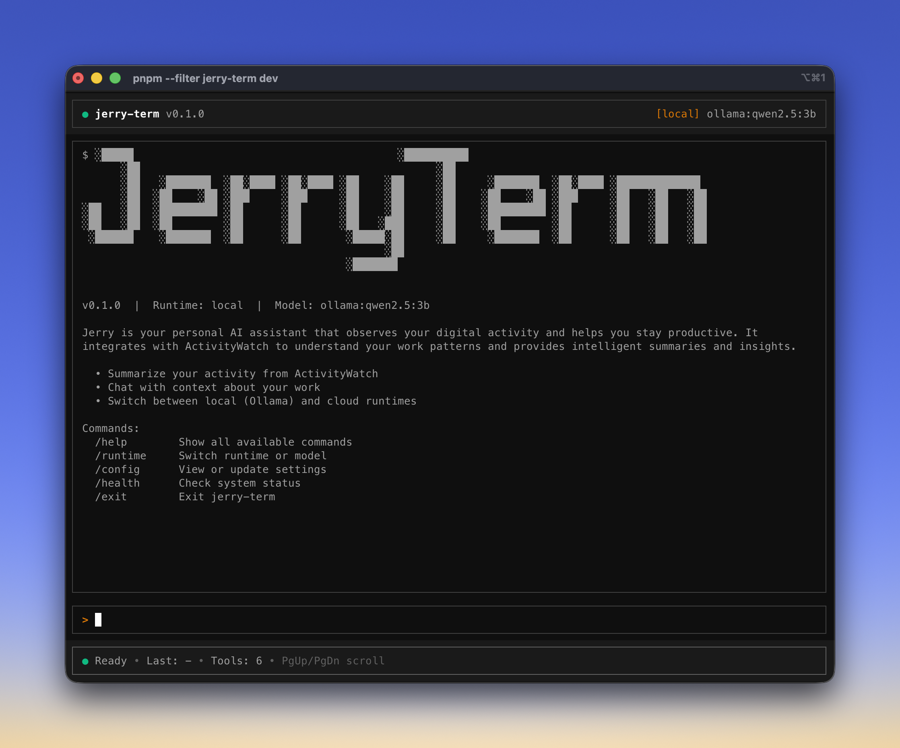

# jerry-term

Interactive terminal CLI for Jerry AI agent with a rich OpenTUI-based UI.



## Installation

```bash
npm i -g jerry-term
```

Or run directly from the monorepo:

```bash
pnpm --filter jerry-term dev
```

## Quick Start

```bash
# Start the interactive UI
jerry-term

# One-shot query (runs headless, prints result, exits)
jerry-term "summarize my day"

# Check version
jerry-term --version
jerry-term -v

# Run health diagnostics
jerry-term --health
jerry-term -H

# Start with a specific runtime and model
jerry-term -r ozwell
jerry-term -r anthropic --model claude-sonnet-4-20250514

# Use basic REPL instead of OpenTUI UI
jerry-term --no-ui

# Verbose output (shows tool calls in one-shot mode)
jerry-term --verbose "what did I work on?"

# Use a custom config file
jerry-term --config ./my-config.json
```

### CLI Reference

```
jerry-term [options] [message]

Options:
  -v, --version          Show version
  -h, --help             Show help
  -r, --runtime <kind>   Set initial runtime (local|ozwell|byo-cloud|anthropic)
  --model <id>           Set initial model for the chosen runtime
  -H, --health           Run health diagnostics and exit
  --verbose              Enable debug output
  --no-ui                Use basic REPL instead of OpenTUI UI
  --config <path>        Custom config file path
```

## UI Overview

jerry-term provides a full-screen terminal UI with observability panels:

```
┌─────────────────────────────────────────────────────────────────┐
│ ● jerry-term v0.1.0                  [local] ollama:qwen2.5:3b  │  ← Header
├─────────────────────────────────────────────────────────────────┤
│ ▼ 🤔 Thinking                                           [Ctrl+K]│  ← Thinking Panel
│   ⠋ Waiting for model...                                       │    (visible while busy)
├─────────────────────────────────────────────────────────────────┤
│ ▼ 🔧 Tools (2)                                          [Ctrl+T]│  ← Tools Panel
│ ├─ ✓ summarize_activity (2.3s)                                 │    (visible when tools active)
│ └─ ⏳ search_memory (...)                                       │
├─────────────────────────────────────────────────────────────────┤
│                                                                 │
│ Based on your ActivityWatch data, you spent most of your time  │  ← Response Area
│ in VS Code working on the jerry-term project...                │
│                                                                 │
├─────────────────────────────────────────────────────────────────┤
│ > _                                                             │  ← Input Prompt
├─────────────────────────────────────────────────────────────────┤
│ ● Ready • Last: 2.3s • Tools: 2/2                              │  ← Status Bar
└─────────────────────────────────────────────────────────────────┘
```

- **Header**: Shows connection status, current runtime, and model
- **Thinking Panel**: Shows current inference phase (waiting/tools/generating); auto-hides when idle
- **Tools Panel**: Real-time tool execution tree with status, timing, and expandable output
- **Response Area**: Displays conversation with Jerry (user input, assistant responses)
- **Input Prompt**: Type messages or commands here
- **Status Bar**: Shows connection state, last response time, and tool progress (done/total)

## Keyboard Shortcuts

| Shortcut  | Action                                   |
| --------- | ---------------------------------------- |
| `Enter`   | Submit input                             |
| `↑` / `↓` | Navigate command history                 |
| `Scroll`  | Mouse/trackpad scroll in transcript area |
| `Ctrl+T`  | Toggle Tools panel visibility            |
| `Ctrl+K`  | Toggle Thinking panel visibility         |
| `Ctrl+E`  | Expand/collapse all tool outputs         |
| `Ctrl+L`  | Clear transcript                         |
| `Ctrl+C`  | Cancel current turn (if busy) or exit    |

## Built-in Commands

All commands start with `/`:

| Command                     | Aliases            | Description                                                                  |
| --------------------------- | ------------------ | ---------------------------------------------------------------------------- |
| `/runtime [kind]`           | `/rt`              | Open runtime picker or switch to `local`, `ozwell`, `byo-cloud`, `anthropic` |
| `/model [id]`               | `/m`               | Open model picker or set model directly                                      |
| `/health`                   | `/hc`              | Run system health checks                                                     |
| `/aw-tail [limit] [bucket]` | `/aw`, `/activity` | Peek latest ActivityWatch events (connectivity check)                        |
| `/config [key] [value]`     | `/cfg`             | View or update configuration (persisted to config file)                      |
| `/help [command]`           | `/h`, `/?`         | Show help                                                                    |
| `/exit`                     | `/q`, `/quit`      | Exit the CLI                                                                 |

**Note:** Configuration changes via `/config`, `/runtime`, and `/model` take effect on the next turn and are automatically persisted to `~/.config/jerry-term/config.json`.

### Runtime and Model Picker

Use `/runtime` or `/model` without arguments to open an interactive tree picker:

```
┌─ Select Runtime ─────────────────────────────────┐
│ ▸ Local (Ollama)           ollama:llama3.1:8b    │
│   Ozwell                   gpt-4.1-mini          │
│   BYO-Cloud                Select provider...    │
└──────────────────────────────────────────────────┘
```

**Picker navigation:**

- `↑` / `↓` — Navigate between options
- `Enter` or `→` — Select / drill into
- `Esc` or `←` — Go back / cancel

The picker fetches live model lists from Ollama, Ozwell, OpenAI, and Anthropic APIs. If a provider isn't configured yet, select it to enter your API key.

**Last model memory:** jerry-term remembers your last-used model per runtime. When switching back to a runtime, it restores your previous model selection.

### Examples

```bash
# View available runtimes and their status
> /runtime
Current runtime: local
Current model:   ollama:llama3.1:8b

Available runtimes:
  * local      [ready] model: ollama:llama3.1:8b
    ozwell     [not configured] (set API key via /config apiKey or env)
    byo-cloud  [not configured] (set API key via /config apiKey or env)

# Switch to Ozwell runtime (with optional model override)
> /runtime ozwell
> /runtime ozwell gpt-4.1-mini

# Check system health
> /health

# Peek latest ActivityWatch events
> /aw-tail
> /aw 20
> /aw-tail aw-watcher-window_Mac

# View current configuration
> /config

# Set configuration values (persisted to config file)
> /config model gpt-4.1-mini
> /config apiKey ozw_your_key
> /config endpoint https://custom.api.endpoint
> /config runtime byo-cloud

# Get help on a specific command
> /help runtime
```

## Chatting with Jerry

Simply type your message and press Enter:

```
> summarize my work from yesterday

Based on your ActivityWatch data, yesterday you spent approximately 6 hours
working across several projects...

> what were the main themes?

The main themes from your work yesterday were:
1. Documentation and planning (2.5 hours)
2. Code implementation (2 hours)
...
```

## Runtime Configuration

jerry-term supports three runtime backends:

### 1. Local (Ollama) — Default

Nothing leaves the machine except localhost Ollama calls.

```bash
JERRY_RUNTIME=local \
  JERRY_MODEL=ollama:qwen2.5:3b \
  jerry-term
```

**Requirements**: Ollama must be running at `http://127.0.0.1:11434`

### 2. Ozwell (Cloud)

Uses Ozwell as the cloud model provider.

**Via environment variables:**

```bash
JERRY_RUNTIME=ozwell \
  JERRY_MODEL=gpt-4.1-mini \
  OZWELL_API_KEY=ozw_your_key \
  jerry-term
```

**Via interactive commands:**

```bash
# Start jerry-term, then:
> /config apiKey ozw_your_key
> /runtime ozwell gpt-4.1-mini
```

**API key resolution order:** `OZWELL_API_KEY` > `OZWELL_AGENT_KEY` > `JERRY_API_KEY` > config file

**Endpoint resolution:** `JERRY_ENDPOINT` > `OZWELL_ENDPOINT` > default

If Ozwell is unavailable, jerry-term falls back to local Ollama automatically.

### 3. BYO Providers (OpenAI, Anthropic)

jerry-term supports BYO (bring-your-own) API keys for OpenAI and Anthropic. Use the interactive picker or environment variables.

#### OpenAI

**Via interactive picker (recommended):**

```bash
# Start jerry-term, then use the runtime picker:
> /runtime
# Select "BYO-Cloud" → "OpenAI" → Enter your API key
# Live models will be fetched from OpenAI and displayed
```

**Via environment variables:**

```bash
OPENAI_API_KEY=sk-... jerry-term
# Then switch via /runtime byo openai
```

**API key resolution:** `OPENAI_API_KEY` > `JERRY_API_KEY` > config file

#### Anthropic (Claude)

**Via interactive picker (recommended):**

```bash
> /runtime
# Select "BYO-Cloud" → "Anthropic" → Enter your API key
# Live models will be fetched from Anthropic and displayed
```

**Via environment variables:**

```bash
ANTHROPIC_API_KEY=sk-ant-... jerry-term
# Then switch via /runtime anthropic
```

**API key resolution:** `ANTHROPIC_API_KEY` > config file

#### More providers coming soon

The BYO picker shows OpenAI and Anthropic. Additional providers (Moonshot, custom endpoints) are planned for future releases.

### Managing API Keys

API keys are stored in `~/.config/jerry-term/config.json` in a credentials vault. Keys are displayed in masked format (`sk-pr****abcd`) for security.

**Clear a saved key:**

```bash
> /config clearKey openai      # Remove OpenAI key
> /config clearKey anthropic   # Remove Anthropic key
> /config clearKey ozwell      # Remove Ozwell key
> /config apiKey clear         # Remove key for active runtime
```

**Important:** If you clear the API key for your currently active provider (e.g., you're using BYO-Cloud with OpenAI and run `/config clearKey openai`), jerry-term will automatically switch to local runtime with the default Ollama model to prevent "no API key" errors.

**View current config (with masked keys):**

```bash
> /config
# Shows: apiKey: sk-pr****abcd
```

## Environment Variables

| Variable            | Purpose                             | Example                                     |
| ------------------- | ----------------------------------- | ------------------------------------------- |
| `JERRY_RUNTIME`     | Runtime backend                     | `local`, `ozwell`, `byo-cloud`, `anthropic` |
| `JERRY_MODEL`       | Model identifier                    | `ollama:qwen2.5:3b`, `gpt-4.1-mini`         |
| `JERRY_API_KEY`     | Generic API key (all runtimes)      | `ozw_...`, `sk-...`                         |
| `JERRY_ENDPOINT`    | Custom API endpoint (overrides all) | `https://...`                               |
| `JERRY_EGRESS`      | Egress policy                       | `local`, `cloud`                            |
| `JERRY_TERM_CONFIG` | Custom config file path             | `./my-config.json`                          |
| `OZWELL_API_KEY`    | Ozwell API key                      | `ozw_...`                                   |
| `OZWELL_AGENT_KEY`  | Ozwell agent key (alternative)      | `ozw_...`                                   |
| `OZWELL_ENDPOINT`   | Ozwell API endpoint                 | `https://ozwellapi.os.mieweb.org`           |
| `OPENAI_API_KEY`    | OpenAI API key                      | `sk-...`                                    |
| `ANTHROPIC_API_KEY` | Anthropic (Claude) API key          | `sk-ant-...`                                |

**Priority:** Environment variables override config file settings. Config file values are used as fallbacks.

## Config File

jerry-term looks for configuration in these locations (in order of precedence):

1. `./.jerry-term.json` (current directory — highest file precedence)
2. `~/.config/jerry-term/config.json` (user config — written by `/config` commands)
3. `~/.jerry-term.json` (legacy location)

**Minimal config:**

```json
{
    "runtime": "local",
    "model": "ollama:qwen2.5:3b"
}
```

**Full config with all options:**

```json
{
    "runtime": "ozwell",
    "model": "gpt-4.1-mini",
    "apiKey": "ozw_your_api_key",
    "endpoint": "https://custom.ozwell.endpoint",
    "egress": "cloud"
}
```

**Persistence:** When you use `/config` or `/runtime` commands, changes are automatically saved to `~/.config/jerry-term/config.json`. These persist across sessions but can still be overridden by environment variables.

## Available Tools

jerry-term includes local tool implementations that work without the Jerry worker:

| Tool                 | Description                  | Status                   |
| -------------------- | ---------------------------- | ------------------------ |
| `summarize_activity` | Summarize ActivityWatch data | Full (calls AW HTTP API) |
| `search_memory`      | Search semantic memory       | Stub (requires worker)   |
| `schedule_followup`  | Schedule reminders           | Stub (requires worker)   |
| `read_file`          | Read file contents           | Stub (requires worker)   |
| `list_watched`       | List watched directories     | Stub (requires worker)   |
| `index_document`     | Index a document             | Stub (requires worker)   |

**Note**: `summarize_activity` works fully in standalone mode by calling the ActivityWatch HTTP API directly. Other tools return helpful messages indicating they require the Jerry worker.

## Health Checks

Run `/health` or `jerry-term --health` to check system dependencies:

```
jerry-term health check
━━━━━━━━━━━━━━━━━━━━━━━━━━━━━━

✓ Ollama            Running (245ms)
⚠ ActivityWatch     Not running - activity features unavailable
✓ Footnote          Index found (12ms)
✓ MCP Tools         Disabled

Overall: degraded
```

Status indicators:

- `✓` (green) — OK
- `⚠` (yellow) — Warning (optional service)
- `✗` (red) — Error (required service)

## Development

jerry-term uses [OpenTUI](https://opentui.com/) for the terminal UI, which requires **Bun** runtime for the interactive UI.

```bash
# Install dependencies
pnpm install

# Run in development mode (requires Bun for UI)
pnpm --filter jerry-term dev

# Run with Node.js (readline REPL only)
pnpm --filter jerry-term dev:node

# Build
pnpm --filter jerry-term build

# Run tests
pnpm --filter jerry-term test

# Type check
pnpm --filter jerry-term typecheck

# Local install for testing
cd packages/jerry-term
npm link
jerry-term --version
```

### Runtime Requirements

- **Bun 1.3+**: Required for the interactive OpenTUI interface
- **Node.js 22+**: Supported for `--no-ui` readline mode only

## Troubleshooting

### "Ollama not running"

Start Ollama and ensure it's accessible at `http://127.0.0.1:11434`:

```bash
ollama serve
# In another terminal:
curl http://127.0.0.1:11434/api/tags
```

### "ActivityWatch not running"

ActivityWatch is optional but needed for `summarize_activity`. Install and start it:

1. Download from [activitywatch.net](https://activitywatch.net/)
2. Start the ActivityWatch tray application
3. Verify: `curl http://127.0.0.1:5600/api/0/info`

### UI rendering issues

If the UI doesn't render correctly:

- Ensure you're running with **Bun** (not Node.js) for the interactive UI
- Ensure your terminal supports truecolor (256+ colors)
- Try a modern terminal emulator (Kitty, Ghostty, WezTerm, Alacritty, iTerm2)
- Use `--no-ui` flag for the legacy readline REPL (works with Node.js)

### Sticky TUI / transcript scroll — UNSOLVED

**Status: unsolved.** jerry-term may still scroll with the host terminal’s scrollback, and the in-app transcript may not receive the mouse wheel.

Workarounds while this is open:

- Scroll the transcript with **PgUp / PgDown** (or Shift+↑ / Shift+↓)
- Try another terminal (Kitty, Ghostty, WezTerm, Alacritty) or iTerm2 alternate-screen / mouse settings
- Do not set `OTUI_USE_ALTERNATE_SCREEN=false`
- Use `--no-ui` if you need a reliable non-fullscreen REPL

Tracked in [`docs/plans/phase-3.md`](../../docs/plans/phase-3.md) under _Open: Sticky fullscreen / transcript scroll_.

### Copy/paste text

The full-screen UI captures keyboard input. To copy text from the transcript:

- **macOS:** Hold `Option` while clicking and dragging to select, then `Cmd+C`
- **Linux/Windows:** Hold `Alt` while selecting, then `Ctrl+Shift+C`
- **Alternative:** Use `--no-ui` mode for standard terminal selection

### Ozwell fallback

If you see `[jerry] Ozwell unavailable...`, jerry-term will automatically fall back to local Ollama. Check:

- Your `OZWELL_API_KEY` is valid
- The Ozwell endpoint is reachable

## Limitations (Phase 3.1 Deferred)

The following features are planned but not yet available in jerry-term:

- **Cloud worker queue** (`/enqueue`): Offloading long-running tasks to the jerry-app worker queue is handled by the `jerry` CLI, not jerry-term. jerry-term stays in-process for v0.1.
- **Session resume** (`-s <session-id>`): Resuming previous conversations requires the cloud worker. This will be added when jerry-term gains a cloud-agent client.
- **Embedded worker**: jerry-term does not bundle a worker process; it relies on agent-runtime directly.

See [`docs/plans/phase-3.md`](../../docs/plans/phase-3.md) for the full roadmap.

## License

MIT
