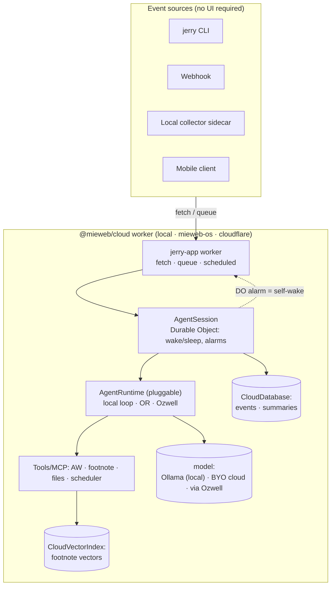
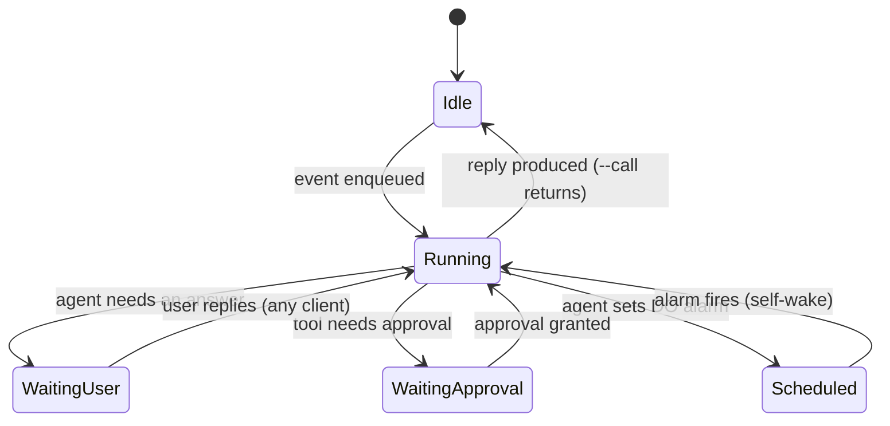

# Jerry — Architecture & Build Plan

> Audience: a senior/10x engineer. This document covers **why** and the **subtle
> design tensions**, not the obvious mechanics. If something is standard
> professional practice (lint, CI, tests, semantic commits), it's assumed.

---

## 1. Vision

Jerry is your **value advocate**: a portable agent that reads your activity
signals (ActivityWatch, and later TimeHarbor intent, Pulse clips, and shared
artifacts) and interprets them into a defensible narrative of the value you
created — what you worked on, why it mattered, what obstacles you navigated, and
how your effort moved the organization forward. It interprets contribution; it
does not merely summarize activity. (See the product framing in the repo README.)

To deliver that reliably, Jerry is an **event-driven agent**: it wakes on an
event, does something (possibly multi-step, possibly waiting on a human or a
timer), then goes dormant until the next event. No UI is required for the core;
any UI becomes just one of several event sources. The same agent code must run on
a laptop, a self-hosted server, and Cloudflare without rewrites.

### What “Ozwell” is — and why it's optional

**Ozwell is not a trained model or a fixed agent.** Ozwell is an *agent system* —
an OpenAI-compatible API and runtime for defining and running agents, with
conversations, tool-calling, MCP, streaming (SSE), files, and embeddings. Its
canonical contract is the Zod-based spec in
[`mieweb/ozwellai-api`](https://github.com/mieweb/ozwellai-api) (call-for-call
compatible with OpenAI's API, plus conversation-management and shared/multi-user
conversation endpoints); the Ozwell backend is itself backed by `@mieweb/cloud`,
and its underlying model is pluggable (Ollama, OpenAI, …).

**But Jerry must also run with no Ozwell at all.** The core promise to a
skeptical developer is: *if you point Jerry at local Ollama, nothing about your
activity ever leaves your machine.* So Ozwell is **one backend behind a pluggable
`AgentRuntime` port**, never a hard dependency. Three backends, one interface:

| Runtime | Where it runs | What leaves the machine |
| --- | --- | --- |
| `local` | In-process loop over **local Ollama** (OpenAI-compatible) | **Nothing.** Fully offline. |
| `byo-cloud` | Same in-process loop, pointed at the user's chosen OpenAI-compatible LLM | Only model-call payloads, only to the endpoint the user configured |
| `ozwell` | Managed path: `@mieweb/cloud` + the Ozwell agent system | Goes to Ozwell (our default hosted offering) |

Because Ozwell's API is OpenAI-compatible, the in-process loop and the Ozwell
path share the **same wire shape**, so the `AgentRuntime` port is thin and the
rest of Jerry (tools, events, storage) is identical across backends. Jerry and
Lisa are agent *definitions* (instructions + tools) that any backend runs; on the
`ozwell` path they map to Ozwell agent ids. Per Ozwell's trademark policy,
user-facing surfaces are branded as Jerry (“powered by Ozwell”), not as Ozwell.
How the user *chooses* a runtime and bounds what may leave the machine is the
subject of §4.

The decisive move: **don't invent a runtime for the event shell.** An
event-driven, stateful, suspendable agent is structurally identical to a
Cloudflare Worker with Durable Objects. We already own that abstraction as
`@mieweb/cloud` (a Cloudflare-shaped portability layer) and it runs locally via
its Node harness. So Jerry is built *on* `@mieweb/cloud`: the conversation/turn
comes from the selected `AgentRuntime` (local loop or Ozwell), and the small
amount of generic *event-lifecycle* machinery (wake/sleep/self-schedule around a
runtime) is contributed *back into* `@mieweb/cloud` as a reusable host. Jerry
becomes the first consumer of a platform capability we co-develop.

---

## 2. The core insight: the Worker model *is* the agent model

The Cloudflare execution model maps 1:1 onto an event-driven agent. This is the
load-bearing idea of the whole architecture — internalize it before reading on.

| Cloudflare / `@mieweb/cloud` concept | Agent meaning |
| --- | --- |
| `fetch` handler | Synchronous request: CLI `--call`, webhook, mobile client |
| `queue` handler | A message landing in an ongoing conversation (async turn) |
| `scheduled` handler + Durable Object **alarms** | Cron and **self-wake** ("remind me", "check back in an hour") |
| **Durable Object** (single-threaded, addressable, persistent) | One agent *session* — its thread, its in-flight state, its alarms |
| `CloudDatabase` (D1 → SQLite/libSQL) | Threads, events, summaries |
| `CloudVectorIndex` (Vectorize → libSQL vectors) | Long-term semantic memory |

Why this matters: a Durable Object is **single-threaded per key and durable
across time**. That is exactly what an agent session needs — no race conditions
between concurrent messages to the same conversation, and state that survives the
process going dormant. We get "wake up, act, sleep" for free because that is how
DOs already behave. Self-scheduling ("wake me at 5pm") is a DO alarm, not a
background daemon we have to babysit.



Note: Jerry's worker owns the **event lifecycle** (wake/sleep, self-scheduling,
suspend/resume); the selected **`AgentRuntime`** owns the **conversation/turn**
(loop, tools, model). On the `ozwell` runtime the conversation/turn is served by
the Ozwell agent system (itself backed by `@mieweb/cloud`); on `local`/`byo-cloud`
it's an in-process loop. The data plane (tools, events, vectors, storage) is
identical across runtimes — only the model endpoint moves (§4).

---

## 3. Layered architecture and the build-vs-buy line

We deliberately **buy** the hard, generic infrastructure and **build** only what
is specific to Jerry. Hand-rolling an LLM loop, tool-calling, MCP, and
human-in-the-loop approvals is a tar pit — but we also can't hard-wire one vendor,
because the user must be able to swap the whole runtime (see §1/§4). So we buy a
loop *and* keep one thin port over it.

| Layer | Responsibility | Decision |
| --- | --- | --- |
| **L1 — Agent runtime** | Loop (model → tool-call → observe), streaming, MCP, approvals, conversations | **Buy + thin port** (`AgentRuntime`): `local`/`byo-cloud` backend = a Vercel AI SDK loop over an OpenAI-compatible model (Ollama or the user's cloud LLM); `ozwell` backend = the Ozwell agent system (spec `mieweb/ozwellai-api`). Same OpenAI-compatible wire shape both ways. |
| **L2 — Event shell** | Wake/sleep, self-scheduling, suspend/resume around a runtime | **Build (thin) + upstream**: a small `@mieweb/cloud-agent` host that binds an `AgentRuntime` to a Durable Object (alarms, queues, event lifecycle). |
| **L3 — Tools/Skills** | AW aggregation, footnote search, file ops, scheduler | **Build**: Jerry-specific, offered to the runtime via tool-calling / MCP. |
| **L4 — Durable substrate** | DO sessions, Queues, alarms | **Buy**: `@mieweb/cloud` (runs locally via its Node harness). Not hand-built. |
| **L5 — Storage** | Events, summaries, vectors (the active runtime owns conversation storage) | **Buy contracts**: `CloudDatabase`, `CloudVectorIndex`, `CloudBucket`/`KV`. |

The subtle point about **L2**: it is *not* the brain and it is *not* Jerry. The
brain (loop, tools, model) is the selected `AgentRuntime`. L2 is a thin host that
gives a runtime an **event lifecycle** it doesn't have on its own: a Durable
Object that wakes on `fetch`/`queue`, sets alarms to self-wake, and persists
suspend/resume state. Jerry is then just *configuration* — an agent definition
(instructions + tools) plus triggers — that runs identically on any backend.
Keeping L2 generic and upstreaming it into `@mieweb/cloud` is what makes “spin up
Lisa” a configuration exercise, not a fork.

---

## 4. Trust and data-path control (privacy profiles)

This is a first-class feature, not a setting. Jerry reads your activity — exactly
the data a skeptical developer is right to guard. So the architecture makes the
**trust boundary explicit, auditable, and user-controlled**, with a
privacy-preserving default.

**Default is local.** Out of the box Jerry uses the `local` runtime (Ollama) on
the `@mieweb/cloud` local target (SQLite/fs). Model inference, tools, vectors
(footnote embeddings via Ollama), and storage are all in-process — nothing about
your activity leaves the machine.

**One egress boundary, declared by the profile.** The profile names the runtime
and what may leave:

```jsonc
// jerry profile
{
  "runtime": "local",            // local | byo-cloud | ozwell
  "model":   "ollama:qwen2.5",   // or an OpenAI-compatible URL+key for byo-cloud
  "egress":  "deny",             // deny = offline · allow-model = only model calls · allow-tools = explicit tools may reach out
  "tools":   { "aw": "local", "footnote": "local", "drive": "ask", "youtube": "ask" }
}
```

- `local` + `egress: deny` → fully offline; any tool that would touch the network is hard-disabled.
- `byo-cloud` → model calls go *only* to the user's configured endpoint; everything else stays local.
- `ozwell` → managed path; the conversation goes to Ozwell.

**Two kinds of egress, kept independent.** (1) *Model inference* — bounded by
`runtime`/`egress`. (2) *Tool side-effects* — a tool like "post to YouTube" or
"read Google Drive" reaches the network regardless of which model runs. These are
gated per tool (`local`/`ask`/`allow`) with **human-in-the-loop approval** (`ask`)
surfaced in the CLI before the tool runs. A user can run a fully local model yet
still approve a single outbound tool call; the two decisions never bleed together.

**Auditable paths.** `--debug` prints, per turn, which runtime handled it and
which tools ran with their egress disposition; `--dry-run` resolves the plan
(model + tools that *would* run) without executing or sending anything. The
skeptic can *see* the path before trusting it.

**Why the architecture makes this cheap:** tools, events, storage, and vectors
all live on Jerry's side of the `AgentRuntime` port and on the `@mieweb/cloud`
local target. Swapping the runtime changes *only* where model inference goes — the
sensitive data plane doesn't move, just the model endpoint.

---

## 5. Defining the agent and its event host (`@mieweb/cloud-agent`)

Jerry is defined as a backend-agnostic **agent** (instructions + tools/MCP), bound
to a Durable-Object **event host**, and executed through a pluggable
**`AgentRuntime`** (local loop or Ozwell, §1). The host and the runtime port are
the thin generic pieces we build and upstream; the agent definition is Jerry.

```ts
// shape, not final API

// (1) The agent definition — backend-agnostic.
const jerry = {
  name: 'jerry',
  instructions: string,          // persona / value-advocate rubric
  tools: Tool[] | McpServer[],   // AW, footnote, files — as tool-calls or MCP
}

// (2) A runtime executes a turn. Both backends satisfy the same port.
interface AgentRuntime {
  runTurn(input): AsyncIterable<Event>   // model loop + tool-calls + streaming
}
// localRuntime(model)   → Vercel AI SDK over Ollama / any OpenAI-compatible model
// ozwellRuntime(client) → the Ozwell agent system

// (3) The host wraps agent + runtime in a DO with an event lifecycle.
hostAgent({
  agent:   jerry,
  runtime: resolveRuntime(profile),   // local | byo-cloud | ozwell  (§4)
  store:   { db: CloudDatabase, vectors?: CloudVectorIndex },
  triggers: Trigger[],                // fetch routes, queue topics, schedules
})
```

`hostAgent` returns the wiring for a Durable Object — **one DO instance per
session key** (e.g. per user, per conversation). The DO:

1. Maps the session to a conversation. On `ozwell` that's an Ozwell conversation
   (Ozwell owns its message storage); on `local`/`byo-cloud` the host keeps
   message history in `CloudDatabase`. Either way we persist our own
   events/summaries alongside.
2. Serializes turns: a `queue` message and a concurrent `fetch` to the same
   session can't interleave mid-turn, because the DO is single-threaded per key.
   **This is the property that makes suspend/resume safe** — see §7.
3. Holds alarms for self-wake. When a turn decides "follow up in 1h", it sets a
   DO alarm; the platform re-enters the DO later with no external trigger.

What the host explicitly **does not** implement: the loop, tool dispatch, MCP
plumbing, or streaming — those live behind the `AgentRuntime` (AI SDK or Ozwell).
The host owns only *when* the agent runs and *how it sleeps and resumes*.

Subtlety — **skills vs tools**: a *tool* is a single callable the model can
invoke. A *skill* is a curated bundle (instructions + several tools + maybe
domain data) attached/detached as a unit. Skills keep the per-task tool surface
small so the model isn't drowning in 40 tools; the host selects which tools/skills
the runtime is offered based on the triggering event.

These generic pieces (`hostAgent` + the `AgentRuntime` port) are developed
**inside the `@mieweb/cloud` submodule on a branch** and proposed upstream as a PR
(see §9). Until merged, Jerry pins the submodule to that branch.

---

## 6. Repository layout

New repo `mieweb/jerry`. pnpm workspaces. Submodules for co-evolution.

```
mieweb/jerry/
  vendor/cloud/          # submodule → mieweb/cloud  (@mieweb/cloud-agent host dev here, branch→PR)
  vendor/footnote/       # submodule → mieweb/melvil-artipod-footnote (vector + FTS search, MCP server)
  vendor/ozwellai-api/   # submodule → mieweb/ozwellai-api (OpenAI-compatible Ozwell API spec/contract)
  packages/
    jerry-app/           # the worker: fetch/queue/scheduled + Jerry AgentSession DO + Jerry's backend-agnostic agent definition
    tools/               # AW aggregation + footnote + file tools
    collector/           # local sidecar: folder/screenshot watch + AW poll → push events (Bun or Node)
    cli/                 # message-first CLI; thin bin over @mieweb/cloud-agent-cli
  wrangler.jsonc         # cloudflare target
  mieweb.jsonc           # mieweb CLI target config; default = local
```

The layout is organized around the worker as the anchor: `jerry-app` is the
deployable, `tools`/`collector`/`cli` are the satellites that feed it, and
`vendor/*` are the co-evolving platform dependencies. Keeping the portable core
(`jerry-app` + `tools`) cleanly separated from host-specific code (`collector`)
is what preserves the portability invariant (§12).

---

## 7. Event model, threads, and suspend/resume

This is the part most likely to be implemented naively and break. Read carefully.

**Two stores, one timeline.** The active **runtime** owns the **conversation**
(message history, tool-call transcript) for each session — the Ozwell agent system
on the `ozwell` runtime, or the host's own `CloudDatabase`-backed history on
`local`/`byo-cloud`. We always own a parallel **event log** in `CloudDatabase`
that captures the *lifecycle*: `user_message`, `agent_message`, `scheduled_wake`,
`external` (webhook/collector), `waiting_for_user`/`resumed`, plus enough to drive
summaries. Don't duplicate the runtime's transcript; our event log is the source
of truth for *when things happened and what state the session is in*, and it keys
back into the runtime's conversation. The "chat" the user sees is a projection of
that conversation.

**Turns are queue-driven.** An inbound message is recorded as an event and a
queue item is enqueued. The DO drains the queue one turn at a time. A turn runs
the runtime (its loop/tools) until it produces a reply *or* it needs something it
doesn't have.

**Suspension is a first-class state, not a blocked thread.** When the agent asks
the user a question (or hits a tool approval), the turn does **not** block waiting
for stdin. It writes the thread to `waiting_for_user` (or `waiting_for_approval`)
and **returns** — the DO goes dormant. The pending question lives in DO/database
state. When the answer arrives (a later `fetch`/`queue` event, possibly minutes
or days later, possibly from a *different* client than asked), the DO resumes
from the stored state and continues the loop.



Why the DO's single-threadedness is essential here: between "wrote
`waiting_for_user` and returned" and "answer arrives", another event for the same
session must not start a *second* concurrent turn. The DO key guarantees
serialization, so resume is deterministic. Implement suspension as **persisted
continuation state**, never as an in-memory promise that won't survive dormancy.

---

## 8. The CLI contract (message-first, agent-name-as-binary)

The old Deno subcommand CLI (`jerry ask` / `report` / `config`) is **retired**.
The new CLI is message-first.

**Agent identity is the binary name.** `@mieweb/cloud` ships one generic
dispatcher, `agent-cli`. `jerry`, `ozwell`, `lisa` are thin bins over it; the
dispatcher reads `basename(argv[0])` to pick the target agent (busybox/git
multicall pattern). Adding an agent = publish a package with a new `bin` name. The
communication pattern is identical; only the recorded target differs.

```jsonc
// @mieweb/jerry package.json
{ "bin": { "jerry": "./bin/jerry.js" } }   // bin/jerry.js: run({ agent: 'jerry' })
```

**Argument grammar** — the CLI reads *all* args as one message unless the first
arg is a flag:

```
args = argv.slice(2)
args.length === 0        → help / REPL
args[0].startsWith('-')  → FLAG MODE
otherwise                → message = args.join(' ')  → default action --call
```

Quotes are optional because the shell strips them and we `join(' ')`. Quote only
to preserve multiple spaces or escape shell metacharacters (`?`, `&`, `|`).

```bash
jerry I want to make a quick note for the day
jerry i just made this pr            # runs in the current folder; cwd is sent as context
jerry how is my day going am I on schedule
jerry "preserve   spaces   and  the ?"   # quotes only needed here
```

**Flags & modes:**

| Invocation | Meaning | Waits for reply? | Handler |
| --- | --- | --- | --- |
| `jerry <words…>` → `--call` | send + reply (default) | yes (streams) | `fetch` |
| `jerry -txt <words…>` / `--put` | enqueue into conversation, log reply in thread | **no** | `queue` |
| `jerry --help` / `--version` / `--debug` | meta | n/a | — |
| `jerry --report …` / `--config …` | retired verbs, now flags | n/a | — |

`-txt`/`--put` is the "fire and forget" path: the agent still processes the
message and its reply is logged in the thread, but the CLI returns immediately
instead of waiting. Useful for piping notes/events without blocking.

**Local vs remote is transparent — and chosen by the user.** Each agent name
resolves to a **privacy profile** (§4) that names its runtime, model, and egress:

```jsonc
{
  // default: fully local, nothing leaves the machine
  "jerry":  { "runtime": "local",     "model": "ollama:qwen2.5",            "egress": "deny" },
  // bring-your-own cloud LLM: only model calls leave, to your endpoint
  "jerry-cloud": { "runtime": "byo-cloud", "model": "https://api.openai.com/v1#gpt-4o", "egress": "allow-model" },
  // managed Ozwell agent system
  "ozwell": { "runtime": "ozwell", "endpoint": "https://tryozwell.os.mieweb.org", "agentId": "default" }
}
```

The CLI builds the **same** request either way — `{ message, mode, cwd }` against
the resolved runtime — and only the runtime backend differs (in-proc local loop,
BYO HTTPS model call, or the Ozwell API). `--call` waits on the streamed reply
(`fetch`); `--put` enqueues and returns (`queue`). The data plane (tools, events,
storage) is identical across profiles; only the model endpoint moves.

---

## 9. Submodule co-evolution strategy

`@mieweb/cloud` and `@mieweb/footnote` are proof-of-concept repos we own and want
to mature *through* building Jerry. So they're consumed as **git submodules**, not
npm deps. `mieweb/ozwellai-api` (the Ozwell contract) is pinned the same way:

- `vendor/cloud`, `vendor/footnote`, and `vendor/ozwellai-api` are pinned
  submodules.
- New platform capability (`@mieweb/cloud-agent`) is developed on a **branch in
  the submodule's working tree**, exercised by Jerry, then proposed **upstream as
  a PR** to `mieweb/cloud`. Same flow for footnote fixes.
- Jerry pins the submodule to the branch/commit until the PR merges, then moves
  the pin to the merged commit (and eventually to a published npm version once
  `@mieweb/cloud` distributes).

Why: this forces the platform abstractions to be validated by a real consumer
before they ossify, while keeping the option to extract them cleanly. The cost is
submodule discipline (pin hygiene, branch tracking) — acceptable for the
co-evolution payoff.

---

## 10. Storage, summaries, and the DuckDB reversal

**Everything portable goes through `@mieweb/cloud` contracts.** Our event log and
summaries live in `CloudDatabase` (D1 → SQLite/libSQL depending on target);
conversation/message history is owned by the active runtime (the Ozwell agent
system on the `ozwell` path, or `CloudDatabase` on `local`/`byo-cloud`), keyed
back to our events (§7).

**Summaries are SQL rollups, not DuckDB.** An earlier instinct was DuckDB for
analytical summaries. Rejected: DuckDB is **not a `@mieweb/cloud` primitive** and
has no story on Cloudflare or mobile, so it would break the portability invariant
("same code, every target"). Daily/weekly rollups are plain SQL `GROUP BY` over
the event/activity tables — boring, portable, sufficient. DuckDB may return later
strictly as a **local-only** analytical accelerator, never in the portable core.

**Vectors via `CloudVectorIndex`, backed by footnote.** `@mieweb/footnote` is
"Vectorize-compatible" (sqlite-vec + FTS5 + literal/grep search, ships an MCP
server). It is Jerry's long-term/semantic memory and document search. The
contract is `CloudVectorIndex` so the backend can be libSQL vectors locally or
Vectorize on Cloudflare.

---

## 11. The collector sidecar (why local I/O is quarantined)

A Cloudflare-shaped worker cannot read your local disk, screenshots, or
`localhost:5600` (ActivityWatch). Rather than punch host-specific I/O into the
portable core (which would destroy portability), we add a **local collector
sidecar**:

- Runs on the user's machine (Bun or Node — it's allowed to be host-specific).
- Watches a notes/screenshots folder, polls ActivityWatch, etc.
- **Pushes** events/documents into Jerry via `fetch`/`queue` — the same public
  contract any client uses.

So the portable core stays pure (it only ever receives events), and "local
capture" is an ordinary event source. Mobile is the same idea: a thin client that
pushes/pulls over the `fetch` API. This cleanly resolves the local-vs-hosted
tension — the agent never needs to "be local"; local things come *to* it.

---

## 12. Portability as an executable invariant

The non-negotiable property: **the same test suite passes on the `local` target
and the `mieweb` (docker: libSQL + MinIO/S3 + Valkey) target.** If a feature only
works on one, it's a portability bug. Cloudflare is the third target, validated
before deploy. This invariant is what keeps `@mieweb/cloud` honest and prevents
hidden host coupling from creeping into Jerry.

---

## 13. Phased delivery

### M1 — Planning & execution discipline (**done**)

- [x] Create and maintain a `docs/` workspace for execution artifacts and progress
  notes.
- [x] Maintain a step-by-step plan with explicit checkboxes to track progress and
  developer execution quality.
- [x] Define pre-commit flow for every meaningful change: **lint → compile/typecheck
  → update docs impacted by the change → build**.
- [x] Route missing platform capability work through submodule branches and upstream
  PRs (especially `vendor/cloud`).
- [x] Keep phase scope explicit and traceable to acceptance criteria.

### Phase 0 — Foundations
- Initialize `mieweb/jerry`; pnpm workspaces; strict TS; lint/CI.
- Add submodules `vendor/cloud`, `vendor/footnote`, `vendor/ozwellai-api`; consume
  the Vercel AI SDK (local/byo-cloud loop) and the Ozwell client
  (`ozwellai` / `@mieweb/ozwellai`, the `ozwell` runtime).
- Define the **`AgentRuntime`** port + `resolveRuntime(profile)`; ship the
  `local` backend (Ollama) as the default and a privacy-profile config
  (`runtime`/`model`/`egress`/`tools`, default `local`/`deny`) (§4).
- Wire `mieweb` CLI + `wrangler.jsonc` + `mieweb.jsonc` (default target `local`).
- Implement the AW aggregation **pure functions** in `packages/tools`
  (`buildActivitySummary`, `resolveActivityRange`, `resolveRangeHours`,
  `pickBucket`, `formatActivityContext`, `isWorkRelatedUrl`,
  `aggregateMeetingSessions`, `aggregateTopActivities/WebLinks`) — deterministic,
  side-effect-free, fully unit-tested.

### Phase 1 — Event host + Jerry MVP
1. **`@mieweb/cloud-agent`** in `vendor/cloud` (branch → PR): the DO **event
   host** (`hostAgent`) that binds an agent + an `AgentRuntime` to a Durable
   Object — wakes on `fetch`/`queue`, sets/handles alarms, persists suspend/resume
   state, wired to `CloudDatabase` and `CloudQueue`. *(blocks 2–6)*
2. `packages/jerry-app`: worker `fetch`/`queue`/`scheduled` + Jerry
   `AgentSession` DO + the backend-agnostic Jerry **agent definition**
   (instructions + tools) dispatched through `resolveRuntime(profile)`.
3. Event model + summaries on `CloudDatabase`; session→conversation mapping
   (runtime-owned on `ozwell`, host-owned on `local`/`byo-cloud`); queue-driven
   turns; suspend/resume (`waiting_for_user`) via DO state (§7).
4. Tools (offered to the runtime via tool-calling / MCP): AW (aggregation +
   reads collector-pushed events), footnote (`CloudVectorIndex` ingest + search),
   files; scheduler = DO alarm.
5. `packages/collector` sidecar: watch folder + poll AW → push to Jerry.
6. `packages/cli`: `--call` (default), `-txt`/`--put`, `--help/--version/--debug`,
   `--report`, `--config`; local/remote target resolution.
7. **Verify** the portability invariant: same suite green on `local` and `mieweb`.

### Phase 2 — Capture & reach
- MCP: consume external MCP servers and expose Jerry tools as MCP (footnote ships
  a server already).
- Integrations as tools: Google Drive (read/fetch), YouTube (post/fetch),
  Time Huddle (read/post).
- Webhook event source = native `fetch` handler.
- SQL summary rollups (daily/weekly) + scheduled digests Jerry self-schedules via
  DO alarm; optional DuckDB local-only analytics.
- Deploy to `mieweb/os` (self-hosted) and Cloudflare; mobile thin client.
- Local models: Ollama embeddings (footnote) / CloudAI backend.
- Upstream: land the `@mieweb/cloud-agent` PR ([mieweb/cloud#1](https://github.com/mieweb/cloud/pull/1)); footnote fixes as PRs.

---

## 14. Acceptance walkthrough

1. `jerry summarize my last 2 hours` (mock model on `local`) → AW tool invoked,
   summary written to the thread, event marked done, CLI prints reply.
2. Agent asks a clarifying question → thread parks at `waiting_for_user`, DO
   dormant; `jerry yes do it` later resumes the same session and completes.
3. Drop a screenshot in the watched folder → collector pushes → footnote indexes
   → `jerry find that diagram from this morning` cites it.
4. A DO alarm fires a scheduled turn (digest) with **no** external trigger.
5. Steps 1–4 pass unchanged on the `mieweb` docker target → portability proven.

---

## 15. Known sharp edges

- **Submodule pin drift**: branch-pinned submodules rot if not tended. Track the
  upstream PR and bump deliberately.
- **DO/Worker semantics differ subtly across targets**: alarm precision and
  re-entrancy must be tested on each target, not assumed from Cloudflare docs.
- **Suspension must be persisted**, never an in-memory promise — a dormant DO
  loses memory. Continuation state lives in the DB/DO storage.
- **Tool surface bloat**: prefer skills (on-demand bundles) over registering every
  tool globally, or the model's tool selection degrades.
- **`cwd` is contextual, not authoritative**: `jerry i just made this pr` sends
  the folder as a hint; the agent must still verify (git state) before acting.
